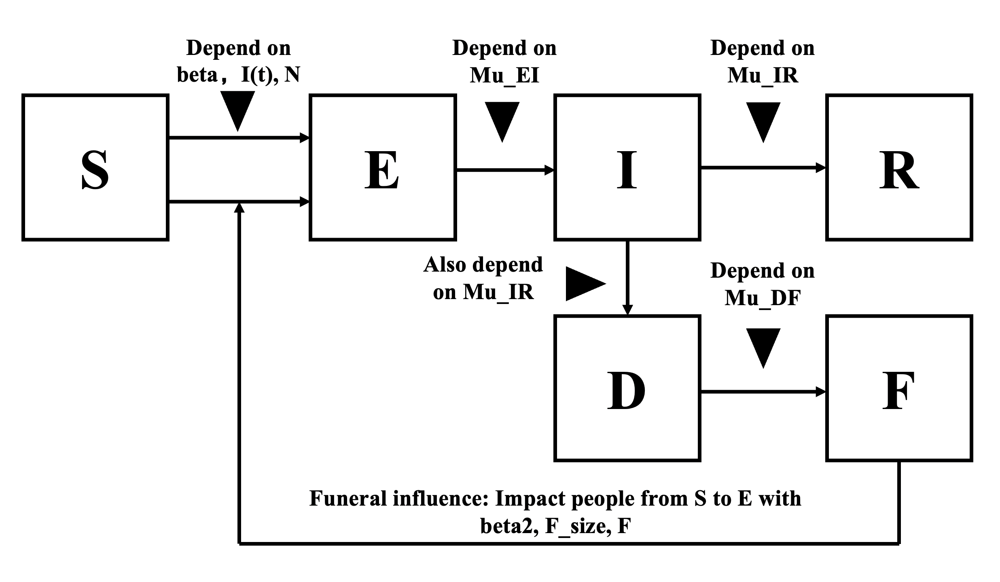

```{r setup, include=FALSE}
knitr::opts_chunk$set(echo = TRUE)
knitr::opts_chunk$set(
  echo = FALSE,
  warning = FALSE,
	message = FALSE,
	include = TRUE,
  comment = '',
  fig.align = "center"
)
library(tidyverse)
```

# Introduction

According to the CDC, Ebola Virus Disease (EVD) is caused by the probably animal-borne Ebola virus, which causes outbreaks primarily on the African continent. The virus spreads by inducing bleeding in infected persons, so that when susceptible people come into contact with the blood or other bodily fluids (breast milk, saliva, sweat, etc.) of symptomatic people they become infected as well. Transmission may happen with direct contact with a person or touching clothing or other objects contaminated with bodily fluids within several days of deposition. Other research has pointed out a variety of factors that contribute to epidemics, defined by the World Health Organization as periods of increasing transmission at a regional level. According to Rugarabamu, et. al. (2020), socioeconomic and cultural factors, such as large urban populations and livelihood practices play a role in outbreaks, many of which occurring in a regional area such as West Africa constitute an epidemic. Additionally, demographic factors affect knowledge of EVD, and people with the least knowledge generally are at higher risk of infection. The perfect storm of all these factors is illustrated by a claim made by WHO that about 60% of Ebola cases in Guinea during the 2014-2015 outbreaks can be attributed to traditional burial practices. This is supported by independent research by Park (2020) that funeral practices such as washing one's hands in a common bowl after touching the face of the deceased drives funeral infections.

Therefore, because burial practices are hypothesized to be the largest driver of transmission, we consider a modified SEIR model that includes D for death and F for funerals (SEIRDF). As explored by Weitz and Dushoff (2015), adding a D state leads to unidentifiability between R0 and the exponential growth rate. However, simulated models that did not add D and F seriously underestimated the basic reproduction number R0 value and thus a major compononent of epidemic modeling. Therefore, we decided on a SEIRDF approach where there is a larger contribution to the number of people exposed from funeral related risk than non-funeral risk. 

# Exploratory Data Analysis

To conduct this study we relied on data collected by the World Health Organization (WHO) for the Ebola outbreaks in West Africa from 2014-2016. The data was republished on [Kaggle](kaggle.com/datasets/imdevskp/ebola-outbreak-20142016-complete-dataset), which is where we retrieved it, as it was not properly archive on WHO. We narrowed our data to confirmed cases of Ebola infection by polymerase chain reaction (PCR) testing and those presenting with symptoms. 

Because the demographic factors would differ across West Africa by country, we decided to focus on the data from Guinea and Sierra Leone because the literature stated that Liberia implemented government control measures that in turn decreased transmission in all three countries. Our goal is to model the transmission dynamics of Ebola in these two countries to determine what are the parameters of a POMP model that we will propose. To inform our approach, we rely on the literature discussed above and the EDA taken below.

We performed exploratory data analysis (EDA) and found cases per day were high in both countries for the first 50 days, and decreased after that point, although still remained elevated for the first 125 days. Cases peaked around day 25, which may be reflective of latent variables that lag cases that we seek model (deaths).

```{r}
sl <- read.csv('SL.csv')
gu <- read.csv('Gu.csv')
```

```{r, fig.height = 4.5, fig.width = 8}
rbind(data.frame(sl, Country = 'Sierra Leone'), data.frame(gu, Country = 'Guinea')) %>% 
  group_by(Date) %>%
  ggplot() +
    facet_wrap(~Country, nrow = 2, scales = "free_y") +
    theme_bw() +
    geom_line(aes(Date, New_Report, color = Country), size = .6) +
    scale_color_manual(
      name = "ConfirmedCases by Date", values = c("#69b3a2", "#a55b6c")
    ) +
    guides(color = FALSE)
```

# Research Question

From the plots above, we observe similar trend and shape of Ebola daily reports in these two countries. We want to know how the virus were spread out in the two countries, are the transmission rates similar? 

# SEIRDF Model

## Model Introduction

We use SEIRDF model for analysis, and this model is consist of six stages:

+ S: susceptible (all individuals)

+ E: incubation (effected population)

+ I: infected (symptomatic)

+ R: recovered patients

+ D: dead patients

+ F: funeral number

```{r fig1, out.width = '100%', echo=F}

```

In the model, $\beta$ is the contact rate during daily life, $\beta2$ is the contact rate in the funerals of dead ebola patients, and these two parameters denote the transition rate from S to E. $\mu_{EI}$ denotes the rate at which individuals in E transition to I, $\mu_{IR}$ is the rate at which individuals in I transition to R and D, and the population from I to R and from I to D are same because of death rate nearly 50%. $\mu_{DF}$ denotes the rate at which individuals in D transition to F, which means the number of funerals, and the size of funerals is denoted by $F_{SIZE}$. The probability of a case being reported is $\rho$.

Then the number of people in each compartment can be computed by
\[
\begin{split}
S(t)&=S(0)-N_{SE}(t)\\
E(t)&=E(0)+N_{SE}(t)-N_{EI}(t)\\
I(t)&=I(0)+N_{EI}(t)-N_{IR}(t)\\
R(t)&=R(0)+N_{IR}(t)/2\\
D(t)&=D(0)+N_{IR}(t)/2\\
F(t)&=\Delta N_{DF}\\
H(t)&=H(0)+N_{IR}(t)
\end{split}
\]

where
\[
\begin{split}
\Delta N_{SE}&\sim \mathrm{Binomial}(S,1-e^{\beta\frac{I}{N}\Delta t}) + \mathrm{Binomial}(F*F_{SIZE},1-e^{\beta2/F_{SIZE}\Delta t})\\
\Delta N_{EI}&\sim \mathrm{Binomial}(E,1-e^{-\mu_{EI}\Delta t})\\
\Delta N_{IR}&\sim \mathrm{Binomial}(I,1-e^{-\mu_{IR}\Delta t})\\
\Delta N_{DF}&\sim \mathrm{Binomial}(\Delta N_{IR}/2,1-e^{-\mu_{DF}\Delta t})
\end{split}
\]

```{r}
library(pomp)
library(doParallel)
cores <-  as.numeric(Sys.getenv('SLURM_NTASKS_PER_NODE', unset=NA))
if(is.na(cores)) cores <- detectCores()  
registerDoParallel(cores)

seir_step <- Csnippet("
  double dN_SE = rbinom(S,1-exp(-Beta*I/N*dt)) + rbinom(F_size*F,1-exp(-Beta2/F_size*dt));
  double dN_EI = rbinom(E,1-exp(-mu_EI*dt));
  double dN_IR = rbinom(I,1-exp(-mu_IR*dt));
  double dN_DF = rbinom(round(dN_IR/2),1-exp(-mu_DF*dt));
  
  S -= dN_SE;
  E += dN_SE - dN_EI;
  I += dN_EI - dN_IR;
  R += round(dN_IR/2);
  D += round(dN_IR/2);
  F = round(dN_DF);
  H += dN_IR;
")

seir_rinit <- Csnippet("
  S = nearbyint(eta*N)-482;
  E = 0;
  I = 482;
  R = nearbyint((1-eta)*N);
  F = 0;
  H = 0;
  ")

dmeas <- Csnippet("
double tol = 1.0e-25;

if(reports > 0.0 && H > 0.0)
{
lik = dbinom(reports,H,rho,FALSE) + tol;
} 
else
{
lik = tol;
}
if (give_log) lik = log(lik);

")

rmeas <- Csnippet("

reports = rbinom(H,rho);
if (reports > 0.0) 
{
reports = nearbyint(reports);
} 
else 
{
reports = 0.0;
}
")
```

## For Guinea

### Simulation and Guess the parameter

We first use the simulation and try some combinations of estimators to see which combination of estimator will provide a simulation close to the true data. On the plot above, blue line represents the true data, red lines represent the 10 simulated results.

These simulations are generated by $\beta=17, \beta2=0.8, mu_{EI}=15, mu_{IR}=1.5, mu_{DF}=0.9, F_{size}=50, \rho=0.33, \eta=0.025, N=10628972$. We could see the $\beta2$ is smaller than $beta$, this is because in our model $\beta2$ is divided by the size of funeral, and $beta$ is divided by the whole population of the country, so it is reasonable that $\beta2$ is smaller than $beta$.

```{r}
df1 = read.csv(file = 'Gu.csv')
ebola = df1 %>%
    select(Date,reports=New_Report) %>%
    pomp(
        times="Date",t0=0,
        rprocess=euler(seir_step,delta.t=1),
        rinit=seir_rinit,
        rmeasure=rmeas,
        dmeasure=dmeas,
        accumvars="H",
        partrans=parameter_trans(
            log=c("Beta","Beta2","mu_EI","mu_IR","mu_DF","F_size"),
            logit=c("rho","eta")
        ),
        paramnames=c("N","Beta","Beta2","mu_EI","mu_IR","mu_DF","F_size","rho","eta"),
        statenames=c("S","E","I","R","D","F","H")
    )
```

```{r}
set.seed(531)

params <- c(Beta=17, Beta2=0.8, mu_EI=15,mu_IR=1.5,mu_DF=0.9,F_size=50,rho=0.33,eta=0.025,N=10628972)

ebola %>%
  simulate(
    params=params,
    nsim=10,format="data.frame",include.data=TRUE
  ) -> sims
sims %>%
  ggplot(aes(x=Date,y=reports,group=.id,color=.id=="data"))+
  geom_line()+
  guides(color="none")+labs(title="Simulation for data")
```

### Local Search

In the diagnostic plot, the likelihood looks increasing and converging above -6530, as the iteration process, while other parameters have large variability. In the plot of the likelihood surface, the loglik plots look so sparse that it does not give us a clear picture or hint of the ridge in likelihood surface. Thus, we move on to do global search.

```{r}
ebola_cooling.fraction.50 <- 0.5
ebola_rw.sd <- rw.sd(
    Beta=0.002,Beta2=0.002,mu_EI=0.002,mu_IR=0.002,mu_DF=0.002,rho=0.002,eta=ivp(0.002)
)

params <- c(Beta=17, Beta2=0.8, mu_EI=15,mu_IR=1.5,mu_DF=0.9,F_size=50,rho=0.33,eta=0.025,N=10628972)

bake(file="local_GU.rds",{
    foreach(i=1:20,.combine=c) %dopar% {
        library(pomp)
        library(tidyverse)
        mif2(ebola,
             params = params,
             Np=2000,
             Nmif=100,
             cooling.fraction.50=ebola_cooling.fraction.50,
             rw.sd=ebola_rw.sd) 
    } -> mifs_local 
}) -> mifs_local

bake(file="lik_local_GU.rds",{
    foreach(mf=mifs_local,.combine=rbind) %dopar% {
        library(pomp)
        library(tidyverse)
        evals <- replicate(10, logLik(pfilter(mf,Np=5000)))
        ll <- logmeanexp(evals,se=TRUE)
        mf %>% coef() %>% bind_rows() %>% bind_cols(loglik=ll[1],loglik.se=ll[2])
    } -> local_logliks
}) -> local_logliks
```

```{r, echo=F}
mifs_local %>%
  traces() %>%
  melt() %>%
  ggplot(aes(x=iteration,y=value,group=L1,color=factor(L1)))+
  geom_line()+
  guides(color="none")+
  facet_wrap(~variable,scales="free_y")
```

```{r}
bake(file="lik_local_GU.rds",{
    foreach(mf=mifs_local,.combine=rbind) %dopar% {
        library(pomp)
        library(tidyverse)
        evals <- replicate(10, logLik(pfilter(mf,Np=5000)))
        ll <- logmeanexp(evals,se=TRUE)
        mf %>% coef() %>% bind_rows() %>% bind_cols(loglik=ll[1],loglik.se=ll[2])
    } -> results
}) -> results
pairs(~loglik+Beta+mu_EI+eta+rho,data=results,pch=16)
```

### Global Search

For the global search, we first define the range for each parameter based on the knowledge from simulation and local search: $\beta \in [3, 7],\beta2 \in [0.5, 1.5],\mu_{EI} \in [10, 20],\mu_{IR} \in [0.7, 1.2],\mu_{DF} \in [0.5, 1.2], \rho \in [0.35,0.45], \eta \in [0, 0.1]$.

And the corresponding values the parameters took when the log-likelihood was maximized were:

```{r}
set.seed(1234567)
fixed_params = c(F_size=50, N=10628972)
runif_design(
    lower=c(Beta=3, Beta2=0.5, mu_EI=10, mu_IR=0.7, mu_DF=0.5, rho=0.35,eta=0),
    upper=c(Beta=7, Beta2=1.5, mu_EI=20, mu_IR=1.2, mu_DF=1.2, rho=0.45,eta=0.1),
    nseq=500
) -> guesses
mf1 <- mifs_local[[1]]


bake(file="global_GU.rds",{
    foreach(guess=iter(guesses,"row"), .combine=rbind) %dopar% {
        library(pomp)
        library(tidyverse)
        mf1 %>%
            mif2(params=c(guess,fixed_params)) %>%
            mif2(Nmif=200) -> mf
        replicate(
            10,
            mf %>% pfilter(Np=10000) %>% logLik()
        ) %>%
            logmeanexp(se=TRUE) -> ll
        mf %>% coef() %>% bind_rows() %>%
            bind_cols(loglik=ll[1],loglik.se=ll[2])
    } -> results
}) %>%
  filter(is.finite(loglik)) -> results

results %>%
  bind_rows(results) %>%
  filter(is.finite(loglik)) %>%
  arrange(-loglik) %>%
  write_csv("Guinea_params.csv")
  
```

```{r}
read_csv("Guinea_params.csv") %>%
    filter(loglik>max(loglik)-50) %>%
    bind_rows(guesses) %>%
    mutate(type=if_else(is.na(loglik),"guess","result")) %>%
    arrange(type) -> all
pairs(~loglik+Beta+mu_EI+eta+rho, data=all, pch=16, cex=0.3, col=ifelse(all$type=="guess",grey(0.5),"red"))

```

From the results above, we could see Beta among 5 tends to have higher log-likelihood, it shows a trend to converge to 5 to max the log-likelihood.And  parameters $\eta$ and $\rho$ also show a pattern of converging to max log-likelihood. However, $mu_{EI}$ doesn't show this pattern.

### Profile Likelihood For $\beta$

To explore how the log-likelihood changes over different values of $\beta$, we calculated the profile likelihood of $\beta$. We chose 500 evenly spaced values between $3$ and $7$ as the initial values for $\beta$. Also for each $\beta$, we uniformly sample a point from the box $\beta2 \in [0.5, 1.5],\mu_{EI} \in [10, 20],\mu_{IR} \in [0.7, 1.2],\mu_{DF} \in [0.5, 1.2], \rho \in [0.35,0.45], \eta \in [0, 0.1]$. as initial value for other parameters. 

The profile log-likelihood for $\beta$ was shown below

```{r}
bake(file="beta_GU.rds",dependson=guesses,{
    foreach(guess=iter(guesses,"row"), .combine=rbind) %dopar% {
        library(pomp)
        library(tidyverse)
        mf1 %>%
            mif2(params=c(guess,fixed_params),Nmif=100,
                 rw.sd=rw.sd(Beta2=0.002,mu_EI=0.002,mu_IR=0.002,mu_DF=0.002,rho=0.002,eta=ivp(0.002))) %>%
            mif2(Nmif=100,cooling.fraction.50=0.2) -> mf
        replicate(
            10,
            mf %>% pfilter(Np=5000) %>% logLik()) %>%
            logmeanexp(se=TRUE) -> ll
        mf %>% coef() %>% bind_rows() %>%
            bind_cols(loglik=ll[1],loglik.se=ll[2])
    } -> prof_results
}) -> prof_results
prof_results %>%
  filter(is.finite(loglik)) -> profile_results

profile_results %>%
    filter(loglik>max(loglik)-100,loglik.se<0.05) %>%
    group_by(round(Beta,2)) %>%
    filter(rank(-loglik)<3) %>%
    ungroup() %>%
    ggplot(aes(x=Beta,y=loglik))+
    geom_point()+
    geom_hline(color="red",yintercept=max(profile_results$loglik)-0.5*qchisq(df=1,p=0.95)
    )
# read_csv("Guinea_params.csv") %>%
#     bind_rows(results) %>%
#     filter(is.finite(loglik)) %>%
#     arrange(-loglik) %>%
#     write_csv("Guinea_params.csv")

profile_results %>%
  filter(loglik>max(loglik)-0.5*qchisq(df=1,p=0.95)) %>%
  summarize(min=min(Beta),max=max(Beta)) -> beta_GU_ci

beta_GU_ci

```

From the plot above, we could see that the maximizer for $\beta$ was from 3 to 7, which was consistent with result from global search. However, we found some flaws in the profile likelihood plot. By Wilk's theorem, we can calculate the $95\%$ confidence interval for log-likelihood, which will be 3.003 to 6.974, which means that as long as the log-liklihood of the models with different values of $\beta$ are in this scope, they will be comparable with the model that has maximum log-likelihood. This fact indicated that maybe parameter $\beta$ in SIERDF model above is weakly identifiable given only the daily new reported cases data.

## For Sierra Leone

### Simulation and Guess the parameter

The simulations are generated by $\beta=20, \beta2=1, mu_{EI}=12, mu_{IR}=2, mu_{DF}=1, F_{size}=50, \rho=0.3, \eta=0.025, N=16190280$. And $\beta2$ is smaller for same reason mentioned before.

```{r}
rm(list=ls())
df1 = read.csv(file = 'SL.csv')

library(pomp)
library(doParallel)
cores <-  as.numeric(Sys.getenv('SLURM_NTASKS_PER_NODE', unset=NA))
if(is.na(cores)) cores <- detectCores()  
registerDoParallel(cores)

seir_step <- Csnippet("
  double dN_SE = rbinom(S,1-exp(-Beta*I/N*dt)) + rbinom(F_size*F,1-exp(-Beta2/F_size*dt));
  double dN_EI = rbinom(E,1-exp(-mu_EI*dt));
  double dN_IR = rbinom(I,1-exp(-mu_IR*dt));
  double dN_DF = rbinom(round(dN_IR/2),1-exp(-mu_DF*dt));
  
  S -= dN_SE;
  E += dN_SE - dN_EI;
  I += dN_EI - dN_IR;
  R += round(dN_IR/2);
  D += round(dN_IR/2);
  F = round(dN_DF);
  H += dN_IR;
")

seir_rinit <- Csnippet("
  S = nearbyint(eta*N)-935;
  E = 0;
  I = 935;
  R = nearbyint((1-eta)*N);
  F = 0;
  H = 0;
  ")

dmeas <- Csnippet("
double tol = 1.0e-25;

if(reports > 0.0 && H > 0.0)
{
lik = dbinom(reports,H,rho,FALSE) + tol;
} 
else
{
lik = tol;
}
if (give_log) lik = log(lik);

")

rmeas <- Csnippet("

reports = rbinom(H,rho);
if (reports > 0.0) 
{
reports = nearbyint(reports);
} 
else 
{
reports = 0.0;
}
")

ebola = df1 %>%
    select(Date,reports=New_Report) %>%
    pomp(
        times="Date",t0=0,
        rprocess=euler(seir_step,delta.t=1),
        rinit=seir_rinit,
        rmeasure=rmeas,
        dmeasure=dmeas,
        accumvars="H",
        partrans=parameter_trans(
            log=c("Beta","Beta2","mu_EI","mu_IR","mu_DF","F_size"),
            logit=c("rho","eta")
        ),
        paramnames=c("N","Beta","Beta2","mu_EI","mu_IR","mu_DF","F_size","rho","eta"),
        statenames=c("S","E","I","R","D","F","H")
    )
```

```{r}
set.seed(531)
params <- c(Beta=20, Beta2=1, mu_EI=12,mu_IR=2,mu_DF=1,F_size=50,rho=0.3,eta=0.025,N=6190280)

ebola %>%
  simulate(
    params=params,
    nsim=10,format="data.frame",include.data=TRUE
  ) -> sims
sims %>%
  ggplot(aes(x=Date,y=reports,group=.id,color=.id=="data"))+
  geom_line()+
  guides(color="none")+labs(title="Simulation for data")
```

### Local Search

In the diagnostic plot, the likelihood looks increasing and converging above -6530, as the iteration process, while other parameters have large variability. In the plot of the likelihood surface, the loglik plots look so sparse that it does not give us a clear picture or hint of the ridge in likelihood surface. Thus, we move on to do global search.

```{r}
ebola_cooling.fraction.50 <- 0.5
ebola_rw.sd <- rw.sd(
    Beta=0.002,Beta2=0.002,mu_EI=0.002,mu_IR=0.002,mu_DF=0.002,rho=0.002,eta=ivp(0.002)
)

params <- c(Beta=20, Beta2=1, mu_EI=12,mu_IR=2,mu_DF=1,F_size=50,rho=0.3,eta=0.025,N=6190280)

bake(file="local_SL.rds",{
    foreach(i=1:20,.combine=c) %dopar% {
        library(pomp)
        library(tidyverse)
        mif2(ebola,
             params = params,
             Np=2000,
             Nmif=100,
             cooling.fraction.50=ebola_cooling.fraction.50,
             rw.sd=ebola_rw.sd) 
    } -> mifs_local 
}) -> mifs_local

bake(file="lik_local_SL.rds",{
    foreach(mf=mifs_local,.combine=rbind) %dopar% {
        library(pomp)
        library(tidyverse)
        evals <- replicate(10, logLik(pfilter(mf,Np=5000)))
        ll <- logmeanexp(evals,se=TRUE)
        mf %>% coef() %>% bind_rows() %>% bind_cols(loglik=ll[1],loglik.se=ll[2])
    } -> local_logliks
}) -> local_logliks
```

```{r, echo=F}
mifs_local %>%
  traces() %>%
  melt() %>%
  ggplot(aes(x=iteration,y=value,group=L1,color=factor(L1)))+
  geom_line()+
  guides(color="none")+
  facet_wrap(~variable,scales="free_y")
```

```{r}
bake(file="lik_local_SL.rds",{
    foreach(mf=mifs_local,.combine=rbind) %dopar% {
        library(pomp)
        library(tidyverse)
        evals <- replicate(10, logLik(pfilter(mf,Np=5000)))
        ll <- logmeanexp(evals,se=TRUE)
        mf %>% coef() %>% bind_rows() %>% bind_cols(loglik=ll[1],loglik.se=ll[2])
    } -> results
}) -> results
pairs(~loglik+Beta+mu_EI+eta+rho,data=results,pch=16)
```

### Global Search

For the global search, we first define the range for each parameter based on the knowledge from simulation and local search: $\beta \in [3, 7],\beta2 \in [0.5, 1.5],\mu_{EI} \in [10, 20],\mu_{IR} \in [0.7, 1.2],\mu_{DF} \in [0.5, 1.2], \rho \in [0.35,0.45], \eta \in [0, 0.1]$.

And the corresponding values the parameters took when the log-likelihood was maximized were:

```{r}
set.seed(1234567)
fixed_params = c(F_size=50, N=6190280)
runif_design(
    lower=c(Beta=3, Beta2=0.5, mu_EI=10, mu_IR=0.7, mu_DF=0.5, rho=0.35,eta=0),
    upper=c(Beta=7, Beta2=1.5, mu_EI=20, mu_IR=1.2, mu_DF=1.2, rho=0.45,eta=0.1),
    nseq=500
) -> guesses
mf1 <- mifs_local[[1]]


bake(file="global_SL.rds",{
    foreach(guess=iter(guesses,"row"), .combine=rbind) %dopar% {
        library(pomp)
        library(tidyverse)
        mf1 %>%
            mif2(params=c(guess,fixed_params)) %>%
            mif2(Nmif=200) -> mf
        replicate(
            10,
            mf %>% pfilter(Np=10000) %>% logLik()
        ) %>%
            logmeanexp(se=TRUE) -> ll
        mf %>% coef() %>% bind_rows() %>%
            bind_cols(loglik=ll[1],loglik.se=ll[2])
    } -> results
}) %>%
  filter(is.finite(loglik)) -> results
```

```{r}
 results %>%
    filter(loglik>max(loglik)-50) %>%
    bind_rows(guesses) %>%
    mutate(type=if_else(is.na(loglik),"guess","result")) %>%
    arrange(type) -> all
pairs(~loglik+Beta+mu_EI+eta+rho, data=all, pch=16, cex=0.3, col=ifelse(all$type=="guess",grey(0.5),"red"))
```

From the results above, we could see Beta less than 10 tends to have higher log-likelihood, but other parameters don't show good convergence with higher log-likelihood.

### Profile Likelihood For $\beta$

To explore how the log-likelihood changes over different values of $\beta$, we calculated the profile likelihood of $\beta$. We chose 500 evenly spaced values between $3$ and $7$ as the initial values for $\beta$. Also for each $\beta$, we uniformly sample a point from the box $\beta2 \in [0.5, 1.5],\mu_{EI} \in [10, 20],\mu_{IR} \in [0.7, 1.2],\mu_{DF} \in [0.5, 1.2], \rho \in [0.35,0.45], \eta \in [0, 0.1]$. as initial value for other parameters. 

The profile log-likelihood for $\beta$ was shown below

```{r}
# read_csv("SL_params.csv") %>%
#     filter(loglik>max(loglik)-50) %>%
#     bind_rows(guesses) %>%
#     mutate(type=if_else(is.na(loglik),"guess","result")) %>%
#     arrange(type) -> all

# read_csv("SL_params.csv") %>%
#     group_by(cut=round(Beta,2)) %>%
#     filter(rank(-loglik)<=10) %>%
#     ungroup() %>%
#     arrange(-loglik) %>%
#     select(-cut,-loglik,-loglik.se) -> guesses

bake(file="beta_SL.rds",{
    foreach(guess=iter(guesses,"row"), .combine=rbind) %dopar% {
        library(pomp)
        library(tidyverse)
        mf1 %>%
            mif2(params=c(guess,fixed_params),Nmif=100,
                 rw.sd=rw.sd(Beta2=0.002,mu_EI=0.002,mu_IR=0.002,mu_DF=0.002,rho=0.002,eta=ivp(0.002))) %>%
            mif2(Nmif=100,cooling.fraction.50=0.2) %>%
            mif2() -> mf
        replicate(
            10,
            mf %>% pfilter(Np=5000) %>% logLik()) %>%
            logmeanexp(se=TRUE) -> ll
        mf %>% coef() %>% bind_rows() %>%
            bind_cols(loglik=ll[1],loglik.se=ll[2])
    } -> prof_results
}) -> prof_results
prof_results %>%
  filter(is.finite(loglik)) -> profile_results

profile_results %>%
    filter(loglik>max(loglik)-100,loglik.se<0.05) %>%
    group_by(round(Beta,2)) %>%
    filter(rank(-loglik)<3) %>%
    ungroup() %>%
    ggplot(aes(x=Beta,y=loglik))+
    geom_point()+
    geom_hline(color="red",yintercept=max(profile_results$loglik)-0.5*qchisq(df=1,p=0.95)
    )

# read_csv("SL_params.csv") %>%
#     bind_rows(results) %>%
#     filter(is.finite(loglik)) %>%
#     arrange(-loglik) %>%
#     write_csv("SL_params.csv")

profile_results %>%
  filter(loglik>max(loglik)-0.5*qchisq(df=1,p=0.95)) %>%
  summarize(min=min(Beta),max=max(Beta)) -> beta_SL_ci

beta_SL_ci
```

From the plot above, we could see that the maximizer for $\beta$ was from 3 to 7, which was consistent with result from global search. However, we found some flaws in the profile likelihood plot. By Wilk's theorem, we can calculate the $95\%$ confidence interval for log-likelihood, which will be 3.003 to 6.974, which means that as long as the log-liklihood of the models with different values of $\beta$ are in this scope, they will be comparable with the model that has maximum log-likelihood. This fact indicated that maybe parameter $\beta$ in SIERDF model above is weakly identifiable given only the daily new reported cases data.

# Conclusions

In this project, we used SEIRDF model to fit the Ebola data set in Guinea and Sierra Leone. We observe same confidence interval of $\beta$ in the two countries, which indicates that the transmission rate is close. This is also consistent with what we observe in the two plots in the beginning (very similar trend and shape). It turned out the log-likelihood is not convex-shaped in our result so we didn't observe a parabola and maximum in the $\beta$ likelihood portfolio. Even with non-convex log likelihood, the confidence intervals of the two transmission rates are sill the same. This exact same confidence interval of the two countries may not seem convincing, but this is because we set the same lower and upper bounds and same number of evened space for global search.

In conclusion, with the new SEIRDF model, we observe very similar transmission rates in Guinea and Sierra Leone. This matches our expectation as we observe similar shape in EDA and these two countries in west Africa have similar weather and traditions, which may explain the similarity in their transmission rates of Ebola.

# Future works

There are some problems we encountered during this project, which can be done in the future:

+ The dynamics of Ebola cases is very complicated, even though we add death and funeral influence into the model, it still can not fit the data very well. Therefore in the future, we can add more compartments into the model, i.e. people who got quarantined, people who are in countryside or city, to best fit the data.

+ For the SEIRDF model we already get, we simplify the influence of funeral and death without setting delaying period, which means that we have assumption that people have funeral the same day they die. So delaying period also needs to be considered in the future, and it might also has influence on infection of disease.

# Difference from Previous Work

+ Our creative model includes influence of Death and Funerals, which is an important approach of Ebola according to papers mentioned before.

+ Apply the model based on data from different countries, and compare.

# References:

1. Course lecture note12-14 https://ionides.github.io/531w21/#class-notes-and-lectures

2. Centers for Disease Control and Prevention. (2021, April 27). What is ebola virus disease? Centers for Disease Control and Prevention. Retrieved April 19, 2022, from https://www.cdc.gov/vhf/ebola/about.html 

3. Weitz, J. S., & Dushoff, J. (2015). Modeling post-death transmission of Ebola: challenges for inference and opportunities for control. Scientific reports, 5, 8751. https://doi.org/10.1038/srep08751

4. Rugarabamu, S., Mboera, L., Rweyemamu, M., Mwanyika, G., Lutwama, J., Paweska, J., &amp; Misinzo, G. (2020, March 1). Forty-two years of responding to ebola virus outbreaks in Sub-Saharan africa: A Review. BMJ Global Health. Retrieved April 19, 2022, from https://gh.bmj.com/content/5/3/e001955 

5. PARK, C. (n.d.). Traditional funeral and burial rituals and ebola outbreaks. Journal of Health and Social Sciences. Retrieved April 19, 2022, from https://journalhss.com/wp-content/uploads/jhss_51_073-090.pdf 

6. Stats 531 Winter 2021 project. https://ionides.github.io/531w21/final_project/project15/blinded.html

