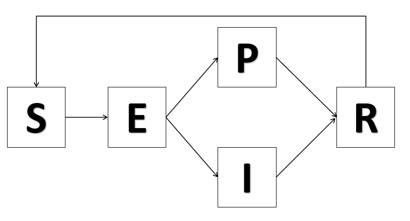

```{r setup, include=FALSE}
knitr::opts_chunk$set(echo = TRUE)
knitr::write_bib("references.bib")
```


```{r include=FALSE, warning=FALSE}
library("tidyverse")
library("pomp")
set.seed(1)
```

```{r include=FALSE,warning=FALSE}
# set parallel computing
library("foreach")
library("doParallel")
registerDoParallel()
```

```{r include=FALSE,warning=FALSE}
library("doRNG")
registerDoRNG(1)
```

```{r include=FALSE}
read_csv("Washtenaw.csv") %>%
  select(Date,reports=Cases) %>%
  filter(Date>"2021-12-01 00:00:00") %>%
  mutate(Time = 1:n())-> dat
```


## Introduction

Novel coronavirus disease, COVID-19, a serious contagious disease was first discovered in December 2019 and now presented a big threat for global public healthy security. Many articles have been published to study the transmission, treatment, and the social and economic effect of the COVID-19 pandemic. Many final projects in STATS531 from 2020 and 2021 focus on COVID-19 datasets [@Project13,@Project15，@Project22,@Project25], but at that time, the Omicron variant has not been discovered. The omicron variant of COVID-19 has become the dominant strain of the virus circulating in the U.S. and the rest of the world. It's more easily spread than previous strains because it has more mutations than any other variant so far [@omicron-variant]. The largest number of daily cases is one million four hundred thousand on January 10th [@NewYorkTime]. A good news is that Omicron infection generally causes less severe disease than infection with prior variants [@CDC]. The reported cases drops quickly to nearly ten thousand a day and many states have lowered the restrictions related to COVID-19. On March 21st, University of Michigan changed face covering policy for COVID-19 [@UMICH]. However, the number of cases starts to rise in April, and has reached 35 thousand. A pubilic concern is that the daily reported cases may not be accurate, because many people who are infected but not showing any symptoms may not be reported. Based on this situation, our team raises two questions. Firstly, can we use time series model to fit the data related to Omicron variant? Secondly, how much can we trust the daily reported number? 

In this case study, we will use the daily cases of COVID-19 in Washtenaw,MI, from December 1st, 2021 to April 6th, 2022 to understand the transmission dynamics of COVID-19. We choose a certain county because policies in different places vary and Washtenaw is where we live in. The starting time point is based on the report from CDC [@Firstcase]. We will carry out the analysis by ARMA and POMP, then we will compare the results and make conclusions.


## COVID-19 Data

The daily confirmed cases of COVID-19 in Washtenaw,MI was obtained from the website of Michigan.gov. Below is the plot of COVID-19 cases from 2020-03-01 to 2022-04-06. We could see at the beginning, it was not serious. From about time 25 in the plot, its cases increase suddenly. At about time 35, it reached its peak. After time 50, situations become better and better. Now the cases are even lower than the beginning.

```{r echo=FALSE}
dat %>%
  ggplot(aes(x=Time,y=reports))+
  geom_line() + ylab("Cases") + ggtitle("Daily Confirmed Cases of COVID-19 in Washtenaw")
```


```{r, echo = FALSE}
acf(dat$reports, main = "ACF plot of Number of Reported Cases")
```

From the ACF plot of the original reported confirmed COVID-19 cases, we can see that the data is very correlated, with very high autocorrelation. Because of this, taking the differenced data will help in terms of having stationarity in the data. As seen from the plot below, the differenced data of the number of reported cases seem more stationary compared to the original dataset. Further, although there are some high correlation in several lags, like at lag 7 and 14, it is still an improvement compared to the ACF of the original data. The lag at 7 indicates that our data may contain seasonality.

```{r, echo = FALSE}
par(mfrow=c(1,2))
plot(dat$Time, c(0,diff(log(dat$reports))), type = "l", ylab = "Number of Cases", main = "Differenced Data")
acf(diff(dat$reports), main = "ACF of Differenced Data")
```

## Check for Seasonality

In the previous ACF plot of the differenced data, it can be observed that there may be some seasonality that exists in the reported confirmed cases of COVID-19, since there is high correlation at lag 7 and lag 14. This may suggest some form of weekly seasonality. To further confirm this observation, a spectral density plot is plotted below. The spectral density plot agrees that there exist a seasonality pattern in the data, with an approximately seven days(1/0.13) period.

```{r, echo = FALSE}
season = spectrum(dat$reports, c(5, 5), main="Spectral density of reported confirmed cases")
```

## Fitting SARIMA Model

Since we've seen that seasonality exists in the data, and that we are fitting over the differenced data, we will fit an SARIMA(p,1,q) model with a weekly period, with the equation
$$\phi(B)Φ(B^{7})(1−B)^1(1−B^{7})^DY_n−\mu= \psi(B)Ψ(B^{7})\epsilon_n$$
where ${\epsilon_n}$ is a white noise process, $\mu$ is the mean of the differenced process $(1-B)^1(1-B^{7})$, and
as stated in Lecture Notes Chapter 6. 

We then proceed to model selection by finding the AIC values for various possible values or p and q for the SARIMA(p,1,q). The values are presented in the table as below.

```{r, warning = FALSE, echo = FALSE}
sarima_aic_table <- function(data, P, Q){
  table <- matrix(NA, (P+1), (Q+1))
  for (p in 0:P){
    for(q in 0:Q){
      table[p+1,q+1] <- arima(data, order=c(p,1,q), seasonal=list(order=c(1,0,0), period=7))$aic
    }
  }
  dimnames(table) <- list(paste("AR", 0:P, sep=""),
                          paste("MA", 0:Q, sep=""))
  table
}

sarima_aic_table <- sarima_aic_table(dat$reports,3,4)
sarima_aic_table
```

Using the AIC report above, the model SARIMA(2,1,2) has the lowest AIC value among all the SARIMA models. Thus, we will choose this model to fit the SARIMA model.

```{r, echo = FALSE}
sarima22 <- arima(dat$reports,
  order=c(2,1,2),
  seasonal=list(order=c(1,0,0),period=7)
)
```

```{r, echo = FALSE,warning=FALSE,message=FALSE}
library(forecast)
autoplot(sarima22, main = "Plot the inverse roots of SARIMA(2,1,2)")
```

As seen from the plot of the inverse roots of the SARIMA model above, we know that we have fitted a stationary casual model. Since all the inverse AR and MA roots are inside the unit circle, the model is therefore casual and stationary. Next, we use the residual plot and Q-Q plot to check how our model fits the data. The figures are shown below. We can see that the residuals remain large around the peaks, and the Q-Q plot indicates that the residuals do not follow normal distribution. Nevertheless, we have to admit that the data around the peaks are hard to fit and our SARIMA model generally performs well. To achieve better results, we will use POMP model.

```{r,echo=FALSE}
plot(dat$Time, sarima22$residuals, xlab = "Day", ylab = "Residuals", type='l')
title('Residual Plot')
```

```{r echo=FALSE}
qqnorm(sarima22$residuals)         #qq
qqline(sarima22$residuals)         #adds line
```

```{r include=FALSE}
read_csv("Washtenaw.csv") %>%
  select(Date,reports=Cases) %>%
  filter(Date>"2021-12-01 00:00:00") %>%
  mutate(Time = 1:n())-> dat
```

## POMP: Recurrent-SEPIR Model

In the course, we learn SIR(Susceptible-Infectious-Recovered) model and SEIR(Susceptible-Exposed-Infectious-Recovered) model. These two models are simple but powerful. However, the assumption that recovered people are no longer susceptible does not hold for COVID-19 [@Reinfection]. Therefore, we think that a recurrent model might be more suitable, which means that people who have recovered from COVID-19 can be infected again. Besides, it is possible that infected people do not show any symptoms, but they can still spread the virus. These people do not know that they are infected and they will not get tested, so these cases will not be reported [@nosymptom]. Based on this situation, we add one more branch after the "Exposed" state. We name it as "Potential Infected", and use the letter "P" to represent the state. This means that, after the "Exposed" state, people can go to "I" or "P", but only cases from state "I" can be reported. The model is shown in the figure below.



Our model can be described as follows.

- $S_t$ : the number of susceptible people at time $t$ who are not infected. 
- $E_t$ : the number of people at time $t$, who have beed exposed to the virus, but do not show any symptoms and will not infect others.
- $P_t$ : the number of people at time $t$, who have been infected, but will not show any symptoms and thus, will not be reported.
- $I_t$ : the number of people at time $t$, who have been infected and are showing symptoms.
- $I_t$ : the number of recovered at time $t$.

And the transition between different stages can be described by the following differential equations.

- $\frac{N_{SE}}{dt} = \frac{\beta I}{N} S_t$
- $\frac{N_{EP}}{dt} = \alpha * \mu_{EPI} E_t$
- $\frac{N_{EI}}{dt} = (1 - \alpha) * \mu_{EPI} E_t$
- $\frac{N_{PR}}{dt} = \mu_{PR} P_t$
- $\frac{N_{IR}}{dt} = \mu_{IR} I_t$
- $\frac{N_{RS}}{dt} = \mu_{RS} R_t$

The parameters in the model are defined as follows.

- $\beta$ : The transmission rate from S to E.
- $\alpha$ : The portion of people transfer from E to P.
- $\mu_{EPI}$ : The rate that people transfer from E to P and I.
- $\mu_{PR}$ : The rate that people transfer from P to R.
- $\mu_{IR}$ : The rate that people transfer from I to R.
- $\mu_{RS}$ : The rate that people transfer from R to S.
- $\rho$ :The probability that cases are reported

We observed that the data looks quite different in different stages. In the first half, the number of reported cases is larger, and there are several peaks. In the second half, the reported cases are fewer, and the value generally maintain at a certain level. To tackle this problem, we let $\beta$ vary in different periods. The code to generate our POMP model is shown below.

```{r warning=FALSE}
#load the model
#intervention_indicator
intervention_indicator <- rep(0,length(dat$Time))
for(i in 1:length(dat$Time)){
  if (i<=24){
    intervention_indicator[i] <- 1
  }
  else if (i>24 & i<=28){
    intervention_indicator[i] <- 2
  }
  else if (i>28 & i<=34){
    intervention_indicator[i] <- 3
  }
  else if (i>35 & i<=41){
    intervention_indicator[i] <- 4
  }
  else if (i>41 & i<=51){
    intervention_indicator[i] <- 5
  }
  else {
    intervention_indicator[i] <- 6
  }
}

#covariate table
covar_ <- covariate_table(
  day=dat$Time,
  intervention = intervention_indicator,
  times="day"
)

sepir_step <- Csnippet("
  double Beta_intervention;
  
  if (intervention==1){
    Beta_intervention = Beta*b1;
  }
  else if (intervention==2){
    Beta_intervention = Beta*b2;
  }
  else if (intervention==3){
    Beta_intervention = Beta*b3;
  }
  else if (intervention==4){
    Beta_intervention = Beta*b4;
  }
  else if (intervention==5){
    Beta_intervention = Beta*b5;
  }
  else {
    Beta_intervention = Beta;
  }
  
  double dN_SE = rbinom(S,1-exp(-Beta_intervention*(I+P)/N*dt));
  double dN_EPI = rbinom(E,1-exp(-mu_EPI*dt));
  double dN_PR = rbinom(P,1-exp(-mu_PR*dt));
  double dN_IR = rbinom(I,1-exp(-mu_IR*dt));
  double dN_RS = rbinom(I,1-exp(-mu_RS*dt));
  S -= dN_SE - dN_RS;
  E += dN_SE - dN_EPI;
  P += nearbyint(alpha*dN_EPI) - dN_PR;
  I += nearbyint((1-alpha)*dN_EPI) - dN_IR;
  R += dN_PR+dN_IR;
  H += dN_IR;
")

sepir_init <- Csnippet("
  S = nearbyint(eta*N);
  E = 100;
  I = 200;
  P = 50;
  R = nearbyint((1-eta)*N);
  H = 0;
")

dmeas <- Csnippet("
  double tol=1.0e-25;
  double mean =rho*H;
  double sd =sqrt(pow(tau*H,2)+rho*H);
  if(reports>0.0){
    lik=pnorm(reports+0.5,mean,sd,1,0)-pnorm(reports-0.5,mean,sd,1,0)+tol;
  } else {
    lik=pnorm(reports+0.5,mean,sd,1,0)+tol;
  }
  if(give_log) lik=log(lik);
")

rmeas <- Csnippet("
  reports = rnorm(rho*H, sqrt(pow(tau*H,2)+rho*H));
  if(reports>0.0){
    reports=nearbyint(reports);
  } else {
    reports=0.0;
  }
")
```

```{r include=FALSE}
dat %>%
  pomp(
    times="Time",t0=1,
    rprocess=euler(sepir_step,delta.t=1),
    rinit=sepir_init,
    rmeasure=rmeas,
    dmeasure=dmeas,
    accumvars = "H",
    partrans = parameter_trans(
      log=c("Beta","b1","b2","b3","b4","b5","mu_EPI","mu_PR","mu_IR","mu_RS","tau"),
      logit=c("rho","alpha")
    ),
    covar=covar_,
    statenames = c("S","E","P","I","R","H"),
    paramnames = c("Beta","b1","b2","b3","b4","b5","mu_EPI","mu_PR","mu_IR","mu_RS","eta","rho","N","tau","alpha"),
    cdir=".",cfile="omicron"
  ) -> omicron
```

Before we use local search and global search to find the best parameters, we try to find a set of parameters as our starting point. According to the census [@population], we fix $N$ as 367601 (The number has been updated now). We tune the starting point following two criterion. Firstly, the value of parameters should be reasonable. Secondly, the simulated results should be close to the real data. Our initial guess and the simulated result are shown below.

```{r warning=FALSE}
#set params
params_guess <- c(Beta=0.4,b1=2.2,b2=3,b3=2,b4=1.6,b5=1.2,mu_EPI=1.6,mu_PR=0.6,mu_IR=0.47,mu_RS=0.2,alpha=0.4,rho=0.95,eta=0.6,N=367601,tau=0.25) 
```

```{r include=FALSE}
set.seed(1)
omicron %>%
  simulate(params=params_guess,nsim=10,format="data.frame",include.data=TRUE) -> y
```


```{r echo=FALSE}
y %>%
  ggplot(aes(x=Time,y=reports,group=.id,color=factor(.id)))+
  geom_line()+
  scale_color_brewer(type="qual",palette = 3)+
  guides(color="none")
```

```{r, include=FALSE}
params = c(b1=2.2,b2=3,b3=2,b4=1.6,b5=1.2, 
            mu_EPI=1.6,mu_PR=0.6,mu_IR=0.47,mu_RS=0.2,
           alpha=0.4,Beta=0.4,rho=0.95,eta=0.6,tau=0.25, N = 367601)
fixed_params = params[c("N", "mu_PR", "mu_IR","alpha","Beta")]
params_rw.sd = rw.sd(b1 = 0.02, b2 = 0.02, b3 = 0.02, b4 = 0.02, b5 = 0.02, mu_EPI=0.02,mu_RS=0.02,rho = 0.02, tau = 0.002, eta = ivp(0.02))
```

```{r include=FALSE}
bake(file = "tmp/starting_values.rds", {
  foreach(i=1:10, .combine = c) %dopar% {
    library(pomp)
    library(tidyverse)
    omicron %>% pfilter(params=params,  Np=5000)
  }
}) -> pf
pf %>% logLik() %>% logmeanexp(se = TRUE) -> L_pf
L_pf
```

The log likelihood is -3611.64, and the standard error is 78.32. The result is far from satisfactory. From the simulated figure, we can see that the reported cases in our simulation decay to zero, however, in reality, the number of cases still maintains at a certain level. Nevertheless, this is just an initial guess.

```{r include=FALSE}
pf[[1]] %>% coef() %>% bind_rows() %>%
  bind_cols(loglik=L_pf[1],loglik.se=L_pf[2]) %>%
  write_csv("omicron_params.csv")
```

### Local search 

Next, we try local search to improve our result. We fixed the two parameters that are related to recovery rate, because these two parameters can be obtained from statistics. We do not want these two values to be updated in order to fit the real data.

```{r, include=FALSE}
bake(file="tmp/local_search.rds",{
  foreach(i=1:10,.combine=c) %dopar% {
    library("pomp")
    library("tidyverse")
    mif2(omicron,
         params = params,
         Np=2000,
         Nmif=200,
         cooling.fraction.50=0.5,
         rw.sd=params_rw.sd
         )
  } -> mifs_local
}) -> mifs_local
```

```{r include=FALSE}
params_local <- coef(mifs_local)
max_local <- params_local[,which.max(logLik(mifs_local))]
max(logLik(mifs_local))
```

The result of local search is shown below. We can see that each time, the log likelihood converges, which can be considered as a good phenomenon. Among all the $b_i$, $b2$ tends to be the largest, while $b5$ tends to the smallest. This is consistent with our data, because we can observe peaks in the middle, and the reported cases are smaller in the second half period. $\eta$ is nearly 0.9, because COVID-19 is a pandemic and the Omicron variant is extremely contagious. $\rho$ is close to 1, which means that most people in state "I" are reported. This is reasonable, because we have multiple ways to get tested efficiently. 

```{r warning=FALSE,echo=FALSE}
mifs_local %>%
  traces() %>%
  melt() %>%
  ggplot(aes(x=iteration,y=value,group=L1,color=factor(L1)))+
  geom_line()+
  guides(color=FALSE)+
  facet_wrap(~variable,scales="free_y")
```

```{r, include=FALSE}
bake(file="tmp/local_results.rds",{
  foreach(mf=mifs_local, .combine=rbind) %dopar% {
    library(pomp)
    library(tidyverse)
    evals <- replicate(10,logLik(pfilter(mf,Np=5000)))
    ll <- logmeanexp(evals,se=TRUE)
    mf %>% coef() %>% bind_rows() %>%
      bind_cols(loglik=ll[1],loglik.se=ll[2])
  } -> local_results
}) -> local_results
```

```{r include=FALSE}
read.csv("omicron_params.csv") %>%
  bind_rows(local_results) %>%
  filter(is.finite(loglik)) %>%
  filter(loglik.se < 1 ) %>%
  arrange(-loglik)->local_search_res
```

We generate simulated results based on parameters that we obtain from local search. The best log likelihood is -803.68 with standard error nearly 2, which is much better than our initial guess. From the simulation result, we can see that our POMP model can simulate the peaks and in the second half period, the number of cases does not decay to zero.

```{r echo=FALSE}
omicron %>%
  simulate(
    params=unlist(local_search_res[1,]),
    nsim=8,format="data.frame",include.data=TRUE
  )->local_sims

local_sims %>%
  ggplot(aes(x=Time,y=reports,group=.id,color=factor(.id)))+
  geom_line()+
  scale_color_brewer(type="qual",palette = 3)+
  guides(color="none")
```

```{r include=FALSE}
read.csv("omicron_params.csv") %>%
  bind_rows(local_results) %>%
  filter(is.finite(loglik)) %>%
  filter(loglik.se < 2.5 ) %>%
  arrange(-loglik)->temp_local
```

```{r echo=FALSE}
pairs(~loglik+b1+b2+b3+b4+b5,data=temp_local,pch=16, col="red")
pairs(~loglik+mu_EPI+mu_RS+rho+eta+tau,data=temp_local,pch=16, col="red")
```

Next, we will look at the likelihood surface of the parameters. We need to pay attention that $\mu_{PR}, \mu_{IR}, \alpha, \beta, N$ are fixed and therefore not reported here.

For the rest of the parameters, we could see in the diagnostic plot, some parameters look stable like $\eta$, waving between 0.83 and 0.92, as the iteration process. While some parameters show large variability like $\mu_{EPI}$. In the plot of the likelihood surface, the loglik plots look so sparse that it does not give us a clear picture or hint of the ridge in likelihood surface. Therefore, we move on to do global search. However, local search results give us the range about parameters which could be used in global search.

### Global search

```{r include=FALSE}
param_box <- rbind(
  b1=c(1,3),b2=c(1,3),b3=c(1,3),b4=c(0.5,2),b5=c(0.5,2),
  mu_EPI=c(1,2.7),
  rho=c(0.7,1),eta=c(0.5,1),tau=c(0.1,0.4)
)
# we fixed mu_RS in global search
fixed_params2 <-params[c("N", "mu_PR", "mu_IR","alpha","Beta","mu_RS")]
fixed_params2["mu_RS"]<-1.529 #get it from local search
params_rw.sd2 = rw.sd(b1 = 0.02, b2 = 0.02, b3 = 0.02, b4 = 0.02, b5 = 0.02, mu_EPI=0.02,rho = 0.02, tau = 0.002, eta = ivp(0.02))
```

```{r include=FALSE}
bake(file="tmp/omicron_global4.rds",{
  foreach(i=1:10,.combine=c) %dopar% {
    library("pomp")
    library("tidyverse")
    mif2(omicron,
         params =c(apply(param_box,1,function(x)runif(1,x[1],x[2])),fixed_params2),
         Np=5000,
         Nmif=200,
         cooling.fraction.50=0.5,
         rw.sd=params_rw.sd2) 
    } -> mifs_global 
}) -> mifs_global
```

```{r include=FALSE}
params_global <- coef(mifs_global)
max_global <- params_global[,which.max(logLik(mifs_global))]
max(logLik(mifs_global))
```

```{r include=FALSE}
bake(file="tmp/global_results4.rds",{
  foreach(mf=mifs_global, .combine=rbind) %dopar% {
    library("pomp")
    library("tidyverse")
    evals <- replicate(10,logLik(pfilter(mf,Np=10000)))
    ll <- logmeanexp(evals,se=TRUE)
    mf %>% coef() %>% bind_rows() %>%
        bind_cols(loglik=ll[1],loglik.se=ll[2])
    } -> global_results
}) -> global_results
```

```{r include=FALSE}
bind_rows(global_results) %>%
  filter(is.finite(loglik)) %>%
  filter(loglik.se < 2.5 ) %>%
  arrange(-loglik) -> best_global_results
```

After the local search, we implement global search to further improve our result. The best log likelihood is -768.17, with standard error less than 1. The result is better than what we get from local search. Compared with simulated result of local search, the variance of simulated result of global search seems to be larger. A possible explanation is that our real data has high variance, since we can observe multiple peaks in a short time period. Note that, we fix $\mu_{RS}$ as 1.529, which we obtain from local search. If we do not fix this value, $\mu_{RS}$ will explode to more than 7, which is not possible, considered the probability of reinfection.

```{r echo=FALSE}
omicron %>%
  simulate(
    params=unlist(best_global_results[1,]),
    nsim=8,format="data.frame",include.data=TRUE
  ) -> sims_global

sims_global %>%
  ggplot(aes(x=Time,y=reports,group=.id,color=factor(.id)))+
  geom_line()+
  scale_color_brewer(type="qual",palette = 3)+
  guides(color="none")
```

```{r include=FALSE}
bind_rows(global_results) %>%
bind_rows(local_results) %>%
  filter(is.finite(loglik)) %>%
  filter(loglik.se < 2.5 ) %>%
  arrange(-loglik) -> temp
```

```{r echo=FALSE}
pairs(~loglik+b1+b2+b3+b4+b5,data=temp,pch=16, col="red")
pairs(~loglik+mu_EPI+rho+eta+tau,data=temp,pch=16, col="red")
```

Based on previous analysis, we get new scatter plot matrix. We could see global search results perform much better than local search results. They are able to converge on a particular region in the parameter space. We are able to have a clear view of the likelihood surfaces for all parameters, and the ranges of parameters compatible with the data under our current model setting are quite narrow. This gives us more confidence in our maximum likelihood estimates.

### Model Fit Analysis

```{r echo=FALSE}
plot(mifs_global)
```

The first plot shows that effective sample size is about 5,000 and the maximization of log likelihood is relatively good. Although we could see the particle fails some time between time 110 and time 120, they recover soon. Based on the whole plot, we could say this result is good. 

For the second plot, we could find one black curve is strange in $\tau$,$\rho$,$b1$ and so on. As I think, it is an outlier of the general convergence for these parameters. Furthermore, looking into more detail about the first diagnostic plot. For log likelihood plot, there is a little different with other curves. For another plot, no apparent difference. Therefore, maybe it's not an abnormal situation. We can't say our filtering process is wrong. Thus, we choose to ignore that and think it's only an outlier. Based on the situation, we could find for most of the parameters their convergence is pretty good. Parameter $\mu_{EPI}$ might have some convergence problem. But generally the model fitting is good enough to carry out interpretations.

The third plot is all the parameters we fix, therefore, it's a constant.


## Summary

In this project, we use SARIMA model and POMP model to fit data that is related to reported cases after the spread of Omicron variant. For POMP model, we design a new recurrent-SEPIR model, based on facts about Omicron variant. We find that both of two models can fit the data well. The reason might be that the size of data is not large and the values generally maintain at a certain level despite several peaks, so SARIMA model can also perform very well. However, POMP model can explain the data better. Based on the result of POMP model, we still need to pay attention to Omicron variant and protect ourselves from being infected, because some cases without any symptoms are not reported and can infect others. Additionally, migration is not considered in our model, so are birth and death. It is possible that we can achieve better results if more situations are considered.

## Reference


