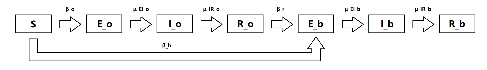

```{r setup, include=FALSE}
knitr::opts_chunk$set(warning = FALSE, message = FALSE, cache = TRUE)
```

```{r message=FALSE, warning=FALSE, include=FALSE}
library(tidyverse)
library(dplyr)
library(ggplot2)
library(pomp)
library(knitr)
library(forecast)
```

# Introduction

Coronavirus disease (COVID-19) is an infectious disease caused by the SARS-CoV-2 virus [1]. Most people infected by the virus will suffer from illness even though they are strong. Older people and those with underlying medical conditions like cardiovascular disease, diabetes, chronic respiratory disease, or cancer are more likely to develop serious illness. Anyone can get sick with COVID-19 and become seriously ill or die at any age. The virus mainly spreads from person to person among those in close contact. The ways to protect ourselves and others are mainly wearing a mask, staying 6 feet away from others, and get vaccinated. Even though there are vaccinations protecting people from being infected, the virus is also changing. Some variants of virus have been observed to be more infectious, and is more likely to cause breakthrough infections or reinfections in those who are vaccinated or previously infected. These variants are more likely to cause severe disease, evade diagnostic tests, or resist antiviral treatment. Alpha, beta, gamma, delta and omicron variants of the coronavirus are classified as variants of concern. 

In this project, we use the time series analysis approaches to investigate the pattern of COVID-19 infections. Our analysis is based on the data of daily confirmed cases in Turkey in 2020[2]. We aimed to explore the pattern of COVID-19 transmission after introducing the new variants in Turkey.

# Explanatory data analysis

We plot the time series of the infected cases in Turkey to have an overview of the data. As we can see, there is one peak in the data around day 50, it presents an outbreak of the corona virus among Turkey population. Although the Turkey government ordered a legal lockdown to restrict the spread of virus in April 2020 [3], the infected cases kept increasing until day 50. As infected people recovered gradually, the infected cases decreased. However, the infected cases continued increasing after days 150. Individuals recovered from the previous infection or got COVID-19 vaccination would have a relatively low risk to be infected again. Thus, we assume that the upward trend was caused by the occurrence of variant virus and the reopening of tourism in August 2020 [3] (around days 150 in the data). After introducing the new variant, people have recovered may also get infected again.  

```{r include=FALSE}
turkey = read.csv("covid_19_data_tr.csv")
turkey$day = 1:nrow(turkey)
#turkey = turkey[,-c(1,2)]
turkey$cases = turkey$Confirmed - turkey$Deaths - turkey$Recovered
```

```{r echo=FALSE}
plot(turkey$cases ~ turkey$day, type='l', xlab = "Days", ylab = "Cases", 
     main = "Daily infected cases in 2020")
```

We want to check the appearance of periodicity by the smoothed periodogram. The plot shown below indicates no evidence of obvious periodicity in the data.

```{r include=FALSE}
tp <-turkey$cases
tp[which(is.na(tp))]<-mean(tp,na.rm=TRUE)
sp = spectrum(tp,spans=c(5,10,10))
```

To check whether the data is stationary, we draw the ACF and PACF plots below. Although the significant lags in the PACF plot die out quickly, the lags in the ACF die out slowly, implying that the data is not stationary. 

```{r echo=FALSE}
acf(turkey$cases, lag.max=30, main = "Autocorrelation of daily cases")
```

```{r echo=FALSE}
pacf(turkey$cases, lag.max=30, main = "Partial autocorrelation of daily infected cases")
```

# ARIMA model

We begin our investigation by fitting a ARIMA model first which has been proved as an effective model to predict the virus [9], and consider it as the benchmark for further explorations. Since the data is non-stationary, we will try to fit a ARIMA(p,1,q) model:$$\phi(B)[\Delta Y_n-\mu] = \psi(B)\epsilon_n$$

where
$$
\begin{aligned}
\mu &= E[Y_n]\\
\phi(x) &= 1 - \phi_1x - \cdots - \phi_px^p\\
\psi(x) &= 1 + \psi_1x + \cdots + \psi_qx^q\\
\epsilon_n &\stackrel{i.i.d} \sim N[0,\sigma^2]
\end{aligned}
$$

```{r eval=FALSE, include=FALSE}
auto.arima(turkey$cases)
```

## Model selection

We use AIC criterion to choose the best model. The results of different $ARIMA(P,1,Q)$ model with parameters P and Q ranging from 0 to 2 to avoid error. The AIC table for each model are shown below.

```{r include=FALSE}
aic_table <- function(data,P,Q){
  table <- matrix(NA,(P+1),(Q+1))
  for(p in 0:P) {
    for(q in 0:Q) {
      table[p+1,q+1] <- arima(data,order=c(p,1,q))$aic
    }
    }
  dimnames(table) <- list(paste("AR",0:P, sep=""),
                          paste("MA",0:Q,sep=""))
  table
}
```

```{r echo=FALSE, message=FALSE, warning=FALSE}
x_aic_table <- aic_table(turkey$cases,2,2)
kable(x_aic_table,digits=2)
```

Among all models above, we could see $ARIMA(2,1,1)$ model has the smallest AIC 3385.08. However, since AIC penalized less for complexity, we also compare this model with $ARIMA(2,1,0)$ by the log likelihood ratio test (LRT) with 95% confidence level. The result shows that $ARIMA(2,1,0)$ is better for the data.

```{r include=FALSE}
fit1 = arima(turkey$cases,order=c(2,1,1))
fit0 = arima(turkey$cases,order=c(2,1,0))

log1 = fit1$loglik
log0 = fit0$loglik
log_diff = log1 - log0
p_value = (1 - pchisq(2 * log_diff, 1))
p_value < 0.05
```


```{r echo=FALSE}
arima210 <- arima(turkey$cases,order=c(2,1,0))
arima210
```


## Model Diagnostics

```{r echo=FALSE}
acf(arima210$residuals, lag.max = 50, main = "Residual Autocorrelation")
```


To check the uncorrelation assumption of the residuals, we draw a ACF plot. Except for lag 9 and 20, there are no significant lags, so it is reasonable to conclude that the uncorrelation assumption holds. 

```{r echo=FALSE, fig.height=5, fig.width=5}
autoplot(arima210, main = "Plotting the ARIMA(2,1,0) characteristic roots")
```


Since all inverse characteristic roots are allocated inside the unit circle, we can conclude that ARIMA(2,1,0) is causal.

```{r echo=FALSE}
qqnorm(arima210$residuals, main = "ARIMA(2,1,0) Q Q Plot")
qqline(arima210$residuals)
```

The QQ plots indicates that the distribution of the residuals deviates from the normal distribution, so the normality assumption may be invalid. However, since other assumptions holds well, we may still consider it as a benchmark for later analysis.

```{r echo=FALSE}
arima210$loglik
```

The log-likelihood of the ARIMA(2,1,0) model is -1692.303. We will use it as the baseline for later investigation.


# SEIREIR Model

As we mentioned in the introduction, Turkey government posted some restrictions in April and COVID-19 developed a new variant later that year[8], leading to a growth of infected cases after day 150. Since SEIR can capture the pattern of infection process with one peak well, it is not suitable for our data, we developed a SEIREIR model from the idea of some previous midterm project [4][5][10] and SEIRS model [7] to capture the pattern of reported infected cases, and some codes are adapted from the course notes[6]. 

```{r pressure, echo=FALSE, fig.cap="SEIREIR model", out.width = '100%', fig.align='center'}

```

The SEIREIR model consists of 7 states:

- $S$ is the number of susceptible people who can be exposed to both original and beta variant. 

- $E_o$ is the population exposed to the original variant. 

- $I_o$ is the infected and infectious population of the original variant. 

- $R_o$ is population recovered from original COVID. They can also be infected by beta variant 
(with a different infecting rate).

- $E_b$ is the population exposed to the beta variant. 

- $I_b$ is the infected and infectious population of the beta variant. 

- $R_b$ is population recovered from beta COVID.

The parameters in this model are: 

- $\beta_o*I_o$ is the rate of transferring from $S$ to $E_o$.

- $\beta_{or}*I_o$ is the rate of transferring from $S$ to $E_o$ after the government's restriction.

- $\beta_b*I_b$ is the rate of transferring from $S$ to $E_b$.

- $\beta_r*I_b$ is the rate of transferring from $R_o$ to $E_b$.

- $\mu_{EI_o}$ is the rate of transferring from $E_o$ to $I_o$.

- $\mu_{EI_b}$ is the rate of transferring from $E_b$ to $I_b$.

- $\mu_{IR_o}$ is the rate of transferring from $I_o$ to $R_o$.

- $\mu_{IR_r}$ is the rate of transferring from $I_o$ to $R_o$ after the government's 
restriction.

- $\mu_{IR_b}$ is the rate of transferring from $I_b$ to $R_b$.

- $\eta$ is the proportion of susceptible population in the whole population. - $k$ is a 
parameter to simulate the measurement process based on the latent process. 

- $N$ is the population of Turkey. 


The population transferring between the states is simulated as:

$$dSE_o(t) ~\sim Binomial(S,1-\exp(-\beta_o*I_o/N*dt)$$

$$dEI_o(t) ~\sim Binomial(E_o,1-\exp(-\mu_{EI_o}*dt))$$
$$dIR_o(t) ~\sim Binomial(I_o,1-\exp(-\mu_{IR_o}*dt))$$
$$dSE_b(t) ~\sim Binomial(S,1-\exp(-\beta_b*I_b/N*dt)$$

$$dRE_b(t) ~\sim Binomial(R_o,1-\exp(-\beta_r*I_b/N*dt)$$

$$dEI_b(t) ~\sim Binomial(E_b,1-\exp(-\mu_{EI_b}*dt))$$
$$dIR_b(t) ~\sim Binomial(I_b,1-\exp(-\mu_{IR_b}*dt))$$
The state $E_b$, $I_b$ and $R_b$ are activated by adding some infected cases to $I_b$ at some time in the year. 

Since Turkey took actions to fight against COVID in April, we use $\beta_{or}$ and $\mu_{IR_r}$ instead of the original parameter after the restrictions took place. 


## Model assumption: 

For simplicity, we set the birth rate, death rate as zero, which means that the population size in Turkey is constant during this period. The total population $N = S+E_o+I_o+R_o+E_b+I_b+R_b$. Moreover, the impacts of the medical development on the recovering and preventing from the infection are not considered in our model.

We implement the model as follows:


```{r echo=TRUE}
seireir_step <- Csnippet("
  double dN_SE_o = rbinom(S,1-exp(-Beta_o*I_o/N*dt));
  double dN_EI_o = rbinom(E_o,1-exp(-mu_EI_o*dt));
  double dN_IR_o = rbinom(I_o,1-exp(-mu_IR_o*dt));
  
  if (t>35){
    dN_SE_o = rbinom(S,1-exp(-Beta_or*I_o/N*dt));
    dN_EI_o = rbinom(E_o,1-exp(-mu_EI_o*dt));
    dN_IR_o = rbinom(I_o,1-exp(-mu_IR_r*dt));
  }
  double dN_RE_b = rbinom(R_o,1-exp(-Beta_r*I_b/N*dt));
  double dN_SE_b = rbinom(S-dN_SE_o,1-exp(-Beta_b*I_b/N*dt));
  double dN_EI_b = rbinom(E_b,1-exp(-mu_EI_b*dt));
  double dN_IR_b = rbinom(I_b,1-exp(-mu_IR_b*dt));
  double e = 0;
  if (t == 125) e = 10;
  S -= (dN_SE_o + dN_SE_b);
  E_o += dN_SE_o - dN_EI_o;
  I_o += dN_EI_o - dN_IR_o;
  R_o += dN_IR_o - dN_RE_b;
  E_b += dN_SE_b + dN_RE_b - dN_EI_b + e;
  I_b += dN_EI_b - dN_IR_b;
  R_b += dN_IR_b;
  H += (dN_IR_o + dN_IR_b);
")

seireir_init <- Csnippet("
  S = nearbyint(eta*N);
  E_o = 0;
  I_o = 100;
  R_o = 0;
  E_b = 0;
  I_b = 0;
  R_b = nearbyint((1-eta)*N);
  H = 0;
")

dmeas <- Csnippet("
  lik = dnbinom_mu(reports,k,rho*H,give_log);
   
  ")

rmeas <- Csnippet("
  reports = rnbinom_mu(k,rho*H);
  ")

turkey %>%
  dplyr::select(day,reports=cases) %>%
  filter(day<=232) %>%
  pomp(
    times="day",t0=0,
    rprocess=euler(seireir_step,delta.t=1/6),
    rinit=seireir_init,
    rmeasure=rmeas,
    dmeasure=dmeas,
    accumvars="H",
    statenames=c("S","E_o","I_o","R_o","E_b","I_b","R_b","H"),
    paramnames=c("Beta_o","Beta_b","Beta_r","mu_EI_o","mu_IR_o",
                 "Beta_or","mu_IR_r",
                 "mu_EI_b","mu_IR_b","eta","rho","k","N"),
    params=c(Beta_o=20,Beta_b = 50,Beta_or = 1, Beta_r = 50,mu_EI_o=0.18,
             mu_IR_o = 0.02,mu_EI_b = 0.05,mu_IR_r = 0.02, 
             mu_IR_b=0.01,rho=0.6,k=10,eta=0.1,N=84340000)
  ) -> measSEIREIR
```

We start with applying a p-filter for the model to test our model. The effective sample size (ESS) shows that the sample size is small around day = 10, but it increase to a high value later.

```{r echo=FALSE}
measSEIREIR %>%
  pfilter(Np=3000) -> pf1
plot(pf1)
```


```{r include=FALSE}
library(foreach)
library(doParallel)
registerDoParallel()

library(doRNG)
registerDoRNG(625904618)

foreach(i=1:10,.combine=c) %dopar% {
  library(pomp)
  measSEIREIR %>% pfilter(Np=3000)
} -> pf
 
```

```{r echo=FALSE}
pf %>% logLik() %>% logmeanexp(se=TRUE) -> L_pf
L_pf
```


```{r include=FALSE}
#new
pf[[1]] %>% coef() %>% bind_rows() %>%
  bind_cols(loglik=L_pf[1],loglik.se=L_pf[2]) %>%
  write_csv("covid_params.csv")
```

## Simulated graphs

We fix N=843400[4], the population of Turkey in 2020. We also fixed values of $\mu_{IR_o},\mu_{IR_b},\mu_{IR_r}$. After an individual got infected, the time of recovery (have a negative COVID-19 test) is about 2 weeks to 3 months, depending on the severity of infections, so the range of the recovery rate varies from $\frac{1}{2 week} =\frac{1}{14days} \approx 0.07 day^{-1}$ to $\frac{1}{1 month} = \frac{1}{92 days} \approx 0.01 day^{-1}$ [11]. Thus, we set our $\mu_{IR_o},\mu_{IR_b},\mu_{IR_r}$ within this range. Based on the current information we above, we simulate the plot to fit our data. From the plot shown below, we can observe the simulated data (red curves) may capture the main trend of original data (green curve) well.

```{r echo=TRUE}
measSEIREIR %>%
simulate(
params=c(Beta_o=20,Beta_b = 50,Beta_or = 1, Beta_r = 50,mu_EI_o=0.18,
             mu_IR_o = 0.02,mu_EI_b = 0.05,mu_IR_r = 0.02, 
             mu_IR_b=0.01,rho=0.6,k=10,eta=0.1,N=84340000),
nsim=20,format="data.frame",include.data=TRUE
) -> sims

sims %>%
ggplot(aes(x=day,y=reports,group=.id,color=.id=="data"))+
geom_line()+
guides(color="none")
```


```{r include=FALSE}
fixed_params <- c(N=84340000, mu_IR_o = 0.05,mu_IR_r = 0.03, 
             mu_IR_b=0.01,k=10)
coef(measSEIREIR,names(fixed_params)) <- fixed_params
```

### Local search

We first run a local search based on our initial guesses by employing the iterated filtering. In the trace plots shown below, we can see that the log likelihood increases gradually and successfully converge. We can also see that some parameters such as $\beta_0$ and $\beta_r$ goes upward, and some, such as $\mu_{EI_o}$ and $\mu_{EI_b}$ goes downwards. Some parameters, such as $\eta$, does not converge, so we have no clue about the direction they are moving towards in the local search.

```{r include=FALSE}
library(foreach)
library(doParallel)
registerDoParallel()
library(doRNG)
registerDoRNG(625904618)
```

```{r echo=TRUE}
params <- c(Beta_o=20,Beta_b = 50,Beta_or = 1, Beta_r = 50,mu_EI_o=0.18,
             mu_IR_o = 0.02,mu_EI_b = 0.05,mu_IR_r = 0.02, 
             mu_IR_b=0.01,rho=0.6,k=10,eta=0.1,N=84340000)
measSEIREIR %>%
  pomp(
    partrans=parameter_trans(log=c("Beta_o","Beta_b","Beta_r","Beta_or"),
                             logit=c("rho","mu_EI_o","mu_EI_b","eta")),
    paramnames=c("Beta_o","Beta_b","Beta_r","Beta_or","rho","mu_EI_o","mu_EI_b","eta"),
  ) -> measSEIREIR2

bake(file="local_search.rds",{
  registerDoRNG(482947940)
  foreach(i=1:20,.combine=c) %do% {
    library(pomp)
    library(tidyverse)
    measSEIREIR2 %>%
      mif2(
        params=params,
        Np=2000, Nmif=50,
        cooling.fraction.50=0.5,
        rw.sd=rw.sd(Beta_o=0.003,Beta_b = 0.002,Beta_or = 0.002, 
                    Beta_r = 0.002,mu_EI_o=0.002,mu_EI_b = 0.002,
             rho=0.002,eta=ivp(0.001))
      )
  } -> mifs_local
}) -> mifs_local
```


```{r echo=FALSE}
library(tidyverse)
mifs_local %>%
  traces() %>%
  melt() %>%
  ggplot(aes(x=iteration,y=value,group=L1,color=factor(L1)))+
  geom_line()+
  guides(color="none")+
  facet_wrap(~variable,scales="free_y")
```


```{r cache=FALSE, include=FALSE, eval=FALSE}
see = mifs_local %>%
  traces() %>%
  melt()

foreach(mf=mifs_local,.combine=rbind) %dopar% {
  library(pomp)
  library(tidyverse)
  evals <- replicate(10, logLik(pfilter(mf,Np=5000)))
  ll <- logmeanexp(evals,se=TRUE)
  mf %>% coef() %>% bind_rows() %>%
    bind_cols(loglik=ll[1],loglik.se=ll[2])
} -> local_results

save(list = c('local_results'),file = 'local.RData')
```


```{r echo=FALSE}
load('local.RData')
pairs(~loglik+Beta_o+Beta_b+Beta_or+Beta_r+mu_EI_o+mu_EI_b+
      rho+eta,data=local_results,pch=16)
```

Based on the local search plot shown above, we observe a clear pattern that a higher value of $\beta_o$ and a lower value of $\mu_o$ is associated with a higher log-likelihood. However, since none of them reach a local maximum, we continue the exploration by the global search.


```{r include=FALSE}
read_csv("covid_params.csv") %>%
  bind_rows(local_results) %>%
  arrange(-loglik) %>%
  write_csv("covid_params.csv")
```

## Global search 

We use a global search from multiple starting points to carry out parameter estimation for dynamic system. We randomly select 160 starting values for parameters, which follow a multivariate uniform distribution, where $\beta_o \in [1,100]$, $\beta_b \in [50,140]$, $\beta_{or} \in [0.5,10]$, $\beta_r \in [30,70]$, $\mu_{EI_o} \in [0.1, 0.3]$, $\mu_{EI_b} \in [0.03, 0.2]$, $\rho \in [0.2, 1]$, and $\eta \in [0, 1]$.

```{r echo=TRUE}
set.seed(2062379496)
runif_design(
  lower = c(Beta_o=1,Beta_b = 50,Beta_or = 0.5, 
            Beta_r = 30,mu_EI_o=0.1,mu_EI_b = 0.03,
            rho=0.2,eta = 0),
  upper = c(Beta_o=100,Beta_b = 140,Beta_or = 10, 
            Beta_r = 70,mu_EI_o=0.3,mu_EI_b = 0.2,
            rho=1,eta = 1),
nseq=160
) -> guesses
```

```{r include=FALSE}
mf1 <- mifs_local[[1]]
```

```{r include=FALSE, eval=FALSE}
bake(file="global_search.rds",{
  foreach(guess=iter(guesses,"row"), .combine=rbind) %dopar% {
  library(pomp)
  library(tidyverse)
  mf1 %>%
    mif2(params=c(guess,fixed_params)) %>%
    mif2(Nmif=50) -> mf
  replicate(
    10,
    mf %>% pfilter(Np=1000) %>% logLik()
    ) %>%
    logmeanexp(se=TRUE) -> ll
  mf %>% coef() %>% bind_rows() %>%
    bind_cols(loglik=ll[1],loglik.se=ll[2])
} -> results
  results
}) %>% 
  filter((is.finite(loglik)))-> global_results


save(list = c('global_results'),file = 'global.RData')
```

```{r echo=FALSE}
load('global.RData')

read_csv("covid_params.csv") %>%
  bind_rows(global_results) %>%
  filter(is.finite(loglik)) %>%
  arrange(-loglik) %>%
  write_csv("covid_params.csv")

read_csv("covid_params.csv") %>%
  filter(loglik>max(loglik)-50) %>%
  bind_rows(guesses) %>%
  mutate(type=if_else(is.na(loglik),"guess","result")) %>%
  arrange(type) -> all

pairs(~loglik+Beta_o+Beta_b+Beta_or+Beta_r+mu_EI_o+mu_EI_b+
      rho+eta, data=all, pch=16, cex=0.3,
      col=ifelse(all$type=="guess",grey(0.5),"red"))
```


In the plots of global search shown above, the grey points represent starting values, and red points represent IF2 estimates. Since we fixed the parameter $N$, $\mu_{IR_o}$, $\mu_{IR_r}$, and $\mu_{IR_b}$, their plots are not shown above. We can observe that all parameters converge on a particular region in the parameter space, which gives us some confidence in our maximization procedure and provides a clear view of the changes in log likelihood with various parameter values. However, some plots in the first row shows that we does not reach the local maximum, which implies the needs of furthur investigations.


```{r include=FALSE}
read_csv("covid_params.csv") %>%
  filter(loglik>max(loglik)-30,loglik.se<2) %>%
  arrange(loglik) -> box
head(box,6)
```


```{r echo=FALSE}
measSEIREIR %>%
simulate(
params=c(Beta_o=40.15,Beta_b = 36,Beta_or =0.66, Beta_r = 57,mu_EI_o=0.14,
             mu_IR_o = 0.02,mu_EI_b = 0.03,mu_IR_r = 0.02, 
             mu_IR_b=0.01,rho=0.64,k=10,eta=0.1,N=84340000),
nsim=20,format="data.frame",include.data=TRUE
) -> sims

sims %>%
ggplot(aes(x=day,y=reports,group=.id,color=.id=="data"))+
geom_line()+
guides(color="none")
```

According to our current investigation, the maximum log likelihood of the SEIREIR model is -2336 with standard error of 0.023. The new simulation with the MLE looks better than the one with our initial guesses.It successfully capture the peak and the increasing trend after days 150.


# Conclusion

In this project we build an SEIREIR model based on our interpretation of the COVID-19 issues in the year of 2020. Since we notice there are two peaks in the cases of people infected by COVID and we are inspired by the fact that there are new variants of this virus, we consider the new peak of the cases might result from the new variant. People who have been infected before might also be easily infected by the new variant and the rate of the new variant disperse and people recovering is also changing. Trying to simulate and analyze this dynamic process, we connect additional EIR states to model the new variant of COVID-19. The maximum log likelihood of our POMP model is -2336, which is much smaller than that of ARIMA. In the simulation figure of POMP, we see the POMP model fits the data well. However, it still can't beat the ARIMA. 

Our pomp model can not model the COVID process in the real world perfectly. The model is based on some assumptions: there is no fluctuation in the population, the influence of medical development on the recovering and the case that one can be exposed to both alpha and beta variant is not considered. Predicting COVID-19 is a complex problems, actually, many factors like quarantine, policy, and vaccination should be taken into consideration. We could imporve our model by adding more features. 

# Reference

[1] Coronavirus disease (COVID-19), https://www.who.int/health-topics/coronavirus#tab=tab_1

[2] Data sources: https://www.kaggle.com/datasets/gkhan496/covid19-in-turkey

[3] Covid-19 in Turkey, https://en.wikipedia.org/wiki/COVID-19_pandemic_in_Turkey#cite_note-:0-9

[4] An Analysis of COVID-19 Cases in Washtenaw County, https://ionides.github.io/531w21/final_project/project15/blinded.html

[5] An Investigation into COVID-19 in California, https://ionides.github.io/531w21/final_project/project13/blinded.html

[6] Course notes, https://ionides.github.io/531w22/

[7] The SEIRS model for infectious disease dynamics, https://www.nature.com/articles/s41592-020-0856-2

[8] Turkey braces for new COVID-19 variant amid pandemic lull, https://www.dailysabah.com/turkey/turkey-braces-for-new-covid-19-variant-amid-pandemic-lull/news

[9] ARIMA modelling & forecasting of COVID-19 in top five affected countries, https://www.ncbi.nlm.nih.gov/pmc/articles/PMC7386367/

[10] Final Project Case study on the United States COVID-19 data based on the SEIR model, https://ionides.github.io/531w20/final_project/Project33/final.html

[11] Ending Isolation and Precautions for People with COVID-19: Interim Guidance, https://www.cdc.gov/coronavirus/2019-ncov/hcp/duration-isolation.html

