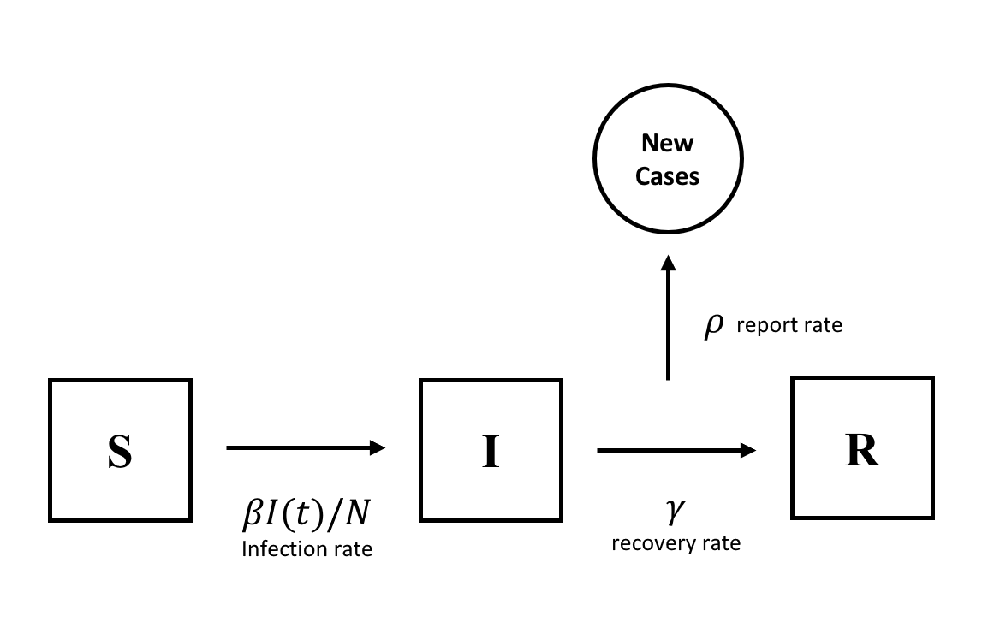
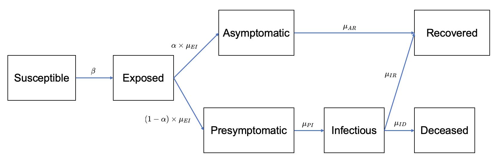

```{r setup, include=FALSE}
knitr::opts_chunk$set(echo = FALSE, fig.align = 'center')
```

```{r library, include=FALSE}
library(COVID19)
library(tidyverse)
library(foreach)
library(doParallel)
library(pomp)
registerDoParallel()
library(doRNG)
registerDoRNG(10)
set.seed(10)
```

# Introduction

COVID-19 (coronavirus disease 2019) is a disease caused by a virus named SARS-CoV-2. It is very contagious and has quickly spread around the world. The virus constantly changes through mutation. Since the beginning of the pandemic, we've seen several prominent variants, including Alpha, Beta, Delta, and Omicron. Among them, Omicron is now the dominant strain of the coronavirus in the world that causes COVID-19. The Omicron variant spreads more easily than earlier variants of the virus that cause COVID-19, including the Delta variant. CDC (Centers for Disease Control and Prevention) expects that anyone with Omicron infection, regardless of vaccination status or whether or not they have symptoms, can spread the virus to others [1]. Learning more about the Omicron variant and preventing its spread helps to fight COVID-19. 

In this project, we analyze the confirmed cases of Omicron in South Africa from a time series analysis perspective. In particular, we hope to describe the spread of Omicron given this time interval by using tools in the time analysis aspect. To achieve that, we fit the data using the ARMA model and POMP models and compare their performance.

# Exploratory Data Analysis

```{r preprocessing}
covid19(country = "South Africa", start = "2021-11-01", end = "2022-04-12",
        verbose = FALSE) %>%
  select(date, confirmed, deaths) %>%
  mutate(confirmed.new = c(diff(confirmed), 0),
         confirmed.newsm = round(c(zoo::rollmean(confirmed.new, 7), rep(0, 6))),
         death.new = c(diff(deaths), 0)) %>%
  mutate(death.new = replace_na(death.new, 0),
         death.newsm = round(c(zoo::rollmean(death.new, 7), rep(0, 6)))) %>%
  slice((-length(confirmed)+6):-length(confirmed)) -> data
```

The data is obtained from the “COVID-19 Data Hub” [2]. We study the Omicron cases in South Africa because it is the place where the Omicron variant of the coronavirus SARS-CoV-2 was first detected and then spreads around the world a little more than two months after [3]. We focus on the data after December $1^{st}$, 2021 when the Omicron became the dominant version of the confirmed cases in South Africa. The original data for the number of confirmed cases is the cumulative data. In this analysis, we make the difference between the confirmed cases and those in the previous days to achieve the number of daily new confirmed cases. We notice from the time plot that the data skews to the right with the peak appearing in the mid of December. We have 156 data points with a mean of 5160.167 and a standard error of 6593.398. The highest number of daily confirmed cases is 37875 which happened on December $11^{th}$, 2021. The majority of the data points are between the range of 1278 and 5074. The data is visualized in the following, where the red line represents the 7-days moving average, and the blue line represents the daily new death cases.

```{r EDA_number, eval=FALSE}
mean(data$confirmed.new)
sd(data$confirmed.new)
quantile(data$confirmed.new, c(0, 0.25, 0.5, 0.75, 1.00))
```

```{r EDA_visualization_trend}
data %>%
  ggplot(aes(x = date, y = confirmed.new)) + 
  geom_line() + 
  geom_point() + 
  geom_line(aes(x = date, y = death.newsm*50), color = 'blue') + 
  geom_line(aes(x = date, y = confirmed.newsm), color ='red') +
  scale_y_continuous(
    name = 'Daily new cases',
    sec.axis = sec_axis(trans=~.*(1/10.56), name="Daily new deaths")
  ) + 
  theme_minimal()
```

We noticed that there are some unusual fluctuations with a period of about 7 days, indicating that there might be some periodic pattern. The autocorrelation plot is the following:

```{r EDA_acf}
 with(acf(data$confirmed.new, plot = F), data.frame(lag, acf)) %>%
  ggplot(aes(x = lag, y = acf)) + 
  geom_hline(aes(yintercept = 0)) +
  geom_segment(mapping = aes(xend = lag, yend = 0)) +
  geom_hline(yintercept=c(-1,1)*qnorm((1 + 0.95)/2)/sqrt(acf(data$confirmed.new, plot = F)$n.used), 
             lty=2, col='blue') +
  scale_y_continuous('ACF')
```

# ARMA model

The stationary ARMA(p,q) model with parameters $(\phi_{1:p}, \psi_{1:q}, \mu, \sigma^2)$ is given by $[4]$:

$$\Phi(B)(Y_n - \mu) = \Psi(B)\epsilon_n$$

and functions and parameters are defined as these:

$$\mu = E[Y_n]$$

$$\Phi(x) = 1 - \phi_1 x - \phi_2 x^2 - ... - \phi_p x^p$$

$$\Psi(x) = 1 + \psi_1 x + \psi_2 x^2 + ... + \psi_q x^q$$

$$\epsilon_n \sim N(0, \sigma^2)$$

The optimal $(p,q)$ parameters are decided using AIC criterion and for this purpose, we generate AIC table as the following:

```{r ARMA_aictable}
aic_table <- function(data,P,Q){table <- matrix(NA,(P+1),(Q+1)) 
for(p in 0:P) {
  for(q in 0:Q) {
    table[p+1,q+1] <- arima(data,order=c(p,0,q))$aic
    }}
dimnames(table) <- list(paste("AR",0:P, sep=""),
                        paste("MA",0:Q,sep=""))
return(table)
}
knitr::kable(aic_table(data$confirmed.new,4,4),digits=2)
```

This suggests a model of $ARMA(3,3)$, and the model fitting summary are the following:

```{r ARMA_result}
(arma_33 <- arima(data$confirmed.new, order = c(3,0,3)))
cbind(aic = arma_33$aic, loglikelihood = arma_33$loglik)
```

We then do a causality and invertibility check. Based on the result, the model is invertible and causal.
```{r causality and invertibility}
fin_model = arima(data$confirmed.new,order=c(3,0,3))
coeffs = fin_model$coef
roots_AR <- polyroot(c(1,-coeffs["ar1"], -coeffs["ar2"], -coeffs["ar3"]))
cat("Absolute value of AR polynomial roots are: ", abs(roots_AR))
roots_MA <- polyroot(c(1,coeffs["ma1"], coeffs["ma2"], coeffs["ma3"]))
cat("\nAbsolute value of MA polynomial roots are: ", abs(roots_MA))
```

We do a small model diagnostic as the following, which seems to suggest that our model performance is not that well. Hence, we continue to conduct the specturm analysis to find some periodic patterns.

```{r ARMA_diagnostic}
par(mfrow=c(1,3))
plot(as.vector(arma_33$residuals), cex=0.5, ylab = "Residuals")
abline(h=0, col='red')
acf(arma_33$residuals, main = "Residuals ACF")
qqnorm(arma_33$residuals, main = "ARMA(3,3) residual QQ plot")
qqline(arma_33$residuals)
```

# Spectrum Analysis

We can find the period by conducting a spectrum analysis. We approximate the spectral density function of the data by using a smoothed periodogram $[4]$. There seem to be a couple of dominant frequencies as is shown in the spectrum plot. The first $\omega_1$ corresponds to the number of days the data set which does not seem to be interesting. The next $\omega_2$ of 0.142 corresponds to a period of about 7. This suggests that the periodicity of our data is about one week. There is another local maximum $\omega_3$ at around 0.283 and this corresponds to the second harmonic of $\omega_2$ so that we can ignore it. One-week periodicity fits in with our intuition as many institutions post the number of confirmed cases weekly. As a result, the data we have may show the periodicity of a week. The period may also be because there is less staff working on Covid testing for people on weekends so that fewer confirmed cases are noticed.

```{r spectrum}
cycle_spec <- spectrum(data$confirmed.new, spans=c(10,10),
                       main="Spectrum of daily confirmed cases", 
                       ylab="spectrum", xlab="Cycles per day")
peak_freq <- cycle_spec$freq[which.max(cycle_spec$spec)]
period <- 1/peak_freq
abline(v = c(peak_freq, 0.142, 0.283),
       col=c("red", "blue", "grey"), 
       lty=c(2,2,2))
period2 = 1/0.142
```

# POMP - SIR model

In this section we tried to analyse the omicron data using the basic POMP SIR model. We treat the omicron pandemic as a partially observed Markov process, with only three basic states: 

1) Susceptible - All individuals at the start

2) Infectious - Individuals that has been infected by Omicron

3) Recovered - Individuals that has been recovered

Here is the state diagram of the model:

```{r SIR_vis}

```

Here is the parameters defined for our model

i. $N = S(t) + I(t) + R(t)$ is the total number of the population. This variable is given as a constant and it is not estimated

i. $\mu_{SI} = \dfrac{\beta I(t)}{N}$ is the infection rate. We are able to change $\beta$ which is defined as the force of infection. The variable $B$ is estimated.

i. $\mu_{IR} = \gamma$ is the recovery rate. This variable is estimated.

i. $\rho$ is the rate in which cases are reported. This variable is estimated.

i. $\eta$ is the another parameter we are going to estimate. It is defined as the fraction of population that are susceptible. This variable is estimated.

i.  We also have one additional variable $H$ which is an accumulator variable. It is the number of individuals who have moved from State $I$ to the state $R$ over the course of that week. Accumulator variables are not estimated.

We model the data by a negative binomial variable $[4]$: $reports \sim NegBin(\rho H(t), k)$. The variable k is also estimated.

We simulated our model with different parameters to find a suitable initialization for our pomp model. After several simulations, the model is initialized with values of $N = 5*10^7$ (fixed), $\beta = 9$ (will be estimated), $\mu_{IR} = 0.04$ (will be estimated), $\rho = 0.5$ (will be estimated), $k=10$ (will be estimated), $\eta = 0.04$ (will be estimated). It is worth to mention that reaching these values also involved particle filtering runs. Here it the simulations for initial values:

```{r SIR_load}

sir_step <- Csnippet("
  double dN_SI = rbinom(S,1-exp(-Beta*I/N*dt));
  double dN_IR = rbinom(I,1-exp(-mu_IR*dt));
  S -= dN_SI;
  I += dN_SI - dN_IR;
  R += dN_IR;
  H += dN_IR;
")


sir_rinit <- Csnippet("
  S = nearbyint(eta*N);
  I = 169;
  R = nearbyint((1-eta)*N);
  H = 169;
")

sir_dmeas <- Csnippet("
  double ll = dnbinom_mu(reports,k,rho*H,give_log);
  lik =  (!isfinite(ll) ? -100 : ll );
")

sir_rmeas <- Csnippet("
  reports = rnbinom_mu(k,rho*H);
")

data %>%
    transmute(date = as.numeric(date) - min(as.numeric(date)),
              reports=confirmed.new) %>%
    pomp(times='date', t0=0,
       rprocess=euler(sir_step, delta.t=1),
       rinit=sir_rinit, 
       accumvars='H',
       rmeasure = sir_rmeas,
       dmeasure = sir_dmeas,       
       statenames=c('S','I','R', 'H'),
       paramnames=c("N","Beta","mu_IR","rho","eta", "k"),
       partrans=parameter_trans(
         log=c("Beta","mu_IR", "k"),
         logit=c("eta","rho")),
       params=c(Beta=9,mu_IR=0.04,rho=0.5,k=10,eta=0.04,N=50000000)) -> omicronSIR
```

```{r SIR_simulation_initial}
omicronSIR %>%
  simulate(params=c(Beta=9, mu_IR=0.04, rho=0.5, k=10, eta=0.04, N=50000000), #taken from one of the runs
           rinit=sir_rinit,
           statenames=c('S','I','R', 'H'),
           paramnames=c("N","Beta","mu_IR","rho","eta", "k"),
           partrans=parameter_trans(
         log=c("Beta","mu_IR","k"),
         logit=c("eta","rho")),
    nsim=4,format="data.frame",include.data=TRUE) %>%
  ggplot(aes(x=date,y=reports,group=.id,color=.id=="data"))+
  geom_line()+
  guides(color="none") 
```

After running the POMP model (mif2 function), we get the following results. The log likelihood soon converges.

``` {r pomp_sir_local_search}
foreach(i = 1:16, .combine = c) %dopar% {
  omicronSIR %>% pfilter(Np = 2000)
} -> pf_SIR
#pf_SIR %>% logLik() %>% logmeanexp(se=TRUE) 

foreach(i = 1:16, .combine = c) %dopar% {
  omicronSIR %>%
    mif2(
        Np=100, Nmif=150,
        cooling.fraction.50=0.5,
        rw.sd=rw.sd(Beta=0.01, rho=0.005, mu_IR=0.005, eta=ivp(0.005), k = 0.01)
      )
} -> mifs_local_sir

mifs_local_sir %>%
  traces() %>%
  melt() %>%
  ggplot(aes(x=iteration,y=value,group=L1,color=factor(L1)))+
  geom_line()+
  guides(color="none")+
  facet_wrap(~variable,scales="free_y")

foreach(mf=mifs_local_sir, .combine=rbind) %dopar% {
  library(pomp)
  library(tidyverse)
  evals <- replicate(5, logLik(pfilter(mf, Np=2000)))
  ll <- logmeanexp(evals, se=TRUE)
  mf %>% coef() %>% bind_rows() %>% 
    bind_cols(loglik=ll[1], loglik.se=ll[2])
} -> local_results_sir
```

It seems that all parameters converge to specific intervals while widths of intervals change. Here is the simulation of the model with estimated group of parameters $\beta=16.49857$, $\mu_{IR}=0.02254904$, $\rho=0.4073849$, $k=3.991062$, $\eta=0.04078927$, $N=50000000$,the best log likelihood is -1997, with a standard error of 6.98.

```{r SIR_simulation_local_best}
omicronSIR %>%
  simulate(params=c(Beta=16.49857 ,mu_IR=0.02254904 ,rho=0.4073849  ,k=3.991062 ,eta=0.04078927  ,N=50000000), #taken from one of the runs
           rinit=sir_rinit,
           statenames=c('S','I','R', 'H'),
           paramnames=c("N","Beta","mu_IR","rho","eta", "k"),
           partrans=parameter_trans(
         log=c("Beta","mu_IR","k"),
         logit=c("eta","rho")),
    nsim=4,format="data.frame",include.data=TRUE) %>%
  ggplot(aes(x=date,y=reports,group=.id,color=.id=="data"))+
  geom_line()+
  ggtitle('Local simulation result')+
  guides(color="none") 
```

Then, we conduct a global search over the parameter space $\beta \sim [0.1, 50], \mu_{IR}\sim[0.01, 1], \rho\sim[0.01, 0.99], k\sim[0.1, 10], \eta \sim [0.01,0.99]$. The likelihood for the local and global result is the following, with a simulation of the best model estimated with parameters $\beta=0.932$, $\mu_{IR}=0.0216$, $\rho=0.964$, $k=0.402$, $\eta=0.575$, $N=50000000$,the best log likelihood is -1677, with a standard error of 0.243.

```{r SIR_global_search}
covid_box_sir <- rbind(
  Beta=c(0.1,50),
  mu_IR=c(0.01,1),
  rho=c(0.01,0.99),
  k=c(0.1,10),
  eta=c(0.01,0.99)
)

foreach(i=1:16,.combine=c) %dopar% {
  library(pomp)
  library(tidyverse)
  mif2(omicronSIR,
       params = c(apply(covid_box_sir,1,function(x)runif(1,x[1],x[2])), N=500000),
       Np=2500,
       Nmif=250,
       cooling.fraction.50=0.5,
       rw.sd=rw.sd(Beta=0.01, rho=0.005, mu_IR=0.005, eta=ivp(0.005), k = 0.01)) 
} -> mifs_global_sir

foreach(mf=mifs_global_sir, .combine=rbind) %dopar% {
  library(pomp)
  library(tidyverse)
  evals <- replicate(5, logLik(pfilter(mf, Np=2000)))
  ll <- logmeanexp(evals, se=TRUE)
  mf %>% coef() %>% bind_rows() %>% 
    bind_cols(loglik=ll[1], loglik.se=ll[2])
} -> global_results_sir

local_results_vis_sir <- local_results_sir
local_results_vis_sir['type'] <- 0
global_results_vis_sir <- global_results_sir
global_results_vis_sir['type'] <- 1
results_vis_sir <- rbind(local_results_vis_sir, global_results_vis_sir)

pairs(~loglik+Beta+mu_IR+rho+k+eta,pch=16, data = results_vis_sir, col=ifelse(results_vis_sir$type==0,grey(0.5),"red"))

omicronSIR %>%
  simulate(
    params=unlist(global_results_sir[1, ]),
    nsim=10,format="data.frame",include.data=TRUE
  ) %>%
  ggplot(aes(x=date,y=reports,group=.id,color=.id=="data"))+
  geom_line()+
  ggtitle('Global simulation result')+
  guides(color="none") 
```

```{r SIR_diag, eval=FALSE}
par(mfrow=c(1,2))
loglik_convergence_local_sir <- do.call(cbind,
  traces(mifs_local_sir,"loglik"))
matplot(loglik_convergence_local_sir,type="l",lty=1,
  ylim=max(loglik_convergence_local_sir,na.rm=T)+c(-10,0))
loglik_convergence_global_sir <- do.call(cbind,
  traces(mifs_global_sir,"loglik"))
matplot(loglik_convergence_global_sir,type="l",lty=1,
  ylim=max(loglik_convergence_global_sir,na.rm=T)+c(-10,0))
```


Since the simulation result is not that good, we are also going to utilize more complex POMP model.

# POMP - SEAPIRD model

Since the SIR model fails to give a fairly good performance, we implemented a more complicated framework comparing to the basic SIR model, the SEAPIRD (Susceptible-Exposed-Asymptomatic-Presymptomatic-Infectious-Recovered-Deceased) model $[6]$. Comparing to the basic SIR and SEIR model, it adds three mode states: asymptomatic, presymptomatic and deceased. Since some omicron patients do not show any clear symptoms while remaining infectious to other people, it may be proper for us to include that state in our model, and the presymptomatic state acts like a bridge state from exposed to infectious (with symptoms). Also, even though omicron variant is not as fatal as the delta variant, death cases are still reported in major countries, and hence we also include the deceased states to denote death. Graphically, our model can be represented in this figure:

```{r SEAPIRD_vis, fig.width=6}

```

Though the basic logic is the same with the SIR model, we still introduced several new parameters here. $\beta$ is the transmission rate from Susceptible people to exposed people, with the number of change modeled by $\Delta N_{SE} \sim Binomial(S, 1-e^{-\beta \frac{I+A+P}{N}\Delta t})$. $\alpha$ denotes the proportion of asymptomatic patients, therefore we set the asymptomatic change follows $\Delta N_{EA} \sim \alpha \times Binomial(E, 1-e^{-\mu_{EI}\Delta t})$. Consequently, the presymptomatic change follows $\Delta N_{EP} \sim (1-\alpha) \times Binomial(E, 1-e^{-\mu_{EI}\Delta t})$. The rest parts are similar with basic SIR model $[5]$:

$$
\begin{aligned}
\Delta N_{AR} &\sim Binomial(A, 1-e^{-\mu_{AR}\Delta t}) \\
\Delta N_{PI} &\sim Binomial(P, 1-e^{-\mu_{PI}\Delta t}) \\
\Delta N_{IR} &\sim Binomial(I, 1-e^{-\mu_{IR}\Delta t}) \\
\Delta N_{ID} &\sim Binomial(I, 1-e^{-\mu_{ID}\Delta t}) \\
\end{aligned}
$$

Also, since local government will possibly take procedures to keep virus from spreading, hence, we add three parameters $c_1, c_2, c_3$ into the transition from susceptible from exposed, each measures 50 days of the Markov process. $\Delta N_{SE} \sim Binomial(S, 1-e^{-\beta \times c_i \frac{I+A+P}{N}\Delta t})$.

Another different thing from the SIR model is that we model the weekly reported cases as normal distribution rather than negative binomial. Since our reported cases is fairly large and the mode is around 1925. Thus, we parametrize the reported cases as $Y_{cases} \sim Normal(\rho H, \tau  \rho H (1-\rho))$.

The final step is parameter configuration and initialization. we set our $\Delta_t$ as 1 day, and $S=500000, I=169$ according to our data. We tried to first simulate using a parameter setting: $\beta=1.83,\mu_{IR}=0.02,\mu_{ID}=0.0002,\mu_{EI}=0.86,\alpha=0.67,\mu_AR=0.85,\mu_{PI}=0.81,c_1=1.06,c_2=4.79,c_3=1.45,\rho=0.98,N=500000,\tau=154735$. Another note is that in this part, we used the 7-day average smoothed version of the daily new cases.

```{r SEAPIRD_load}
intervention_indicator <- rep(0, length(data$date))
for(i in 1:length(data$date)){
  if(i < 50){
    intervention_indicator[i] <- 1
  }
  else if(i >= 50 & i < 100){
    intervention_indicator[i] <- 2
  }
  else{
    intervention_indicator[i] <- 3
  }
}

data %>%
  transmute(date = as.numeric(date) - min(as.numeric(date)),
            cases = confirmed.new,
            deaths = death.new) -> omicron_new
omicron_covar <-  covariate_table(
  day=omicron_new$date,
  intervention = intervention_indicator, 
  times="day"
)

seapird_step <- Csnippet("
    double beta_intervention;
    
    if (intervention == 1){
        beta_intervention = Beta*c_1;
    }
    else if (intervention == 2){
        beta_intervention = Beta*c_2;
    }
    else if (intervention == 3){
       beta_intervention = Beta*c_3;
    }
    else beta_intervention = Beta;
    
  double dN_SE = rbinom(S,1-exp(-beta_intervention*(I+P+A)/N*dt));
  double dN_EI = rbinom(E,1-exp(-mu_EI*dt));
  double dN_PI = rbinom(P,1-exp(-mu_PI*dt));
  double dN_IR = rbinom(I,1-exp(-mu_IR*dt));
  double dN_ID = rbinom(I - dN_IR,1-exp(-mu_ID*dt));
  double dN_AR = rbinom(A,1-exp(-mu_AR*dt));
  
  S -= dN_SE;
  E += dN_SE - dN_EI;
  P += nearbyint((1 - alpha) * dN_EI) - dN_PI;
  A += nearbyint(alpha * dN_EI) - dN_AR;
  I += dN_PI - dN_IR - dN_ID;
  R += dN_IR + dN_AR;
  D += dN_ID;
  H += dN_IR + dN_AR;
")

seapird_init <- Csnippet("
  S = N;
  E = 0;
  P = 0;
  A = 0;
  I = 169;
  R = 0;
  D = 0;
  H = 0;
")

seapird_rmeas <- Csnippet("
    double mean_cases = rho*H;
    double sd_cases = sqrt(tau*rho*H*(1-rho)) ;
    cases =  rnorm(mean_cases,sd_cases) + D;
    deaths = D;
    if (cases > 0.0) {
        cases = nearbyint(cases);
      } else {
    cases = 0.0;
    
    if(sd_cases == 0){
    cases = 0.0;
    }
}
")

seapird_dmeas <- Csnippet("
  double tol = 1.0e-10;
  double mean_cases = rho*H;
  double sd_cases = sqrt(tau*rho*H*(1-rho));
  
  if(sd_cases == 0){
    lik = tol;
  }
  else{
    lik = dnorm(cases-deaths, mean_cases, sd_cases, 0);
  }
  
  if (give_log) lik = log(lik);
  ")

omicronSEAPIRD <- pomp(
  data = omicron_new, 
  times = "date",
  t0 = 0,
  rprocess=euler(seapird_step, delta.t=1),
  rinit=seapird_init,
  rmeasure=seapird_rmeas,
  dmeasure=seapird_dmeas,
  accumvars="H",
  partrans=parameter_trans(
    log=c("Beta","c_1", "c_2", "c_3", "mu_AR",
          "mu_IR", "mu_ID", "mu_PI", "mu_EI", "tau"),
    logit=c("rho", "alpha")
  ),
  covar=omicron_covar,
  obsnames = c("cases", "deaths"),
  paramnames=c("N","Beta","mu_IR", "mu_ID", "mu_EI", "alpha",
               "mu_AR", "mu_PI", "c_1", "c_2", "c_3", "rho",
               "tau"),
  statenames=c("S","E","P", "A", "I","R","D","H")
)
```

```{r SEAPIRD_basic_sim}
omicronSEAPIRD %>%
  simulate(
    params= c(Beta=1.83,mu_IR=0.02,mu_ID=0.0002,mu_EI=0.86,alpha=0.67,
              mu_AR=0.85,mu_PI=0.81,c_1=1.06,c_2=4.79,c_3=1.45,
              rho=0.98,N=500000, tau=154735),
    nsim=5,format="data.frame",include.data=TRUE
  ) %>%
  ggplot(aes(x=date,y=cases,group=.id,color=.id=="data"))+
  geom_line()+
  guides(color="none") 
```

Simulation result is poor using this parameter setting. But the shape somehow looks similar, and therefore we conduct a local search and a global search. For the local search, we can see that the log likelihood soon converges, and some of the parameter like $\mu_{EI}, \rho$ also converge quickly. The other parameters seem not converge to a point, but they remain stable in a range. Also, to show how the resulting parameter performs, we put the parameter with the best log likelihood result.

```{r SEAPIRD_local_global}
# Local Search

foreach(i=1:16,.combine=c) %dopar% {
  library(pomp)
  library(tidyverse)
  mif2(omicronSEAPIRD,
       params = c(Beta=2,mu_IR=0.8,mu_ID = 0.0002,mu_EI=0.5,alpha=0.65,
                  mu_AR=0.5,mu_PI=0.5,c_1=1.1,c_2=1.5,c_3=0.8,
                  rho=0.2,N=500000, tau=2000),
       Np=1000,
       Nmif=200,
       cooling.fraction.50=0.5,
       rw.sd=rw.sd(Beta=0.01, mu_IR=0.01, mu_ID=0.01, mu_EI=0.01, alpha=0.01, mu_AR=0.01, mu_PI=0.01, c_1=0.01, c_2=0.01, c_3=0.01, rho=0.01, tau=0.01)) 
} -> mifs_local_seapird

foreach(mf=mifs_local_seapird, .combine=rbind) %dopar% {
  library(pomp)
  library(tidyverse)
  evals <- replicate(5, logLik(pfilter(mf, Np=2000)))
  ll <- logmeanexp(evals, se=TRUE)
  mf %>% coef() %>% bind_rows() %>% 
    bind_cols(loglik=ll[1], loglik.se=ll[2])
} -> local_results_seapird

local_results_seapird %>%
  filter(is.finite(loglik)) %>%
  arrange(-loglik) -> best_local_searches_seapird

mifs_local_seapird %>%
  traces() %>%
  melt() %>%
  ggplot(aes(x=iteration,y=value,group=L1,color=factor(L1)))+
  geom_line()+
  guides(color="none")+
  facet_wrap(~variable,scales="free_y")

local_sim_seapird <- omicronSEAPIRD %>%
  simulate(
    params=unlist(local_results_seapird[1, ]),
    nsim=10,format="data.frame",include.data=TRUE
  ) %>%
  ggplot(aes(x=date,y=cases,group=.id,color=.id=="data"))+
  geom_line()+
  ggtitle('Local simulation result')+
  guides(color="none") 

#pairs(~loglik+Beta+rho+mu_IR+mu_ID+mu_EI+alpha,data=local_results,pch=16, col="red")

# Global Search

omicron_box <- rbind(
  Beta=c(0.1,10),
  mu_IR=c(0.01,1),
  mu_ID=c(0.00000001,.0001),
  mu_EI=c(0.01,1),
  alpha=c(0.1,1),
  mu_AR=c(0.01,4),
  mu_PI=c(0.01,2),
  rho=c(0.01,0.99),
  c_1=c(0.1,5),
  c_2=c(0.1,10),
  c_3=c(0.1,4),
  tau=c(10000,40000)
)

foreach(i=1:16,.combine=c) %dopar% {
  library(pomp)
  library(tidyverse)
  mif2(omicronSEAPIRD,
       params = c(apply(omicron_box,1,function(x)runif(1,x[1],x[2])), N=500000),
       Np=2500,
       Nmif=250,
       cooling.fraction.50=0.5,
       rw.sd=rw.sd(Beta=0.01, mu_IR=0.01, mu_ID=0.01, mu_EI=0.01, alpha=0.01, mu_AR=0.01, mu_PI=0.01, c_1=0.01, c_2=0.01, c_3=0.01, rho=0.01, tau=0.01)) 
} -> mifs_global_seapird

foreach(mf=mifs_global_seapird, .combine=rbind) %dopar% {
  library(pomp)
  library(tidyverse)
  evals <- replicate(5, logLik(pfilter(mf, Np=2000)))
  ll <- logmeanexp(evals, se=TRUE)
  mf %>% coef() %>% bind_rows() %>% 
    bind_cols(loglik=ll[1], loglik.se=ll[2])
} -> global_results_seapird

global_sim_seapird <- omicronSEAPIRD %>%
  simulate(
    params=unlist(global_results_seapird[1, ]),
    nsim=10,format="data.frame",include.data=TRUE
  ) %>%
  ggplot(aes(x=date,y=cases,group=.id,color=.id=="data"))+
  geom_line()+
  ggtitle('Global simulation result')+
  guides(color="none") 

local_results_vis_seapird <- local_results_seapird
local_results_vis_seapird['type'] <- 0
global_results_vis_seapird <- global_results_seapird
global_results_vis_seapird['type'] <- 1
results_vis_seapird <- rbind(local_results_vis_seapird, global_results_vis_seapird)

pairs(~loglik+Beta+rho+mu_IR+mu_ID+mu_EI+alpha,pch=16, data = results_vis_seapird, col=ifelse(results_vis_seapird$type==0,grey(0.5),"red"))
```

```{r SEAPIRD_local_global_sim}
gridExtra::grid.arrange(local_sim_seapird, global_sim_seapird, ncol=2)
```

We can see that both of them fits well, and generally, according to the pairwise scatter plot, generally the global search gives a better log likelihood result, but the results looks pretty similar. For the local search, the best parameter setting is $\beta=1.15,\mu_{IR}=0.697,\mu_{ID}=0.000325,\mu_{EI}=0.0372,\alpha=0.710,\mu_AR=0.180,\mu_{PI}=0.232,c_1=4.56,c_2=1.59,c_3=0.830,\rho=0.984,N=500000,\tau=262000$, with a log likelihood of -1448.337 and standard error 0.006812. For the global search, the best parameter setting is $\beta=2.56,\mu_{IR}=0.0385,\mu_{ID}=0.00000864,\mu_{EI}=0.266,\alpha=0.0285,\mu_AR=3.49,\mu_{PI}=0.178,c_1=0.565,c_2=10.6,c_3=4.43,\rho=0.993,N=500000,\tau=624000$, with a log likelihood of -1446.122 and standard error 0.006424.

The log likelihood convergence plot is the following. We can see that the log likelihood does not converge to a point due to the small number of iterations, but it becomes steady near the end of $Nmif$ iterations, which is an improvement comparing to the SIR model.

```{r SEAPIRD_diag}
par(mfrow=c(1,2))
loglik_convergence_local_seapird <- do.call(cbind,
  traces(mifs_local_seapird,"loglik"))
matplot(loglik_convergence_local_seapird,type="l",lty=1,
  ylim=max(loglik_convergence_local_seapird,na.rm=T)+c(-10,0),
  ylab='Local log likelihood convergence')
loglik_convergence_global_seapird <- do.call(cbind,
  traces(mifs_global_seapird,"loglik"))
matplot(loglik_convergence_global_seapird,type="l",lty=1,
  ylim=max(loglik_convergence_global_seapird,na.rm=T)+c(-10,0),
  ylab='Global log likelihood convergence')
```

# Conclusion

The purpose of this analysis is to analyze the confirmed cases of Omicron in South Africa from a time series analysis perspective. We tried modelling this time series using ARMA, SIR and SEAPIRD models and compared their performances. Our final conclusion is that SIR model is not that competitive comparing to the basic simple ARMA model, judging from the likelihood perspective. However, SEAPIRD model did a great job but it somehow reaches the bottleneck since both local and global search gives approximately the same result. We may investigate other models further to see if it gives better performance.

# References

[1] Centers for Disease Control and Prevention. Omicron Variant: What You Need to Know,
Apr 16, 2022. URL https://www.cdc.gov/coronavirus/2019-ncov/variants/omicron-variant.html?s cid=11734:omnicron%20variant:sem.ga:p:RG:GM:gen:PTN:FY22.

[2] Ardia D. Guidotti, E. COVID-19 Data Hub, Apr 16, 2022. 
URL https://covid19datahub.io/articles/r.html

[3] Smriti Mallapaty. Where did Omicron come from? Three key theories, Apr 16, 2022.
URL https://www.nature.com/articles/d41586-022-00215-2.11

[4] Analysis of Time Series lecture notes 2022.
URL https://ionides.github.io/531w22/

[5] Final Project 13 in 2021: An Investigation into COVID-19 in California.
URL https://ionides.github.io/531w21/final_project/project13/blinded.html

[6] Mahmoud Harmouch, Disease Spread Modeling With The “SEIRD” Model.
URL https://blog.devgenius.io/covid-19-modeling-using-the-sierd-model-and-visualization-using-plotly-and-ipywidgets-e6d5fbfc07aa