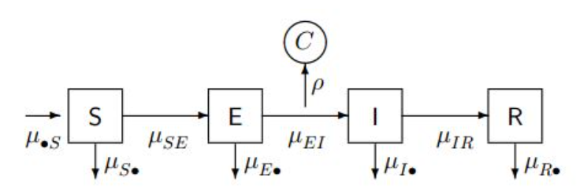

```{r setup, include=FALSE}
#library(tidyverse)
#library(knitr)
library(ggplot2)
library(tidyr)
library(dplyr)
library(pomp)
library(cowplot)
library(tseries)
library(tidyverse)
library(mFilter)
library(forecast)
library(tidyverse)
library(readxl)
library(lubridate)
library(pomp)
library(doParallel)
library(doRNG)
registerDoRNG(11111)
stopifnot(getRversion() >= "4.0")
stopifnot(packageVersion("pomp")>="3.0")
set.seed(1350254336)
df <- read.csv("michigan_covid_clean_noNA.csv")
df$Date = as.Date(df$Date)
```


## Introduction

In December 2019, a novel coronavirus, given the name SARS-CoV-2, was discovered in Wuhan, China [[1](https://www.who.int/publications/i/item/who-convened-global-study-of-origins-of-sars-cov-2-china-part)]. The disease caused by this virus, known commonly by the acronym COVID-19, rapidly spread across the planet, and reached the United States in early 2020. On March 10th, 2020, Governor Gretchen Whitmer announced that two people had been identified as the first potential COVID-19 cases in Michigan [[2](https://www.michigan.gov/coronavirus/0,9753,7-406-98163-521341--,00.html#:~:text=Gretchen%20Whitmer%2C%20the%20Michigan%20Department,confirmed%20cases%20in%20the%20state.)].

Michigan's response to COVID-19 has been nothing short of interesting. In October 2020, Michigan's Supreme Court ruled that the Emergency Powers of the Governor Act of 1945, the law Governor Gretchen Whitmer utilized to issue executive orders in response to the COVID-19 pandemic, was unconstitutional. From this point forward, statewide responses to the pandemic were much more limited, leading to an apparent increase in case numbers [[3](https://covidmapping.org/timeline.html)]. 

In December 2021, a new mutation of the virus that causes COVID-19 colloquially known as the Omicron variant quickly became the most dominant COVID-19 strain. Confirmed COVID-19 cases around the world reached record numbers that were never before seen during the pandemic. Within a few short weeks, the Omicron variant had reached Michigan, with the first case being identified on December 3rd, 2021 [[3](https://covidmapping.org/timeline.html)].

In this project, we explore the suitability of different models to different time periods of Michigan COVID-19 daily cases. First, we explore the application of AutoRegressive Moving Average (ARMA) and AutoRegressive Integrated Moving Average (ARIMA) models to both the entire dataset of Michigan COVID-19 data and cases since December 1st, 2021, when the Omicron variant became the dominant strain. Next, we fit a Partially Observed Markov Process (POMP) model to the Omicron data, specifically a Susceptible-Exposed-Infected-Recovered (SEIR) model. Finally, we discuss the consequences of these models and how the spread of COVID-19 has changed throughout the past two years.

## Data

Our data come from Michigan.gov's Coronavirus data [[4](https://www.michigan.gov/coronavirus/0,9753,7-406-98163_98173---,00.html)]. The data contain daily reports at the county level of COVID-19 cases and deaths (by date of onset of symptoms and date of death) for the time period of March 1st, 2020 to April 13th, 2022. In addition to confirmed cases, the data also includes probable cases estimated by the state. We choose to exclude probable cases from our analysis. Finally, the data include a running cumulative total for the number of cases and deaths. 

In this project, we investigate the data in two different time frames. The first time frame considers the entire dataset, while the second considers only data since the mutation of the Omicron variant of COVID-19, which is between December 1st, 2021 and April 13th, 2022, since this variant is still dominating Michigan cases [[3](https://covidmapping.org/timeline.html)]. 

Using these data, we are able to compile a daily COVID-19 case and death count for the entire state of Michigan, which is what we are interested in exploring using ARIMA and SEIR models. 

## Exploratory Data Analysis

### Full Michigan COVID-19 Data

We begin by exploring trends in daily case counts since the beginning of the COVID-19 pandemic in Michigan. Throughout the pandemic, there have been four significant increases in case numbers in Michigan; December 2020, March 2021, the beginning of the Delta variant in August 2021, and the rise of the Omicron variant in December 2021. 

```{r}
#wide data
ggplot(df) + geom_line(aes(x = Date, y = Cases)) + ggtitle("COVID-19 Confirmed Daily Cases in Michigan") + theme_bw()
```

**Figure 1:** COVID-19 Confirmed Daily Cases in Michigan, March 1st, 2020 to April 13th, 2022

As shown by Figure 1 above, the case counts brought on by the Omicron variant are unlike any seen brought about by previous mutations of the virus. However, unlike previous COVID-19 variants, there are much fewer deaths than cases, as observed in Figures 2 and 3 below. 

```{r}
ggplot(df) + geom_line(aes(x = Date, y = Deaths)) + ggtitle("COVID-19 Confirmed Daily Deaths in Michigan") + theme_bw()
```

**Figure 2:** COVID-19 Confirmed Daily Deaths in Michigan, March 1st, 2020 to April 13th, 2022

Note that there are four main peaks in Figure 2 for the number of COVID-19 deaths in a single day; April 16th, 2020 (164 deaths), December 5th, 2020 (137), April 22, 2021 (84), and December 11th, 2021 (131).  

```{r}
ggplot(df) + geom_line(aes(x = Date, y = Deaths/Cases)) + ggtitle("Ratio of Daily Deaths to Cases in Michigan") + theme_bw()

# sum(df$Cases) == max(df$CumulativeCases) returns true, sanity check
```

**Figure 3:** Ratio of Daily Deaths to Cases, March 1st, 2020 to April 13th, 2022 

As shown in Figure 3 above, the highest ratio of number of deaths to number of cases was observed at the beginning of the pandemic. However, it is important to realize that reliable, widespread tests for COVID-19 were not readily available until months after the beginning of the pandemic. This could explain the very high deaths to confirmed cases ratio before the summer of 2020. 

Nevertheless, Figure 3 tells us that COVID-19 is a deadly disease. The peaks in deaths are associated with rises of daily cases. Since this is a disease that can lead to death regardless of age and health, it is crucial that we take precautions to diligently protect ourselves from this disease.

### Exploring the Omicron Data

```{r}
df %>% filter(Date >= as.Date("2021-12-01")) -> omicron
#omicron = df[df$Date>=as.Date("2021-12-01")]
ggplot(omicron) + geom_line(aes(x = Date, y = Cases))+ ggtitle("COVID-19 Cases in Michigan, December 2021 to April 2022") + theme_bw()
```

**Figure 4:** Daily COVID-19 Cases in Michigan, December 1st, 2021 to April 13th, 2022. The first confirmed case of the Omicron variant in Michigan was observed on December 3rd, 2021. 

Looking at Figure 4 above, it is clear that there is an odd pattern in the presence of cases, as some days receive more reports of cases than others. This warrants spectrum analysis on the Omicron data to detect patterns in the cases, which we will explore in the next section. 


```{r}
ggplot(omicron) + geom_line(aes(x = Date, y = Deaths/Cases)) + ggtitle("Ratio of Daily COVID-19 Deaths to Cases in Michigan, December 2021 to April 2022") + theme_bw()
```

**Figure 5:** Ratio of COVID-19 Deaths to Cases, December 1st, 2021 to April 13th, 2022. 

Interestingly, the period where we see the highest number of reported cases (January 2021) is also the period where we see the lowest deaths to cases ratio. This may indicate a time period where many healthier, younger people were infected with Omicron, and made a full recovery. This supports research from Johns Hopkins University that the Omicron variant is less deadly than other earlier variants of COVID-19, which may signal that the end of the pandemic is approaching [[5](https://coronavirus.jhu.edu/pandemic-data-initiative/data-outlook/comparing-cases-deaths-and-hospitalizations-indicates-omicron-less-deadly)]. 

### Seasonality Analysis 

#### Full Data

```{r}
acf(df$Cases)
```

**Figure 6:** Autocovariance function of daily cases data.

Figure 6 above plots the autocovariance function of daily case counts for all of our data. As the time between two days increases, there generally tends to be a smaller covariance between the first observation and the later observation. This plot also highlights the weekly pattern we saw in earlier analysis. 

```{r}
spec = spectrum(df$Cases,spans=c(3,5,3),main = "Smoothed periodogram")
abline(v=spec$freq[which.max(spec$spec)], lty="dotted")
abline(v=spec$freq[which.max(spec$spec[100:500])+98], lty="dotted")

```

**Figure 7:** Smoothed periodogram for seasonality of March 2020 to April 2022 data. The frequencies associated with the dashed lines above are:

```{r}
#maximum frequency
1/spec$freq[which.max(spec$spec)]

#next greatest peak
1/spec$freq[which.max(spec$spec[100:500])+98]

```

The peak frequency corresponds to a period of 7 days. This could be due to a delay in reporting; for example, some county health departments may only report their cases and deaths once per week, leading to an upward spike in cases weekly. Another potential explanation could depend on if some days see more people receiving COVID-19 tests than other days. 

#### Omicron Data

Next, we explore patterns in the Omicron data, and notice a weekly . 

```{r}
acf(omicron$Cases)
```

**Figure 8:** Autocovariance function of Omicron (December 2021 - April 2022) data.

```{r}
spec = spectrum(omicron$Cases,spans=c(3,5,3),main = "Smoothed periodogram")
abline(v=spec$freq[which.max(spec$spec)], lty="dotted")
abline(v=spec$freq[which.max(spec$spec[10:100])+9], lty="dotted")

```

**Figure 9:** Smoothed periodogram for Omicron (December 2021 - April 2022) data. The frequencies associated with the dashed lines above are:

```{r}
#maximum frequency
1/spec$freq[which.max(spec$spec)]

#next peak of frequency
1/spec$freq[which.max(spec$spec[10:100])+9]

```


We keep these patterns, as well as what we have seen throughout our exploratory analysis, in mind as we build our models.

## ARIMA Models

### Full Data

When considering fitting the data, our first choice is an ARIMA model. In this part, we will first focus on full data. Since we did not found significant seasonal effect in data, our model equation should be: 
$$\phi(B)\triangledown^{d}(Y_n-\mu)=\psi(B)\epsilon_n$$
With assumption that $\epsilon_n$ is the white noise process and $\phi(x),\psi(x)$ are AR or MA coefficients.

To reduce trend in original data, we decided to set **d=1**. Then we use Augmented Dickey–Fuller (ADF) test[[6](https://en.wikipedia.org/wiki/Augmented_Dickey%E2%80%93Fuller_test)] to check the stationary of data:
$$H_{0}: \text{A unit root is present in a time series.}$$
$$H_{1}: \text{The data is stationary.} $$
```{r, warning=FALSE, echo=F}
data = df
date = rep(NA, 77)
for(i in 1:767){data$Date[i] = substr(data$Date[i],1,10)}
case = ts(data$Cases, start = c(2020,3,1), frequency = 365)
case_diff = diff(case)
adf.test(case_diff)
```
**Above:** R output for the Augmented Dickey-Fuller Test

The test result shows the rationality of using d=1.

We calculate the Akaike Information Criterion (AIC) [[7](https://ionides.github.io/531w22/05/slides.pdf)] for several values of the autoregressive and moving-average parameters p and q, with the results in Table 1 below. We proceed with analysis of ARIMA(5,1,5), which is the paramter with the lowest AIC.

```{r, echo = F, warning = F, message = F}
aic_table <- function(data,P,Q){
  table <- matrix(NA,(P+1),(Q+1))
  for(p in 0:P) {
    for(q in 0:Q) {
      table[p+1,q+1] <- arima(data,order=c(p,1,q), method="ML")$aic
    }
  }
  dimnames(table) <- list(paste("AR",0:P, sep=""),paste("MA",0:Q,sep=""))
  table
}
cnt_aic_table <- aic_table(case,5,5)
knitr::kable(cnt_aic_table,digits=3, caption = 'Table 1: AIC Table for All Michigan COVID Data')
```

Then, we look at the performance of the model by plotting the fitted data with the original data. The result is shown in Figure # below. The red line, representing the fitted values, is pretty similar to the original line.

```{r,echo = F,fig.align="center"}
fit = arima(case,order=c(5,1,5), method="ML")
plot(case, type='l',main = "Michigan COVID-19 Omicron Cases and fitted ARIMA(5,1,5) Model", 
      xlab = "Days since December 1st, 2021",
      ylab = "Confirmed Cases")
lines(fitted(fit),col = 'red')
legend("topright", inset=.05, c("Original data","Fitted data"),lty=c(1, 1),
        col=c("black", "red"))
```

**Figure 10:** Michigan Confirmed COVID-19 Daily Cases (black) and ARIMA(5, 1, 5) model fitted values (red). 

The residual analysis of ARIMA(5,1,5) model shows that the residuals do not seem to follow a normal distribution, and by analyzing the autocorrelation function (ACF) graph, we can see that some autocorrelation still exists in the residuals.

```{r, echo=FALSE, fig.align="center",fig.width=10, fig.height=5}
par(mfrow=c(1,2))
acf(fit$residuals, main = "Residuals Autocorrelation")
qqnorm(fit$residuals, main = "QQ-Plot: Residuals")
qqline(fit$residuals)
```

**Figure 11:** Autocovariance function (left) and normal QQ-plot (right) of ARIMA(5,1,5) residuals.


### Omicron

Now, we turn our attention to cases since the first confirmed Omicron variant case in Michigan in December 2021. Compared to the full data, the noise from different types of coronavirus variants were reduced due to the dominance of the omicron variant. We want to know the performance of ARIMA under this situation, so we again use AIC to choose an appropriate AIC model. Based on Table 2 below, we choose ARIMA(5,1,5), the same model we fit to the full data.

```{r,echo=FALSE, warning=F}
cnt_aic_table <- aic_table(omicron$Cases,5,5)
knitr::kable(cnt_aic_table,digits=3, caption = 'Table 2: AIC Table for ARIMA Models for Michigan Omicron Cases')
```

```{r,echo = F,fig.align="center",,echo=FALSE, warning=F}
fit = arima(omicron$Cases,order=c(5,1,5), method="ML")
plot(omicron$Cases, type='l',main = "Michigan COVID-19 Omicron Cases and fitted ARIMA(5,1,5) Model", 
      xlab = "Days since December 1st, 2021",
      ylab = "Confirmed Cases")
lines(fitted(fit),col = 'red')
legend("topright", inset=.05, c("Original data","Fitted data"),lty=c(1, 1),
        col=c("black", "red"))

```

**Figure 12:** Michigan Confirmed COVID-19 Daily Cases since December 1st, 2021 (black) and ARIMA(5, 1, 5) model fitted values (red). 

When we came back to residual analysis we found that even only focusing on Omicron cases, the autocorrelation between residuals and the distribution of residuals still violate our hypothesis.

```{r, echo=FALSE, fig.align="center",fig.width=10, fig.height=5}
par(mfrow=c(1,2))
acf(fit$residuals, main = "Residuals Autocorrelation")
qqnorm(fit$residuals, main = "QQ-Plot: Residuals")
qqline(fit$residuals)
```

**Figure 13:**  Autocovariance function (left) and normal QQ-plot (right) of ARIMA(5,1,5) residuals from the omicron data. 


```{r}
df <- read_excel("Data.xlsx")
df %>% filter(CASE_STATUS == "Confirmed") %>% group_by(Date) %>% summarise(Cases = sum(Cases), Deaths = sum(Deaths), CumulativeCases = sum(Cases.Cumulative), CumulativeDeaths = sum(Deaths.Cumulative)) %>% drop_na() -> data

cases = data %>% select(-CumulativeCases, -CumulativeDeaths, -Deaths) %>% filter(Date > as.Date("2021-12-01")) %>% mutate(Time = 1:n())
```

## SEIR Model

We will now experiment with using a SEIR POMP model to model the daily number of COVID-19 cases reported in Michigan from late December 2021 until the present (\~100 data points). Using a SEIR model makes sense since it is known that Covid-19 has an incubation period (corresponding to the "E" compartment) and obtaining Covid-19 twice in a period of a few months is unlikely so once a patient has recovered they can be considered to not be susceptible anymore. We restrict our data to the past four months to specifically examine the Omicron wave. Extending our data any longer would include other outbreaks from different variants that could have dramatically different transmission rates which would be tricky or impossible for a SEIR model.

Our SEIR model can be described by the following diagram where the compartments are defined as

-   $S$: susceptible population
-   $E$: exposed population, asymptomatic but won't test positive yet
-   $I$: infected population, symptomatic/tests positive
-   $R$: removed population
-   $C$: reported cases

 [[8](https://kingaa.github.io/sbied/stochsim/slides.pdf)]

Each transition between states occurs at rate dependent on the number in the previous state and the transition parameters [[9](https://kingaa.github.io/sbied/stochsim/slides.pdf)] The number of people in a given compartment at each time step is given by:

$$
\begin{align}
S(t) &= S(0) - N_{SE}(t) \\
E(t) &= E(0) + N_{SE}(t) - N_{EI}(t)\\
I(t) &= I(0) + N_{EI}(t) - N_{IR}(t)\\
R(t) &= R(0) + N_{IR}(t)
\end{align}
$$

where our model for the transition dynamics is given by

$$
\begin{align}
\frac{d}{dt}N_{SE}(t) &= \text{Binomial}(S(t), 1-e^{-\frac{\beta}{N}dt}) \\
\frac{d}{dt}N_{EI}(t) &= \text{Binomial}(E(t), 1-e^{-\mu_{EI}dt}) \\
\frac{d}{dt}N_{IR}(t) &= \text{Binomial}(I(t), 1-e^{-\mu_{IR}dt})
\end{align}
$$

and we use an overdispersed binomial measurement model for the number of cases given by

$$
\frac{d}{dt}C(t) \sim N(\rho H, \rho(1-\rho)H + (\psi\rho H)^2)
$$

where $\psi$ is a parameter that quantifies overdispersion. [[15](https://kingaa.github.io/sbied/measles/notes.pdf)]

### Model Assumptions

-   We assume that demographic changes are negligible, i.e. we ignore births and deaths. This is a reasonable assumption because we are only analyzing data over a relatively short period of time of 4 months.

-   We fixed the population size $N=9.9876\cdot10^6$ (the current population of Michigan) and let $\eta$ vary instead to reflect how much of the population is susceptible. We cannot assume the entire population is susceptible because some will have immunity from the vaccine (although the vaccinated can still contract the variant) or be in quarantine at various times

-   We assume that the value of $\beta$ shifts from an initial high value $\beta_0$ at the start of the wave to a lower value $\beta_1$ around the inflection point of the Omicron outbreak. Although a sudden drastic shift is probably not realistic, we believe that a decrease in the value of $\beta$ makes sense to model as people take more precautions with an outbreak, decreasing transmissibility.

### Implementing the SEIR model [[10](https://kingaa.github.io/sbied/stochsim/slides.pdf)]

Our implementation of the SEIR model follows the implementation described in the notes and in homework assignments with slight modifications for the time dependence of $\beta$ and the overdispersion model.

```{r}
seir_step <- Csnippet("
  double Beta = beta0;
  if(t>33) {
    Beta = beta1;
  }
  double dN_SE = rbinom(S,1-exp(-Beta*I/N*dt));
  double dN_EI = rbinom(E,1-exp(-mu_EI*dt));
  double dN_IR = rbinom(I,1-exp(-mu_IR*dt));
  S -= dN_SE;
  E += dN_SE - dN_EI;
  I += dN_EI - dN_IR;
  R += dN_IR;
  H += dN_IR;
")

seir_rinit <- Csnippet("
  S = nearbyint(eta*N);
  E = 30000;
  I = 15000;
  R = nearbyint((1-eta)*N);
  H = 0;
")

seir_dmeas <- Csnippet("
  double tol=1.0e-25;
  double mean = rho*H;
  double sd = sqrt(pow(psi * H,2)+rho*H);
  if(Cases>0.0){
    lik=pnorm(Cases+0.5,mean,sd,1,0)-pnorm(Cases-0.5,mean,sd,1,0)+tol;
  } else {
    lik=pnorm(Cases+0.5,mean,sd,1,0)+tol;
  }
  if(give_log) lik=log(lik);
")

seir_rmeas <- Csnippet("
  Cases = rnorm(rho * H, sqrt(pow(psi * rho * H,2) + rho * (1-rho) * H));
  if (Cases < 0) {
    Cases = 0;
  }
  Cases = nearbyint(Cases);
")

covidSEIR = cases %>% select(Time, Cases) %>%
  pomp(
    times = "Time", t0 = 0,
    rprocess = euler(seir_step, delta.t = 1), # delta.t set to 1 day
    rinit = seir_rinit,
    rmeasure = seir_rmeas,
    dmeasure = seir_dmeas,
    accumvars = "H",
    partrans=parameter_trans(
      log = c("mu_EI", "mu_IR", "beta0", "beta1", "psi"),
      logit = c("rho", "eta")
    ),
    statenames = c("S", "E", "I", "R", "H"),
    paramnames = c("mu_EI", "mu_IR", 
                   "eta", "rho", "N", "beta0", "beta1", "psi")
  )
```

### Local Search for Parameter Estimates [[11](https://kingaa.github.io/sbied/stochsim/slides.pdf)]  [[12](https://kingaa.github.io/sbied/stochsim/exercises.html)]

We start with the assumption that $\mu_{IR}=\frac{1}{7} = 0.14 \text{ day}^{-1}$ balancing a shorter infectious period for Omicron with other strains.  The incubation period for Omicron is far shorter [[13](https://www.cdc.gov/mmwr/volumes/70/wr/mm705152e3.htm)], ranging from 2-4 days, so we believe a reasonable estimate for $\mu_{EI}$ is $\frac{1}{3 \text{ days}} = 0.33 \text{ day}^{-1}$. We ran simulations with various values for the other parameters and found the following to be a reasonable starting point:

$$
\begin{cases}
N = 9.9876 \cdot 10^6\\
\beta_0 = 0.7 \\
\beta_1 = 0.25 \\
\mu_{EI} = 0.33\\
\mu_{IR} = 0.14\\
\rho = 0.5\\
\eta = 0.4 \\
\psi = 0.15
\end{cases}
$$

```{r}
set.seed(100)
population = 9.987e6
params = c(beta0=0.7, beta1=0.25, mu_EI = 0.33, mu_IR = 0.14, rho = 0.5, eta = 0.4, psi = 0.15, N = population)
fixed_params = params[c("N", "mu_EI", "mu_IR")]
params_rw.sd = rw.sd(rho = 0.02, eta = ivp(0.02), psi = 0.01, beta0 = 0.05, 
                     beta1 = 0.015)

covidSEIR %>%
  simulate(params=params,
	nsim=10,format="data.frame",include.data=TRUE) %>%
  ggplot(aes(x=Time,y=Cases,group=.id,color=.id=="data"))+
  geom_line()+
  guides(color="none") + ggtitle("Initial Simulation Results ") + 
  theme_bw() 
```
**Figure 14:** Michigan Confirmed COVID-19 Cases (blue) and fitted SEIR models (red). 


We also run a quick check that the particle filter is working. We see that the effective sample size seems adequate almost everywhere.

```{r}
covidSEIR %>%
  pfilter(Np=1000,params=params) -> pf
plot(pf, main= "Particle Filter Check")
```
**Figure 15:** Plots for particle filter analysis. 

We carry out replicated particle filters at our initial guess and obtain an unbiased likelihood estimate of $-1644.5$ with a standard error of $4.77$, as seen in the output below.

```{r}
bake(file = "writeup_lik_starting_values.rds", {
  foreach(i=1:10, .combine = c) %dopar% {
    library(pomp)
    covidSEIR %>% pfilter(params=params,  Np=1000)
  }
}) -> pf
pf %>% logLik() %>% logmeanexp(se = TRUE)
```

### Local Search around Initial Parameter Estimates

We run a local search around our initial estimate using an iterative filtering algorithm, fixing $N,\mu_{EI},\mu_{IR}$ but letting all of the other parameters vary.

```{r}
run_id = 1
bake(file = "local_search.rds", {
  foreach(i = 1:20, .combine = c) %dopar% {
    suppressPackageStartupMessages({
      library(tidyverse)
      library(pomp)
    })
    covidSEIR %>%
      mif2(
        params = params,
        Np = 1000, Nmif = 50,
        cooling.fraction.50 = 0.5,
        rw.sd = params_rw.sd
      )
  } -> mifs_local
  attr(mifs_local,"ncpu") <- getDoParWorkers()
  mifs_local
}) -> mifs_local

mifs_local %>%
  traces() %>%
  melt() %>%
  ggplot(aes(x = iteration, y = value, group = L1, color = factor(L1))) +
  geom_line() +
  guides(color = "none") +
  facet_wrap(~variable, scales = "free_y")
```
**Figure 16:** Trace plot for local search.

Looking at the diagnostic plots, we see that the log likelihood seems to increase and converge around $-1200$ for almost all of the particles. We also see a roughly similar movement in the estimates for $\beta_0,\rho$ and $\psi$ with slight variation but considerably more variation in the $\psi$ and $\beta_1$ estimates. The movement towards a larger value of $\psi$ may be the algorithm trying to match the large variation in the data arising from the weekly patterns where the number of cases on each Monday is considerably greater than all other days, which is probably an artifact of how Michigan was conducting its testing and reporting.

We now evaluate the likelihoods using replicated particle filters at each point estimate and look at the MLE parameters found by the filtering algorithm:

```{r}
bake(file = "lik_local.rds", {
  foreach(mf=mifs_local,.combine=rbind) %dopar% {
    library(pomp)
    library(tidyverse)
    evals <- replicate(10, logLik(pfilter(mf,Np=1000)))
    ll <- logmeanexp(evals,se=TRUE)
    mf %>% coef() %>% bind_rows() %>%
    bind_cols(loglik=ll[1],loglik.se=ll[2])
  } -> results
}) -> results

results %>% arrange(-loglik) %>% head %>% 
  knitr::kable(digits = 3, caption = "Table 3: Local search results (in decreasing order of likelihood)")
```


### Global Search for MLE [[14](https://kingaa.github.io/sbied/mif/slides.pdf)] [[15](https://kingaa.github.io/sbied/pfilter/notes.pdf)]

We now carry out a global search of the likelihood using 400 starting points drawn from a box where $\beta_0\in[0.4,0.6]$ , $\beta_1\in[0.15,0.3]$, $\rho\in[0.8,1]$, $\eta\in[0.3,0.5]$, and $\psi\in[0.5,0.95]$. These ranges were obtained by setting a reasonable interval around the parameter estimates obtained from the local search.

```{r, message=FALSE, warning=FALSE}
runif_design(
  lower=c(beta0=0.4,beta1=0.15,rho=0.8,eta=0.3,psi=0.5),
  upper=c(beta0=0.6,beta1=0.3,rho=1,eta=0.5,psi=0.95),
  nseq=400
) -> guesses

mf1 <- mifs_local[[1]]
```

```{r, message=FALSE, warning=FALSE}
bake(file="global_search_.rds",{
registerDoRNG(11111)
m3<-foreach(guess=iter(guesses,"row"), .combine=rbind) %dopar% {
library(pomp)
library(tidyverse)
mf1 %>%
mif2(params=c(unlist(guess),fixed_params)) %>%
mif2(Nmif=50) -> mf2
replicate(
10,
mf2 %>% pfilter(Np=1000) %>% logLik()
) %>%
logmeanexp(se=TRUE) -> ll
mf2 %>% coef() %>% bind_rows() %>%
bind_cols(loglik=ll[1],loglik.se=ll[2])
} -> results
}) %>%
  filter(is.finite(loglik)) -> results
```

We see that a global search produces parameters with a slightly better estimated likelihood than was found in the local search. Our maximum log likelihood was found to be $-1155$ with a Monte Carlo standard error of $0.025$, higher than the $-1158$ found from the local search.

```{r, message=FALSE, warning=FALSE}
results %>% arrange(-loglik) %>% select(-N, -mu_EI, -mu_IR) %>% head %>%
  knitr::kable(digits = 3, caption = "Table 4: Global search results, in order of decreasing  likelihood")
```

We use the MLE parameters to simulate the data once more and obtain the following plot. We notice that the variance in the number of cases of our simulations is much higher than the actual data, which suggests a possible model misspecification in the reporting dynamics and avenue for investigation. But, with these parameters, the model is better able to capture the weekly variance compared to our initial values and seems reasonable.

```{r}
params = c(beta0=0.582, beta1=0.313, mu_EI = 0.33, mu_IR = 0.14, rho = 0.995, eta = 0.302, psi = 0.643, N = population)
covidSEIR %>%
  simulate(params=params,
	nsim=10,format="data.frame",include.data=TRUE) %>%
  ggplot(aes(x=Time,y=Cases,group=.id,color=.id=="data"))+
  geom_line()+
  guides(color="none") + ggtitle("Final Simulation Results ")
```
**Figure 17:** Final results of POMP simulations. 


```{r, message=FALSE, warning=FALSE}
  bind_rows(results) %>%
  filter(is.finite(loglik)) %>%
  arrange(-loglik) %>%
  write_csv("new_global2.csv")
```

We run some final diagnostics for our model, trying to visualize the global surface using a scatterplot matrix. We notice convergence in the $\beta_0,\beta_1$ and $\eta$ parameters as noted before. But, there seems to be a lack of convergence in the $\psi,\rho$ parameters which suggests that a possible modification to the model might be to let $\psi$ and $\rho$, which measure model overdispersion and the reporting rate, to vary with time or any covariate.

```{r, message=FALSE, warning=FALSE}
read_csv("new_global2.csv") %>%
  filter(loglik>max(loglik)-100000) %>%
  bind_rows(guesses) %>%
  mutate(type=if_else(is.na(loglik),"guess","result")) %>%
  arrange(type) -> all

pairs(~loglik+beta0+beta1+eta+psi+rho, data=all,
      col=ifelse(all$type=="guess",grey(0.5),"red"),pch=16)
```
**Figure 18:** Estimates of likelihood surfaces, plotted in red, based on local starting points, plotted in gray.

## Conclusion

Dealing with an unprecedented pandemic in statistical models is a difficult challenge to carry through and model properly. In model fitting part, we firstly tried ARIMA models for both full data and Omicron cases, but they did not perform well. There are many reasonable explanations for why an ARIMA model was not appropriate for the whole data set. Assumptions of ARIMA modeling such as constant model parameters over time and with the many novel coronavirus variants that appear for brief periods are violated. And modeling these outbreaks using seasonality does not work because these variants appear in unpredictable intervals, and the introduction of policies can cause fluctuations in the data.

Therefore, we proposed to use SEIR model to deal with Omicron cases in Michigan. We used two values for $\beta$, a higher $\beta_0$ at the start and a lower $\beta_1$ around the inflection point to model population behavior as news of a new variant spreads. The global search found parameters for our SEIR model that fit the one-peak time series data reasonably well and was much more explanatory than using ARIMA.

There were many assumptions in our model that do not hold in the real world. Removing these assumptions would add extra complexity to our model, for example, we only had a single "recovered" state for the subset of the population not able to contract Covid-19/Omicron again, but there is also a subset of the population in quarantine who are also less likely to contract Covid. Using a SEIQR model to model this is an approach that could work very well to incorporate this fact [[17](https://www.nature.com/articles/s41598-021-03436-z)]. Another assumption was that there was a single strain of Covid-19 during this time period, namely the Omicron variant. This was not true, as there was still the Delta variant and other older variants affecting people. We only incorporated a single Omicron variant because it was the dominant strain during this time period. Using a multiple strain model with different transmission parameters is another possible avenue of investigation [[18](https://arxiv.org/pdf/2102.11333.pdf)].

## References

1. [WHO-convened global study of origins of SARS-CoV-2: China Part](https://www.who.int/publications/i/item/who-convened-global-study-of-origins-of-sars-cov-2-china-part)

2. [Michigan announces first presumptive positive cases of COVID-19](https://www.michigan.gov/coronavirus/0,9753,7-406-98163-521341--,00.html#:~:text=Gretchen%20Whitmer%2C%20the%20Michigan%20Department,confirmed%20cases%20in%20the%20state.)

3. [Michigan COVID-19 Timeline](https://covidmapping.org/timeline.html)

4. [Coronavirus - Michigan Data](https://www.michigan.gov/coronavirus/0,9753,7-406-98163_98173---,00.html)

5. [Omicron Less Deadly than Previous Variants - Johns Hopkins Coronavirus Resource Center](https://coronavirus.jhu.edu/pandemic-data-initiative/data-outlook/comparing-cases-deaths-and-hospitalizations-indicates-omicron-less-deadly)

6. [ADF Test - Wikipedia](https://en.wikipedia.org/wiki/Augmented_Dickey%E2%80%93Fuller_test)

7. [STATS 531 Lecture Slides](https://ionides.github.io/531w22/05/slides.pdf)

8. [SEIR model](https://kingaa.github.io/sbied/stochsim/slides.pdf)

9. [Information about compartment structure](https://kingaa.github.io/sbied/stochsim/slides.pdf)

10. [Information about SEIR model](https://kingaa.github.io/sbied/stochsim/slides.pdf) 

11. [Information about SEIR model local search](https://kingaa.github.io/sbied/stochsim/slides.pdf)

12. [Information about SEIR model local search](https://kingaa.github.io/sbied/stochsim/exercises.html)

13. [Investigation of a SARS-CoV-2 B.1.1.529 (Omicron) Variant Cluster — Nebraska, November–December 2021](https://www.cdc.gov/mmwr/volumes/70/wr/mm705152e3.htm)

14. [Information about SEIR model global search](https://kingaa.github.io/sbied/mif/slides.pdf) 

15. [Information about SEIR model global search](https://kingaa.github.io/sbied/pfilter/notes.pdf)

16. [Measles in large and small towns case study](https://kingaa.github.io/sbied/measles/notes.pdf)

17. [SEIQR model](https://www.nature.com/articles/s41598-021-03436-z)

18. [Two variant SEIR modeling](https://arxiv.org/pdf/2102.11333.pdf)

19. [STATS 531 Winter 2021 Final Projects](https://ionides.github.io/531w21/final_project/)

20. [STATS 531 Winter 2021 Final Project 15](https://ionides.github.io/531w21/final_project/project15/blinded.html)
