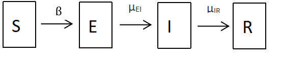

\newcommand\prob{\mathbb{P}}
\newcommand\E{\mathbb{E}}
\newcommand\var{\mathrm{Var}}
\newcommand\cov{\mathrm{Cov}}
\newcommand\data[1]{#1^*}

# Introduction

Coronavirus disease 2019 (COVID-19) is a contagious disease caused by the virus with the name, the severe acute respiratory syndrome coronavirus 2 (SARS-CoV-2). The first known case was identified in Wuhan, China, in December 2019 [@patient0]. The disease has since spread worldwide, leading to the ongoing COVID-19 pandemic. By April 16, 2022 the total cases reached more than 500 million and resulted more than 6 million deaths worldwide [@jhu].
In the United States, it has resulted in more than 80 million confirmed cases with around 1 million all-time deaths, the most of any country, and the nineteenth-highest per capita worldwide.[@jhu]
In our project we are going to search a dynamic model for the number of sequenced human COVID-19 viruses in the United States. Because modeling the whole pandemic is quite challenging and requires a wide range of data, from genetic sequences of the virus to the density of the population, from lockdown times to the vaccination rate. Performing a complete and thorough analysis of the pandemic beyond the scope of this class. Therefore we limit ourselves to the specific covid variants in the United States. 
Comparing dynamic model parameters of subsequent variants would give insight into how the virus adapts to human interventions such as lockdowns, vaccinations, and social distancing [@bertozzi]. And understanding the trends potentially prepare us for future prevention. 

# Data

We took the data from the GISAID, it is a global science initiative and primary source established in 2008 that provides open access to genomic data of influenza viruses and the coronavirus. They provide the variant information for each case. We focus on the cases of Delta and Omicron variants [@gisaid]. Our data consist the total number of people infected by delta and omicron variants each week from Jan. 2021 to March 2022 in the United States.

```{r libs, echo=FALSE, include=FALSE}
knitr::opts_chunk$set(warning = FALSE, message = FALSE) 
library(doParallel)
library(doRNG)
registerDoParallel()
registerDoRNG(2488820)
library(tidyverse)
library(pomp)
library(knitr)

read_csv("delta_omicron.csv") -> covid19
```
# Exploratory Data Analysis

```{r eda_plot, echo = F, include = T}
covid19 %>% mutate(`Weekly total sequenced cases` = reports) %>% ggplot(aes(year, `Weekly total sequenced cases`, col = variant)) + geom_line()
```

From the plot, we can see that the number of reports for Delta variant and Omicron variant are not similar to each other. Delta variant's reports number increased sharply around June 2021 and fluctuated for 6 months and decreased sharply when Omicron emerges. Omicron increased just after Delta variant, which increased in new year and then it decreased in couple of weeks. Omicron variant started its distribution later than Delta, but had higher reports number at peak than the Delta variant did at peak, which is consistent with the report that the first Delta variant was detected on 23 February 2021 in the United States [@wikidelta] and the first Omicron variant was detected on 1 December 2021 in the United States [@cdcomicron].

# Methods 

First, we fit an SEIR model for the delta variant cases in the United States. Which is known as the most deadly variant of the virus [@delta_death]. Then we compare the estimated parameters with the Omicron variant. 

SEIR model is a fundamental class of models for disease transmission dynamics. Here $S$ means the number of susceptible people, $E$ means the number of exposed people, $I$ means the number of people infected, $R$ means the number of people recovered. Some people in stage $S$ may become the people in stage $E$, and people in stage $E$ may become the people in stage $I$, then the people in stage $I$ may become people in stage R. 



In this model, we have the following parameters: $\beta$ = *Exposure rate*, $\mu_{EI}$ = *Incubation rate*, $\mu_{IR}$ = *Recovery rate*, $\eta$ = *Initial Susceptible rate*, $k$ = *Initial infecteds*, $N$ = *Susceptible size* and $\rho$ = *Reporting rate*. In our model, the value of $N$ will be fixed at $300,000,000$ according to the population of the US, $k$ will be fixed at $10$ and reporting rate will be fixed at $0.1$. This is because roughly $10\%$ of all cases are sequenced. And rest of the parameters will be estimated.

To find the best parameters of our models, we will estimate the value of the parameters by ourselves first, using the graph to find the approximate values of the parameters, and then using a local search method with the initial value find by our previous method to find more accurate values of the parameters, then we will use a global search method to find the value of the parameters.

For our SEIR models we use the construction in the class notes[@lectures].

--------


```{r, echo = FALSE, include = FALSE}
variant_1 = 'Delta'
covid19 %>% 
  filter(variant == variant_1) %>% select(week,reports) -> covid19
```

## SEIR Model for Delta Variant Cases

```{r seir_pomp, echo = FALSE, include = FALSE}
sir_step <- Csnippet("
  double dN_SE = rbinom(S,1-exp(-Beta*I/N*dt));
  double dN_EI = rbinom(E,1-exp(-mu_EI*dt));
  double dN_IR = rbinom(I,1-exp(-mu_IR*dt));
  S -= dN_SE;
  E += dN_SE - dN_EI;
  I += dN_EI - dN_IR;
  R += dN_IR;
  H += dN_IR;
  ")

sir_rinit <- Csnippet("
  S = nearbyint(eta*N);
  E = 0;
  I = 1;
  R = nearbyint((1-eta)*N);
  H = 0;
  ")

sir_dmeas <- Csnippet("
  lik = dnbinom_mu(reports,k,rho*H,give_log);
  ")

sir_rmeas <- Csnippet("
  reports = rnbinom_mu(k,rho*H);
  ")

covid19 %>%
  pomp(times="week",t0=0,
       rprocess=euler(sir_step,delta.t=1/7),
       rinit=sir_rinit,
       rmeasure=sir_rmeas,
       dmeasure=sir_dmeas,
       accumvars="H",
       paramnames=c("N","Beta","mu_EI","mu_IR","rho","eta","k"),
       partrans=parameter_trans(
         log=c("Beta", "mu_EI", "mu_IR"),
         logit=c("eta","rho")),
       statenames=c("S","E","I","R","H"),
       params=c(Beta=75,mu_EI=.5,mu_IR=.5,rho=0.1,k=10,eta=0.03,N=300000000))-> covid19SEIR

run_level <- 3
Np <-              switch(run_level,100, 1e3, 2e3)
Nlocal <-          switch(run_level,  2,   5,  20)
Nglobal <-         switch(run_level,  2,   5, 100)
Npoints_profile <- switch(run_level,  4,  10,  50)
Nreps_profile   <- switch(run_level,  2,   4,  15)
Nmif <-            switch(run_level, 10,  50, 100)
Nreps_eval <-      switch(run_level,  2,   5,  10)
```

### Local Search for the Parameters

```{r local, echo = FALSE, include = T}
if(T){
    fixed_params <- c(N=300000000, k=10, rho=0.1)
    coef(covid19SEIR,names(fixed_params)) <- fixed_params
    bake(file="local_search.rds",{
    registerDoRNG(909957)
    sds = 0.01
    foreach(i=1:32,.combine=c) %dopar% {
        library(pomp)
        library(tidyverse)
        covid19SEIR %>%
        mif2(
            Np=Np, Nmif=Nmif,
            cooling.fraction.50=0.5,
            rw.sd=rw.sd(Beta=sds, mu_IR = sds, mu_EI=sds, eta=ivp(sds))
        )
    } -> mifs_local
    mifs_local
    }) -> mifs_local
    
    mifs_local %>%
        traces() %>%
        melt() %>%
        filter(value>-2000) %>%
        ggplot(aes(x=iteration,y=value,group=L1,color=factor(L1)))+
        geom_line()+
        guides(color="none")+
        facet_wrap(~variable,scales="free_y")
}
```

We started the local search with 100 iterations keeping the reporting rate, k and total number of population to be fixed and other parameters to start with our initial guesses. The likelihood seems to increase in general while some of the runs seems to get stuck in the local maxima. The plot for mu_EI suggests that higher incubation rate could probably suggests lower likelihood and the lines seems to shrink together as the iterations increase. The convergence of parameters like mu_IR, eta, Beta could be a problem that could be induced by not well-identified parameters, more exploration is required in the global search part to verify whether those are the problems that need to be solved.

```{r locald2, echo = FALSE, include = FALSE}

bake(file="lik_local.rds",{
  registerDoRNG(9092257)
  foreach(mf=mifs_local,.combine=rbind) %dopar% {
    library(pomp)
    library(tidyverse)
    evals <- replicate(10, logLik(pfilter(mf,Np=20000)))
    ll <- logmeanexp(evals,se=TRUE)
    mf %>% coef() %>% bind_rows() %>%
      bind_cols(loglik=ll[1],loglik.se=ll[2])
  } -> results
  results
}) -> results

results = results %>% as_tibble() %>% arrange(-loglik) %>% head(10)
opt_params = results[1, ]
```

Here are the estimated parameters from the local search that give the maximum likelihood ($`r opt_params$loglik`$): $\beta = `r opt_params$Beta`$, $\mu_{EI}= `r opt_params$mu_EI`$, $\mu_{IR}=`r opt_params$mu_IR`$ and $\eta=`r opt_params$eta`$ with fixed $N=`r opt_params$N`$ and $k=`r opt_params$k`$, $\rho=`r opt_params$rho`$ values.

### Global Search for the Parameters

```{r global, echo = FALSE, include = T}

if(T){
    mf1 <- mifs_local[[1]]

    bake(file="global_search.rds",{
        set.seed(2061396)
        runif_design(
          lower=c(Beta=1,mu_EI=0.1, mu_IR=0.1,eta=0.02),
          upper=c(Beta=100,mu_EI=1., mu_IR=3,eta=0.08),
          nseq=Nglobal
        ) -> guesses
    registerDoRNG(127374)
    foreach(guess=iter(guesses,"row"), .combine=rbind) %dopar% {
      library(pomp)
      library(tidyverse)
      mf1 %>%
        mif2(params=c(unlist(guess),fixed_params),Np=Np) %>%
        mif2() -> mf
      replicate(
        Nreps_eval,
        mf %>% pfilter(Np=Np) %>% logLik()
      ) %>%
        logmeanexp(se=TRUE) -> ll
      mf %>% coef() %>% bind_rows() %>%
        bind_cols(loglik=ll[1],loglik.se=ll[2])
    } -> results
    }) %>%
      filter(is.finite(loglik)) -> results
      
    results %>%
      filter(is.finite(loglik)) %>%
      arrange(-loglik) %>%
      write_csv("covid19_params.csv")

    pairs(~loglik+Beta+mu_EI+mu_IR+eta,
          data=filter(results,loglik>max(loglik)-200))
    
    read_csv("covid19_params.csv") %>%
        filter(loglik>max(loglik)-200) %>%
        sapply(range) -> box
    
    results = results %>% as_tibble() %>% arrange(-loglik) %>% head(10)
    opt_params_delta = results[1, ]
    kable(results)
    
    loglik = opt_params_delta$loglik
    Beta = opt_params_delta$Beta 
    mu_EI = opt_params_delta$mu_EI
    mu_IR = opt_params_delta$mu_IR
    rho = opt_params_delta$rho
    eta = opt_params_delta$eta
    k = opt_params_delta$k
    N = opt_params_delta$N
    
}
```

Above plot is the relationship of the paremetrs and likelihood during the global search. Here are the estimated parameters from the global search that give the maximum likelihood ($`r loglik`$): $\beta = `r Beta`$, $\mu_{EI}= `r mu_EI`$, $\mu_{IR}=`r mu_IR`$ and $\eta=`r eta`$ with fixed $N=`r N`$ and $k=`r k`$, $\rho=`r rho`$ values. The likelihood of model from global search is much higher than the likelihood of model from local search, which shows the significant improvement on goodness of fit from global search. The result could also be supported by the a paper from National library of Medicine: the incubation rate for delta variant is about 4 days [@ogata_shorter_2022], which is close to the value in the model.

### Simulation with the Maximum Likelihood Estimates

```{r sim, echo = FALSE, include = T}
sim_data = covid19SEIR %>%
    pomp(params=c(Beta=Beta,mu_EI=mu_EI,mu_IR=mu_IR,rho=rho,k=k,eta=eta,N=N)) %>%
    simulate(nsim=100,format="data.frame",include.data=TRUE, seed = 108)

ggplot()+
  geom_line(aes(x=week,y=reports, color='red', group=.id), 
            data = sim_data %>% filter(.id != 'data'))+
  geom_line(aes(x=week,y=reports, c='black'), 
            data = sim_data %>% filter(.id == 'data'))+
  guides(color=FALSE)

```

According to the simulation plot above, the simulated data from model captures the start time with some delay. Simulated reports start to increase around week 27 but this is a bit later than the actual report. The number of reports of delta variants increases sharply from 20 week and fluctuated from 30-50 week and decrease til after 60. The simulation somehow covers the data but quite different. Data have weeks of fluctuations after they reach their peak. But simulations have sharper peaks. 

```{r beta_profile, echo = FALSE, include = FALSE}
    registerDoRNG(123213123)
    bake(file="beta_profile.rds",{
        freeze(seed=31321,
          profile_design(
            Beta=seq(1.,400.,length=50),
            lower=box[1,c("eta","mu_IR","mu_EI")],
            upper=box[2,c("eta","mu_IR","mu_EI")],
            nprof=15, type="runif"
          )) -> guesses
      foreach(guess=iter(guesses,"row"), .combine=rbind) %dopar% { 
        library(pomp)
        library(tidyverse)
        sds = 0.01
        mf1 %>%
            mif2(params=c(unlist(guess),fixed_params),
                 Np=Np,
                 rw.sd=rw.sd(eta=ivp(sds),mu_IR=sds,mu_EI=sds),
                 Nmif=Nmif,cooling.fraction.50=0.5) -> mf
        replicate(
            10,
            mf %>% pfilter(Np=Np) %>% logLik()) %>%
            logmeanexp(se=TRUE) -> ll
            mf %>% coef() %>% bind_rows() %>%
            bind_cols(loglik=ll[1],loglik.se=ll[2])
        } -> results
        results
}) -> results_bdelta

```

## SEIR Model for Omicron Variant Cases

Now we repeat the process for Omicron cases.

```{r omic_load, echo = FALSE, include = FALSE}
read_csv("delta_omicron.csv") -> covid19

variant_1 = 'Omicron'
covid19 %>% 
  filter(variant == variant_1) %>% select(week,reports) %>% 
  filter(week>40) %>% mutate(week = week-40) -> covid19

covid19 %>%
  pomp(times="week",t0=0,
       rprocess=euler(sir_step,delta.t=1/7),
       rinit=sir_rinit,
       rmeasure=sir_rmeas,
       dmeasure=sir_dmeas,
       accumvars="H",
       paramnames=c("N","Beta","mu_EI","mu_IR","rho","eta","k"),
       partrans=parameter_trans(
         log=c("Beta", "mu_EI", "mu_IR"),
         logit=c("eta","rho")),
       statenames=c("S","E","I","R","H"),
       params=c(Beta=180,mu_EI=1.,mu_IR=1.,rho=0.1,k=10,eta=0.04,N=300000000))-> covid19SEIR

```

### Local Search for the Parameters

```{r localomic, echo = FALSE, include = T}
if(T){
    fixed_params <- c(N=300000000, k=10, rho = 0.1)
    coef(covid19SEIR,names(fixed_params)) <- fixed_params
    bake(file="local_searcho.rds",{
    registerDoRNG(908057)
    sds = 0.01
    foreach(i=1:32,.combine=c) %dopar% {
        library(pomp)
        library(tidyverse)
        covid19SEIR %>%
        mif2(
            Np=Np, Nmif=Nmif,
            cooling.fraction.50=0.5,
            rw.sd=rw.sd(Beta=sds, mu_IR = sds, mu_EI=sds, eta=ivp(sds))
        )
    } -> mifs_local
    mifs_local
    }) -> mifs_local
    
    mifs_local %>%
        traces() %>%
        melt() %>%
        filter(value>-1000) %>%
        ggplot(aes(x=iteration,y=value,group=L1,color=factor(L1)))+
        geom_line()+
        guides(color="none")+
        facet_wrap(~variable,scales="free_y")
}
```

The plot for loglikelihood shows that the likelihood increases and show perfect convergence as iteration goes to 100. mu_EI and mu_IR shows some rough convergence with some exceptions. eta does not show convergence well. it could be caused by either non well-defined parameter or inapppropriate search and require more exploration in global search

```{r locald2omic, echo = FALSE, include = FALSE}

bake(file="lik_localo.rds",{
  registerDoRNG(90907)
  foreach(mf=mifs_local,.combine=rbind) %dopar% {
    library(pomp)
    library(tidyverse)
    evals <- replicate(10, logLik(pfilter(mf,Np=20000)))
    ll <- logmeanexp(evals,se=TRUE)
    mf %>% coef() %>% bind_rows() %>%
      bind_cols(loglik=ll[1],loglik.se=ll[2])
  } -> results
  results
}) -> results

results = results %>% as_tibble() %>% arrange(-loglik) %>% head(10)
opt_params = results[1, ]
```

Here are the estimated parameters from the local search that give the maximum likelihood ($`r opt_params$loglik`$): $\beta = `r opt_params$Beta`$, $\mu_{EI}= `r opt_params$mu_EI`$, $\mu_{IR}=`r opt_params$mu_IR`$ and $\eta=`r opt_params$eta`$ with fixed $N=`r opt_params$N`$ and $k=`r opt_params$k`$, $\rho=`r opt_params$rho`$ values.

### Global Search for the Parameters

```{r globalomic, echo = FALSE, include = T}

if(T){
    mf1 <- mifs_local[[1]]

    bake(file="global_searcho.rds",{
        fixed_params <- c(N=300000000, k=10, rho = 0.1)
        set.seed(20613296)
        runif_design(
          lower=c(Beta=1,mu_EI=0.1, mu_IR=0.1,eta=0.02),
          upper=c(Beta=100,mu_EI=1., mu_IR=3,eta=0.08),
          nseq=Nglobal
        ) -> guesses
    registerDoRNG(12774)
    foreach(guess=iter(guesses,"row"), .combine=rbind) %dopar% {
      library(pomp)
      library(tidyverse)
      mf1 %>%
        mif2(params=c(unlist(guess),fixed_params),Np=Np) %>%
        mif2() -> mf
      replicate(
        Nreps_eval,
        mf %>% pfilter(Np=Np) %>% logLik()
      ) %>%
        logmeanexp(se=TRUE) -> ll
      mf %>% coef() %>% bind_rows() %>%
        bind_cols(loglik=ll[1],loglik.se=ll[2])
    } -> results
    }) %>%
      filter(is.finite(loglik)) -> results
      
    results %>%
      filter(is.finite(loglik)) %>%
      arrange(-loglik) %>%
      write_csv("covid19_paramsomics.csv")

    read_csv("covid19_paramsomics.csv") %>%
        filter(loglik>max(loglik)-200) %>%
        sapply(range) -> boxomics

    pairs(~loglik+Beta+mu_EI+mu_IR+eta,
          data=filter(results,loglik>max(loglik)-200))

    results = results %>% as_tibble() %>% arrange(-loglik) %>% head(10)
    opt_params_omic = results[1, ]
    kable(results)
    
    loglik = opt_params_omic$loglik
    Beta = opt_params_omic$Beta 
    mu_EI = opt_params_omic$mu_EI
    mu_IR = opt_params_omic$mu_IR
    rho = opt_params_omic$rho
    eta = opt_params_omic$eta
    k = opt_params_omic$k
    N = opt_params_omic$N
    
}
```

Above plot is the relationship of the parameters and likelihood during the global search. Here are the estimated parameters from the global search that give the maximum likelihood ($`r loglik`$): $\beta = `r Beta`$, $\mu_{EI}= `r mu_EI`$, $\mu_{IR}=`r mu_IR`$ and $\eta=`r eta`$ with fixed $N=`r N`$ and $k=`r k`$ $\rho=`r rho`$ values.

The pair plots show that  as mu_IR being close to 0.5, the likelihood gets larger. The closer mu_EI gets to 0.3 likelihood gets larger. The likelihood of model from global search is a little bit higher than the likelihood of model from local search, which suggests a little improvement.

### Simulation with the Maximum Likelihood Estimates

```{r sim_omic, echo = FALSE, include = T}
sim_data = covid19SEIR %>%
    pomp(params=c(Beta=Beta,mu_EI=mu_EI,mu_IR=mu_IR,rho=rho,k=k,eta=eta,N=N)) %>%
    simulate(nsim=100,format="data.frame",include.data=TRUE, seed = 108)

ggplot()+
  geom_line(aes(x=week,y=reports, color='red', group=.id), 
            data = sim_data %>% filter(.id != 'data'))+
  geom_line(aes(x=week,y=reports, c='black'), 
            data = sim_data %>% filter(.id == 'data'))+
  guides(color=FALSE)

```

The plot shows that the model from global search captures the trend and time of peak of data. The simulated data sharply increased from week 7 and got to peak about week 13 and decreased after that, which similar to the collected data. The number of reports at peak is not captured well from the model, which probably means more complex model are required to develope to make improvement.

```{r beta_profileomics, echo = FALSE, include = FALSE}
    registerDoRNG(123213123)
    bake(file="beta_profileo.rds",{
        freeze(seed=31321,
          profile_design(
            Beta=seq(100.,500.,length=50),
            lower=boxomics[1,c("eta","mu_IR","mu_EI")],
            upper=boxomics[2,c("eta","mu_IR","mu_EI")],
            nprof=15, type="runif"
          )) -> guesses
      foreach(guess=iter(guesses,"row"), .combine=rbind) %dopar% { 
        library(pomp)
        library(tidyverse)
        sds = 0.01
        mf1 %>%
            mif2(params=c(unlist(guess),fixed_params),
                 Np=Np,
                 rw.sd=rw.sd(eta=ivp(sds),mu_IR=sds,mu_EI=sds),
                 Nmif=100,cooling.fraction.50=0.5) -> mf
        replicate(
            10,
            mf %>% pfilter(Np=2500) %>% logLik()) %>%
            logmeanexp(se=TRUE) -> ll
            mf %>% coef() %>% bind_rows() %>%
            bind_cols(loglik=ll[1],loglik.se=ll[2])
        } -> results
        results
}) -> results_bomicron

```

## Profile likelihood Comparison for Beta

For estimated 4 parameters, $\beta$, $\mu_{EI}$, $\mu_{IR}$, $\eta$, we look at which one of them differs greatly in global optimzation plots. By looking at those plots, for both datasets, $\mu_{EI}$, $\mu_{IR}$ and $\eta$ circled around similar ranges in likelihood optmization. But on the other hand $\beta$ differed greatly.For global optimization of Delta variant, $\beta$ ranged between 50, 200. But for Omicron range was between (150, 600). Therefore we took a step forward and compared profile likelihood of $\beta$ for two datasets. 

```{r, beta_comparison, echo = FALSE, include = T}

maxloglik <- max(results_bomicron$loglik,na.rm=TRUE)
ci.cutoff_omic <- maxloglik-0.5*qchisq(df=1,p=0.95)
results_bomicron %>%
  filter(is.finite(loglik)) %>%
  group_by(Beta) %>%
  filter(rank(-loglik)<3) %>%
  ungroup() %>% 
  mutate(variant = 'Omicron') -> omic_beta 

maxloglik <- max(results_bdelta$loglik,na.rm=TRUE)
ci.cutoff_delta <- maxloglik-0.5*qchisq(df=1,p=0.95)
results_bdelta %>%
  filter(is.finite(loglik)) %>%
  filter(loglik>maxloglik-40) %>%
  group_by(Beta) %>%
  filter(rank(-loglik)<3) %>%
  ungroup() %>% 
  mutate(variant = 'Delta') -> delta_beta

betapl = rbind(omic_beta, delta_beta)

hline_dat = data.frame(variant=c("Delta", "Omicron"),
                       threshold=c(ci.cutoff_delta , ci.cutoff_omic))

betapl %>%
  ggplot(aes(x=Beta,y=loglik,group=variant,color=variant))+
  geom_point()+
  geom_hline(data=hline_dat, aes(yintercept=threshold))+
  guides(color="none")+
  facet_wrap(~variant,scales="free")
```

We set the box for doing profile likelihood by making the boundary for non fixed variables other than beta and drew the 95% confidence interval. From this plot, we can find that the likelihood peak when $\beta$ is about 130 for Delta variant. And by the confidence interval, we roughly expect the maximum likelihood be in somewhere between 100 and 150. This does not cover our maximum likelihood estimate in global search which was `r opt_params_delta$Beta`. This might happen when there is high correlation between model parameters, which should be further investigated. For Omicron, profile likelihood of $\beta$ suggests a 95% interval roughly between 320 and 440, which covers the MLE in the global search. Nonetheless, it is clear that, $\beta$ is significantly larger for the Omicron variant.  

# Conclusion

In this report, we construct SEIR models to explain the spread of Delta and Omicron variant in the United States. For our model, we fix the parameter $N = 300,000,000, k = 10, \rho = 0.1$ By comparing the log likelihood, we get the estimated value of the parameters of the SEIR model for each variant, the estimated parameters have been shown in the previous part.

By comparing the estimated parameters for the two variants, we can see that the value of $\beta$ of the Omicron variant is much larger than that of the Delta variant, the value of $\mu_{EI}$ of the Omicron variant is less than that of the Delta variant but the product of $\beta$ and $\mu_{EI}$ of the Omicron variant is larger than that of the Delta variant. The comparison means that the Omicron variant can spread faster than the Delta variant, which corresponds with the fact that the Omicron cases increasing much faster than the Delta cases, which could be supported with report from the article Omicron variant spreads about 70 times faster than delta, expert says [@faster]. The value of $\mu_{IR}$ of the Omicron variant is much less than that of the Delta variant, which means that it will take more time for a people infected by Omicron variant to recover than the people infected by Delta variant, which corresponds to the higher peak value of the infected number of Omicron variant. The value of $\eta$ of the Omicron variant is less than that of the Delta variant, showing that less people are facing the risk of infected by the Omicron variant than infected by the Delta variant, which explains why the number of people infected by the Omicron variant decreases much faster than the number of people infected by the Delta variant. However, our findings for parameters other than $\beta$ should be interpreted causiosly since we could not find time to run profile likelihood for those and get a statisticly significcant comparison. Rather we only comment on point estimates.  

According to our simulation, the SEIR model we get can explain the spread of the two variants, while our estimated model still have some limitations. For example, due to the influence of different prevention and control policy in different time, the spread speed of the virus may be different. Besides, the rate of sequenced cases may be different in different time. To get better models later, more information is needed and also more complex models may be needed.

**<big>References</big>**.


