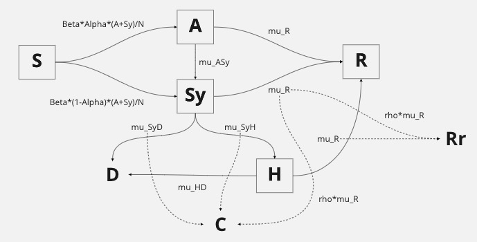
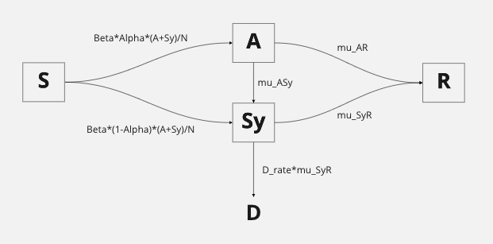

```{r setup, include=FALSE}
knitr::opts_chunk$set(
	echo = FALSE,
	message = FALSE,
	warning = FALSE
)
```


```{r}
library(tidyverse)
library(pomp)
run_level = 2
Np = switch(run_level, 1000, 1e3, 5e3)
Nmif = switch(run_level, 10, 100, 200)
Nreps_eval = switch(run_level, 2, 10, 20)
Nreps_local = switch(run_level, 10, 20, 40)
Nreps_global = switch(run_level, 10, 20, 100)
Npoints_profile <- switch(run_level,  3,  10,  50)
Nreps_profile   <- switch(run_level,  2,   4,  15)
```


```{r}
library(doParallel)
cores <- as.numeric(Sys.getenv('SLURM_NTASKS_PER_NODE',unset=NA))  
if(is.na(cores)) cores <- 6
registerDoParallel(cores)
results_dir <- paste0("run_level_",run_level,"/")
if(!dir.exists(results_dir)) dir.create(results_dir)
bake(file=paste0(results_dir,"cores.rds"),cores) -> cores

library(doRNG)
registerDoRNG(482947940)
# https://ionides.github.io/531w22/hw07/sol07.html
```


```{r}
covid_raw = read_csv("data/Moscow.csv")
```
```{r}
covid_raw %>%
  filter(date <"2021-04-01" ) %>%
  select(confirmed, deaths, recovered) %>%
  apply(2, diff) %>%
  as_tibble() %>%
  mutate(day=row_number()) -> covid
```

# Introduction
A new type of coronavirus has started to break out around the world since 2019 and was declared to be a pandemic by WHO in March 2020 [1]. The virus can spread to a large number of people in a short period of time, which could cause  symptoms such as colds, fever, and even threaten life in severe cases. Therefore, in the past few years, many institutions have been recording daily data about Covid-19 around the world, including the number of new infections, the death rate, the number of recoveries, and so on. These data are important for demographics and can also help people understand which treatments are most effective [2]. Therefore, these recordings will bring great help to the control of the global epidemic if these data can be well analyzed.
Apart from the potential epidemiology benefits, we believe Covid-19 is unique in even a pure modeling standpoint as well, because we have 1) a very large amount of data globally across different regions and ethnicity, 2) a number of different variations of the virus resulting in multiple waves of confirmed cases, 3) multiple factors intertwined together resulting an complex system that might be hard to be described by differential equations. The above reason makes analyzing the data interesting but also makes it hard to design a model that could effectively capture the available information. In this report, we mainly try to tackle the third point.
In the following context, we will introduce two models which will be referred to as the *SIR-CDR* model and the *SIR-D* model. Both of which are plug-and-play POMP models and the model design are based on our current study of how Covid-19 spreads. 


# Dataset

We use the Covid-19 data in Moscow [3]. We chose this data because it has recorded and updated the number of confirmed cases, number of deaths, and number of recovered cases daily. The original dataset has the total cases since 2020-06-01 to 2022-04-12. We converted it into daily cases to better illustrate the trend. The plot of the data is shown below.

```{r}
legend <- c("confirmed"="blue", "deaths"="red", "recovered"="green")

covid_raw %>%
  select(confirmed, deaths, recovered) %>%
  apply(2, diff) %>%
  as_tibble() %>%
  mutate(day=row_number()) %>% 
  ggplot(aes(x=day)) +
  geom_line(aes(y=confirmed, color="confirmed"), stat='identity') +
  geom_line(aes(y=deaths, color="deaths"), stat='identity') +
  geom_line(aes(y=recovered, color="recovered"), stat='identity') +
  theme(plot.title = element_text(hjust = 0.5, face="bold", size=15)) +
  scale_color_manual(values = legend) +
  ylab("Daily cases") +
  labs(x = "day") +
  ggtitle("Covid-19 for Moscow from 2020-06-01 to 2022-04-12")
```

As we expected, there are several waves of cases. Since this report is mainly focused on the complex system part rather than the time varying part as described earlier in the introduction, we only use the first wave of the data before 2021-04-01 and the result is shown below.
  
```{r}
ggplot(covid, aes(day)) +
  geom_line(aes(y=confirmed, color="confirmed"), stat='identity') +
  geom_line(aes(y=deaths, color="deaths"), stat='identity') +
  geom_line(aes(y=recovered, color="recovered"), stat='identity') +
  theme(plot.title = element_text(hjust = 0.5, face="bold", size=15)) +
  scale_color_manual(values = legend) +
  ylab("Daily cases") +
  labs(x = "day") +
  ggtitle("Covid-19 for Moscow before 2021-04-01")
```

```{r}
plot(covid$deaths, type="l", col="red", main="Covid-19 deaths for Moscow before 2021-04-01", xlab="day", ylab="Daily deaths")
```

# Model
## SIR-CDR model

For both the original dataset and the smaller dataset we selected, we can observe that the number of confirmed cases is almost a lagged version of the number of deaths. And it is reasonable to assume that the number of confirmed cases should equal the sum of the number of deaths and recovered cases, up to some varying lag and observational uncertainty. This motivates us to develop the *SIR-CDR* model which is a multivariate POMP model based on the SIR model that measures the number of confirmed cases, the number of death cases and the number of recovered cases simultaneously. By using more information in the model, we hope that the model could be fitted much more efficiently and capture the key lag information which is directly related to how people recover from Covid-19. Importantly, though deaths and recovered cases are both considered as in-transmissive cases in the standard SIR model, it should be more beneficial to model them separately as they represent the very opposite outcome of the pandemic.



We have 8 compartments:

- **S**: the number of susceptible individuals
- **A**: the number of asymptomatic individuals
- **Sy**: the number of symptomatic individuals
- **H**: the number of hospitalized individuals
- **R**: the number of recovered individuals
- **D**(measurement): the daily number of observed death cases
- **C**(measurement): the daily number of observed confirmed cases
- **Rr**(measurement): the daily number of observed recovered cases

We assume that there's a chance of infected cases becoming asymptomatic which is unobservable throughout the event since there wasn't a test kit yet at the early stages of the pandemic. Both the asymptomatic case and the symptomatic case are transimissive but the hospitalized cases are not transimissive. The asymptomatic case could recover on its own resulting in the **R** compartment, which is also unobservable. The asymptomatic case could could start to develop symptoms resulting in the **Sy** compartment. The symptomatic cases could recover which is observable, and could also result in death in the **D** compartment, and could also result in a hospital in the **H** compartment. The hospitalized cases could either recover or die. Another feature of the model is that we have a parameter **Cap** representing the capacity of the available medical treatments. We imagine this would play a big role as there had been several Covid-19 related medical shortage across the global. When the hospital compartment **H** is at its capacity, additional cases coming from the $$Sy$$ compartment would stay at the $Sy$ compartment until there's more availability.

We then have 11 parameters:

- $\beta$: the transmission rate
- $\alpha$: the chance of a case being asymptomatic
- $\mu_{R}$: the mean recovery rate for asymptomatic, symptomatic or hospitalized cases; they share a common parameter because there are any specialized medical treadment for Covid-19 and hospital could only provide general life support lowering the possibility of death
- $\mu_{SyR}$: the mean recovery rate for symptomatic cases 
- $\mu_{ASy}$: the mean rate for asymptomatic cases developing symptoms
- $\mu_{SyH}$: the mean rate to symptomatic cases to seek for medical help
- $\mu_{SyD}$: the mean rate to symptomatic cases resulting in death
- $\mu_{HD}$: the mean rate to hospitalized cases resulting in death
- $\rho$: the reporting rate
- $N$: population, we set it to 11920000 as it's available in our dataset
- $\eta$: initial infected rate, we set it to 0.0002 based a rough estimation from the dataset using the number of confirmed cases in day 1
- Cap: the medical capacity of hospitals

Together, we have the following initialization:

\begin{align}
S &= N*(1-\eta) \\
A &= N(\eta \alpha) \\
Sy &= N(\eta (1-\alpha)) \\
H &= 0\\
R &= 0 \\
D &= 0\\
C &= 0\\
Rr &= 0\\.
\end{align}

Then we have the measurement model which measures three compartment simultaneously. We assume the asymptomatic cases are observable throughout the event. The symptomatic cases are observable with some reporting rate $\rho$. The hospitalized cases are fully observable as this is one of the major pandemic and we assume official would pay extra attention recognizing such event. Then, we have our measurement model as:

\begin{align}
\text{deaths} \sim \text{Pois}(D)\\
\text{confirmed} \sim \text{Pois}(C)\\
\text{recovered} \sim \text{Pois}(Rr)\\.
\end{align}

And then the process model:
\begin{align}
dN_{SA} &\sim \text{Binom}(S, 1-\exp{-\beta\alpha(A+Sy)dt/N})\\
dN_{SSy} &\sim \text{Binom}(S, 1-\exp{-\beta(1-\alpha)(A+Sy)dt/N})\\
dN_{AR} &\sim \text{Binom}(A, 1-\exp{-\mu_{R}dt})\\
dN_{ASy} &\sim \text{Binom}(A, 1-\exp{-\mu_{ASy}dt})\\
dN_{SyR} &\sim \text{Binom}(Sy, 1-\exp{-\mu_{SyR}dt})\\
dN_{SyH} &\sim \text{Binom}(Sy, 1-\exp{-\mu_{SyH}dt})\\
dN_{HR} &\sim \text{Binom}(H, 1-\exp{-\mu_{R}dt})\\
dN_{SyH} &\sim \text{Binom}(Sy, 1-\exp{-\mu_{SyD}dt})\\
dN_{HD} &\sim \text{Binom}(H, 1-\exp{-\mu_{HD}dt})\\
\end{align}

The process model is similarly to the standard SIR model where $dN_{AB}$ represents the flow from a compartment $A$ to compartment $B$, except the thresholding capacity mechanism we mentioned above. For the three measurement compartment, symptomatic cases are partially observed with rate $\rho$ and hospitalized cases are fully observed while the asymptomatic cases are fully hidden.

The compartments related to the measurements is then:

\begin{align}
D_{t+1} &= D_{t} + dN_{SyD, t} + dN_{HD, t} \\
C_{t+1} &= C_t + dN_{SyH, t} + \rho dN_{SyR, t} \\
Rr_{t+1} &= Rr_t + dN_{HR, t} + \rho dN_{SyR, t} \\
\end{align}

We then have tried many ways to tweak the model and choosing reasonable initial values, but this model turns out to be very hard to optimize. Even the particle filtering could stress some difficulties with constantly single-digit effective sample sizes. We would imagine this is because the model itself has a very specific structure and would require a lot of fine tuning to align things together. Though we couldn't make it work, we still think this general structure could lead to modeling advantages and is worth reporting.  


```{r eval=FALSE, include=FALSE}
std_names = c("S", "A", "Sy", "H", "R")
accu_names = c("D", "C", "Rr")
state_names = c(std_names, accu_names)
obs_names = c("confirmed", "deaths", "recovered")

para_names = c("Beta", "Alpha",
               "Mu_R", "Mu_ASy", "Mu_SyH", "Mu_SyD", "Mu_HD",
               "rho", "N", "eta", "Cap")

covid_rinit = Csnippet("
  S = nearbyint(N * (1-eta));
  A = nearbyint(N * eta * Alpha);
  Sy = nearbyint(N * eta * (1-Alpha));
  H = 0;
  R = 0;
  D = 0;
  C = 0;
  Rr = 0;
  ")

covid_dmeas = Csnippet("
  lik = dpois(deaths, D, 1) + dpois(confirmed, C, 1) + dpois(recovered, Rr, 1);
  lik = (give_log) ? lik : exp(lik);
  ")

covid_rmeas = Csnippet("
  deaths = rpois(D);
  confirmed = rpois(C);
  recovered = rpois(Rr);
  ")

covid_step = Csnippet("
  double dN_SA = rbinom(S, 1-exp(-Beta*Alpha*(A+Sy)/N*dt));
  double dN_SSy = rbinom(S, 1-exp(-Beta*(1-Alpha)*(A+Sy)/N*dt));
  double dN_AR = rbinom(A, 1-exp(-Mu_R*dt));
  double dN_ASy = rbinom(A, 1-exp(-Mu_ASy*dt));
  double dN_SyR = rbinom(Sy, 1-exp(-Mu_R*dt));
  double dN_SyH = rbinom(Sy, 1-exp(-Mu_SyH*dt));
  double dN_HR = rbinom(H, 1-exp(-Mu_R*dt));
  double dN_SyD = rbinom(Sy, 1-exp(-Mu_SyD*dt));
  double dN_HD = rbinom(H, 1-exp(-Mu_HD*dt));
  
  S = S - dN_SA - dN_SSy;
  A += dN_SA - dN_ASy - dN_AR;
  Sy += dN_SSy + dN_ASy - dN_SyR - dN_SyD;
  R += dN_AR + dN_SyR + dN_HR;
  
  if (Sy + H > Cap) {
  H = Cap;
  Sy -= (Sy + H - Cap);
  } else {
  Sy -= dN_SyH;
  H += dN_SyH;
  }
  
  H += - dN_HD - dN_HR;
  
  D += dN_SyD + dN_HD;
  C += dN_SyD + dN_SyH + rho*dN_SyR;
  Rr += dN_HR + rho*dN_SyR;
  ")


covid_sir = pomp(covid, # data 
               times='day',# the column name for time
               t0=0, # must be no later than `times[1]`
               rprocess=euler(covid_step, delta.t=1/12),
               rinit=covid_rinit,
               dmeasure=covid_dmeas,
               rmeasure=covid_rmeas,
               statenames=state_names,
               paramnames=para_names,
               partrans=parameter_trans(
                 log=c("Beta", "N", 
                       "Mu_R", "Mu_ASy", "Mu_SyH", "Mu_SyD", "Mu_HD"),
                 logit=c("rho", "Alpha", "eta")
               ),
               accumvars=c("C", "D", "Rr")
               )
```


## SIR-D model


We then proceed to try a much smaller model, the *SIR-D* model which only measures the death cases. In the spirit of the *SIR-CDR* model and the benefits of distinguishing death cases apart from recovered cases as we discussed above, we have two separate compartments for the death cases and the recovered cases. This is different from the standard SIR model where a single compartment is responsible for accounting the in-transmissive cases which include the death cases and the recovered cases. This is less of a deal since both cases represent the very opposite outcome of the pandemic and we would want to account for them separately.



More specifically, we have 5 compartments:

- **S**: the number of susceptible individuals
- **A**: the number of asymptomatic individuals
- **Sy**: the number of symptomatic individuals
- **R**: the number of recovered individuals
- **D**(measurements): the daily number of observed death cases


We assume that there’s a chance of infected cases becoming asymptomatic which is unobservable throughout the event, since there wasn’t a test kitat the early stages of the pandemic. Both the asymptomatic case and the symptomatic case are transmissive. The asymptomatic case could recover on its own resulting in the **R** compartment, which is also unobservable. The asymptomatic case could start to develop symptoms resulting in the **Sy** compartment, which is observable. The symptomatic cases could recover, which is observable, and could also result in death in the **D** compartment.

We also have 9 parameters:

- $\beta$: the transmission rate
- $\alpha$: the chance of a case being asymptomatic, we set it as 0.3 based on a study that shows a asymptomatic rate of roughly 30% [6]
- $\mu_{AR}$: the mean recovery rate for asymptomatic cases 
- $\mu_{SyR}$: the mean recovery rate for symptomatic cases 
- $\mu_{ASy}$: the mean rate for asymptomatic cases developing symptoms
- D_rate: the rate of death occurring, we set it to 0.01 as a study shows that roughly 98.2% known patients recovered [5]
- $N$: population, we set it to 11920000 as it's available in our dataset
- $\eta$: initial infected rate, we set it to 0.0002 based a rough estimation from the dataset using the number of confirmed cases in day 1
- $k$: the size parameter of the Negative Binomial distribution for the measurement model.

Together, we have the following initialization:
\begin{align}
S &= N*(1-\eta) \\
A &= N(\eta \alpha) \\
Sy &= N(\eta (1-\alpha)) \\
R &= 0 \\
D &= 0\\
\end{align}

And the measurement model:
$$
\text{deaths} \sim \text{NegBinom}(k, D)
$$

And the process model:
\begin{align}
dN_{SA} &\sim \text{Binom}(S, 1-\exp{-\beta\alpha(A+Sy)dt/N})\\
dN_{SSy} &\sim \text{Binom}(S, 1-\exp{-\beta(1-\alpha)(A+Sy)dt/N})\\
dN_{AR} &\sim \text{Binom}(A, 1-\exp{-\mu_{AR}dt})\\
dN_{ASy} &\sim \text{Binom}(A, 1-\exp{-\mu_{ASy}dt})\\
dN_{SyR} &\sim \text{Binom}(Sy, 1-\exp{-\mu_{SyR}dt})\\
dN_{SyD} &\sim \text{Binom}(Sy, 1-\exp{-\text{D_rate}\mu_{SyR}dt})\\
\end{align}


And the general flow between compartment is defined similarly as in the standard SIR model, where 
$dN_{AB}$ represents the flow from a compartment $A$ to compartment $B$. One thing different from SIR is that instead of allowing arbitrary flow from the above equation, we added the constraint that all compartments can only maintain a positive value. More specifically, if $dN_{AB}$ defines a bigger change out of the compartment $A$, which result in a negative value of $A$, we set  $A \leftarrow 0$ and let $dN_{AB} \leftarrow A$  to ensure that the maximum number that can flow out of a compartment is the size of the compartment in such case. Consequently, the downstream receptive compartment only receives the restricted flow. The intuition is as simple as even sometimes the system requires a larger change but the population in each compartment has to be bigger than 0. This is implemented as a sequence `if-else` control sequence in the process model.


```{r eval=FALSE, include=FALSE}
# legend <- c(`deaths+recovered`="blue", "confirmed"="black")
# covid %>% 
#   mutate(`deaths+recovered`=deaths+recovered) %>% 
#   ggplot(aes(x=day)) +
#   geom_point(aes(y=`deaths+recovered`, colour="death + recovered")) +
#   geom_point(aes(y=confirmed, colour="confirmed")) +
#   scale_color_manual(breaks=c("death + recovered", "confirmed"),  values=c("black", "blue")) +
#   theme(plot.title = element_text(hjust = 0.5, face="bold", size=15)) +
#   ylab("Cases")
#   
```


```{r}

std_names = c("S", "A", "Sy", "R")
accu_names = c("D")
state_names = c(std_names, accu_names)
obs_names = c("deaths")

para_names = c("Beta", "Alpha",
               "Mu_AR", "Mu_SyR", "Mu_ASy", "D_rate", 
               "N", "eta", "k")

covid_rinit = Csnippet("
  S = nearbyint(N * (1-eta));
  A = nearbyint(N * eta * Alpha);
  Sy = nearbyint(N * eta * (1-Alpha));
  R = 0;
  D = 0;
  ")

covid_dmeas = Csnippet("
  lik = dnbinom_mu(deaths, k, D, give_log);
  ")


covid_rmeas = Csnippet("
  deaths = rnbinom_mu(k, D);
  ")

covid_step = Csnippet("
  double dN_SA = rbinom(S, 1-exp(-(Beta*Alpha*(A+Sy)/N)*dt));
  double dN_SSy = rbinom(S, 1-exp(-Beta*(1-Alpha)*(A+Sy)/N*dt));
  double dN_AR = rbinom(A, 1-exp(-Mu_AR*dt));
  double dN_ASy = rbinom(A, 1-exp(-Mu_ASy*dt));
  double dN_SyR = rbinom(Sy, 1-exp(-Mu_SyR*dt));
  double dN_SyD = rbinom(Sy, 1-exp(-D_rate*Mu_SyR*dt));
  
  S = S - dN_SA - dN_SSy;
  A += dN_SA;
  
  if ((dN_AR + dN_ASy) > A) {
    A = 0;
    R += nearbyint(A*(dN_AR/(dN_ASy+dN_AR)));
    Sy += nearbyint(A*(dN_ASy/(dN_ASy+dN_AR)));
    //Rr += nearbyint(rho*A*(dN_AR/(dN_ASy+dN_AR)));
  } else {
    A = A - dN_ASy - dN_AR;
    Sy += dN_SSy + dN_ASy;
    R += dN_AR;
    //Rr += dN_AR;
  }
  
  if ((dN_SyD + dN_SyR) > Sy) {
    Sy = 0;
    R += nearbyint(Sy*(dN_SyR/(dN_SyD+dN_SyR)));
    D += nearbyint(Sy*(dN_SyD/(dN_SyD+dN_SyR)));
    //Rr += nearbyint(rho*Sy*(dN_SyR/(dN_SyD+dN_SyR)));
  } else {
    Sy = Sy - dN_SyR - dN_SyD;
    R += dN_SyR;
    D += dN_SyD;
  }
  ")


covid_sir = pomp(covid, # data 
               times='day',# the column name for time
               t0=0, # must be no later than `times[1]`
               rprocess=euler(covid_step, delta.t=1/12),
               rinit=covid_rinit,
               dmeasure=covid_dmeas,
               rmeasure=covid_rmeas,
               statenames=state_names,
               paramnames=para_names,
               accumvars="D",
                params=c(
                  N=11920000,
                  D_rate=0.01,
                  eta=0.0002,
                  Beta=0.13,
                  Alpha=0.3,
                  Mu_AR=0.05,
                  Mu_SyR=0.05,
                  Mu_ASy=0.5,
                  k=10
                  )
               )


```

### Local search

We then perform a local search with starting value of
\begin{align}
N &= 11920000 \\
\text{D_rate} &= 0.01 \\
\eta &=0.002 \\
\beta &= 0.13 \\
\alpha &= 0.3 \\
\mu_{AR} &= 0.05 \\
\mu_{SyR} &= 0.05 \\
\mu_{ASy} &= 0.5\\
k &= 10\\.
\end{align}


Aside from the fixed parameters we mentioned above, we use a perturbation of  0.01 to the remaining parameters of $\beta, \mu_{AR}, \mu_{SyR}, \mu_{ASy}$. The result for `r Nmif` iterations of IF2 algorithm with `r Np` particles for `r Nreps_local` simulations is shown below.

```{r}
stew(file=paste0(results_dir,"local_search.rds"), {
  foreach(i=1:Nreps_local, .combine=c, .errorhandling='remove' ) %dopar% {
    covid_sir %>% 
      mif2(
        Np=Np,
        Nmif=Nmif,
        cooling.fraction.50=0.5,
        paramnames=para_names,
        partrans=parameter_trans(
           log=c("Beta",  
                 "Mu_AR", "Mu_SyR", "Mu_ASy", "k"),
           logit=c("Alpha", "eta", "D_rate")
        ),
        rw.sd=rw.sd(Beta=0.01, Mu_AR=0.01, Mu_SyR=0.01, Mu_ASy=0.01),
      )
  } -> mifs_local
})
```
```{r}
mifs_local %>%
  traces() %>%
  melt() %>%
  ggplot(aes(x=iteration,y=value,group=L1,color=factor(L1)))+
  geom_line()+
  guides(color="none")+
  facet_wrap(~variable,scales="free_y")
```


As we can see, some of the simulations have difficulties optimizing the likelihood and quickly drop down to some very small values. Those simulations seems to corresponds to a $\beta$ value close to 0, which completely zeros out the flow of the compartment since it controls the flow out the source compartment **S**. $\mu_{AR}$ seems to have a value around 0.1 representing roughly 10% of the asymptomatic population recovers without developing symptoms each day.


```{r}
stew(file=paste0(results_dir,"local_result.rds"), {
  foreach(mf=mifs_local,.combine=rbind, .errorhandling='remove') %dopar% {
    evals <- replicate(Nreps_eval, logLik(pfilter(mf,Np=Np)))
    ll <- logmeanexp(evals,se=TRUE)
    mf %>% coef() %>% bind_rows() %>%
      bind_cols(loglik=ll[1],loglik.se=ll[2])
  } -> local_results
})
```

```{r eval=FALSE, include=FALSE}
pairs(~loglik+Beta+Mu_AR+Mu_SyR+Mu_ASy,data=local_results,pch=16)
```
### Global search
```{r}
runif_design(
  lower=c(Beta=0.001, Mu_AR=0.001, Mu_SyR=0.001, Mu_ASy=0.001),
  upper=c(Beta=2, Mu_AR=2, Mu_SyR=2, Mu_ASy=2),
  nseq=Nreps_global
) -> guesses

mf1 = mifs_local[[1]]
```
```{r}
fixed_params = c(N=11920000,
                 D_rate=0.01,
                 eta=0.0002,
                 Alpha=0.3,
                 k=10
                 )
```

We then proceed to perform the global search with `Nreps_global` starting points random draws as follow.

\begin{align}
\beta &\sim U(0.001, 2) \\
\mu_{AR} &\sim U(0.001, 2) \\
\mu_{SyR} &\sim U(0.001, 2) \\
\mu_{Asy} &\sim U(0.001, 2) \\
\end{align}

```{r}
bake(file=paste0(results_dir,"global_search.rds"), {
foreach(guess=iter(guesses,"row"), .combine=rbind, .errorhandling='remove', .inorder=FALSE) %dopar% {
   mf1 %>%
    mif2(params=c(guess,fixed_params)) %>%
    mif2(Nmif=Nmif/2) -> mf
  replicate(
    Nreps_eval,
    mf %>% pfilter(Np=Np) %>% logLik()
  ) %>%
    logmeanexp(se=TRUE) -> ll
  mf %>%
    coef() %>%
    bind_rows() %>%
    bind_cols(loglik=ll[1],loglik.se=ll[2]) } -> results
}) %>% filter(is.finite(loglik)) -> global_results
```


The log-likelihood evaluated with `r Nreps_eval` repetitions are shown below. We observe the similar behavior where some of the starting points raise difficulties to the IF2 algorithm, which resulted in a diverged optimization. We also see a cluster of the parameter $\mu_{SyR}$ have very large values ranging from 50 to 150. Together with the constant difficulties which the IF2 algorithm has. This is an indication that the model is miss-specified.

```{r}
pairs(~loglik+Beta+Mu_AR+Mu_SyR+Mu_ASy,
      data=global_results)
```

The global search result from the converged runs are shown below. Gray points are the starting points for the global search and the red points are the end result. From the limited data points, we can see that the model seems to favor a $\beta$ value of around 1 and the small$\mu_{AR}$ and $\mu_{ASy}$ values. For $\mu_{SyR}$, despite having rather reasonable starting values below 2, we see a consistent trend of moving towards large values. This further confirms that our model is miss-specified

```{r}
global_results %>% 
  filter(loglik>max(loglik)-500) %>%
  bind_rows(guesses) %>%
  mutate(type=if_else(is.na(loglik),"guess","result")) %>%
  arrange(type) -> all

pairs(~loglik+Beta+Mu_AR+Mu_SyR+Mu_ASy, data=all, pch=16, cex=1,
  col=ifelse(all$type=="guess",grey(0.5),"red"))

```

The best parameters along with its log-likelihood is shown below. Again the non-sensible large value of $mu_{SyR}$ is very likily an indication of model specification.

```{r}
best_param = global_results[which.max(global_results$loglik),]
knitr::kable(best_param)
```

We then simulate using the above best parameter from above and the result is shown below.

```{r}
sims = simulate(covid_sir,
                nsim=5,
                params=best_param,
                format="data.frame",
                include.data=TRUE,
                )
# sims %>% filter(.id==1)
```

```{r}
sims %>% ggplot(aes(x=day, y=deaths, group=.id, color=.id=="data")) +
  geom_line() + theme(legend.position = "none")
```

As we can see, the proposed model failed to capture the general non-linear shape of the data.

### Profile likelihood

From the above global search result, we obtain the parameters range to construct the profile likelihood.

```{r}
filter(global_results,loglik>max(loglik)-20) %>%
  select(Beta,Mu_AR, Mu_SyR, Mu_ASy) %>% 
  sapply(range) -> box
  knitr::kable(box)
```

For a range of $\mu_{SyR}$ values, we sample `Nreps_profile` points from the other parameters for optimization to construct the profile likelihood, and the points are plotted below.

```{r}
  freeze(seed=1196696958,
    profile_design(
      Mu_SyR =seq(0.01,0.95,length=Npoints_profile),
      lower=box[1,c("Beta", "Mu_AR", "Mu_ASy")],
      upper=box[2,c("Beta", "Mu_AR", "Mu_ASy")],
      nprof=Nreps_profile, type="runif"
    )) -> guesses
  plot(guesses)
```

The result is shown below. Notice the range of the log likelihood is across a magnitude of several thousands, and we didn’t achieve our best log-likelihood obtained above. This is due to the reason that we fixed our target parameter $\mu_{SyR}$ in the range of 0 and 1 but the optimized model prefers values of above 100 which is not sensible.

```{r}
bake(file=paste0(results_dir,"Mu_SyR_prof.rds"),dependson=guesses,{
  registerDoRNG(2105684752)
  foreach(guess=iter(guesses,"row"), .combine=rbind, .errorhandling='remove') %dopar% {
    mf1 %>% mif2(params=c(guess,fixed_params),Nmif=Nmif,
      rw.sd=rw.sd(Beta=0.01, Mu_AR=0.01, Mu_ASy=0.01)) %>%
      mif2(Nmif=Nmif,Np=Np,cooling.fraction.50=0.3) -> mf
    replicate(
      Nreps_eval,
      mf %>% pfilter(Np=Np) %>% logLik()) %>%
      logmeanexp(se=TRUE) -> ll
    mf %>% coef() %>% bind_rows() %>%
      bind_cols(loglik=ll[1],loglik.se=ll[2])
  } -> prof_results
  attr(prof_results,"ncpu") <- getDoParWorkers()
  prof_results
}) -> Mu_SyR_prof
```
```{r}
  Mu_SyR_prof %>%
    filter(is.finite(loglik)) -> Mu_SyR_Prof

  pairs(~loglik+Beta+Mu_AR+Mu_SyR+Mu_ASy,data=Mu_SyR_prof,pch=16)
```

Then the attempted “profile likelihood” is plotted below. As we expected, all points are below the threshold and there’s no real meaningful interpretation for this graph other than another confirmation of a miss-specified model

```{r}
Mu_SyR_prof %>%
    filter(loglik>max(loglik)-5000) %>%
    group_by(round(Mu_SyR,2)) %>%
    filter(rank(-loglik)<3) %>%
    ungroup() %>%
    ggplot(aes(x=Mu_SyR,y=loglik))+
    geom_point()+
    geom_hline(
      color="red",
      yintercept=max(global_results$loglik)-0.5*qchisq(df=1,p=0.95)
    )
```


# Conclusion

In this report, we proposed two models trying to capture the complex relationship within the system. Specifically, the *SIR-CDR* model measures three key variables simultaneously while taking into the consideration of ICU capacity, which plays an important role in remedying Covid-19. The much smaller *SIR-D* model measures the death cases and has separate compartments for death cases and recovered cases. Although we had difficulties fitting both models due to various reasons, we believe it is still worthy to present both models, , especially the *SIR-CDR* model, as they have some unique aspects compared to previous Stats 531 Covid19-related projects. Besides, we have the potential chance to capture the complex system upon further tuning.


# References
- [1] https://www.mayoclinic.org/diseases-conditions/coronavirus/symptoms-causes/syc-20479963
- [2] https://research.unc.edu/2020/10/01/the-importance-of-covid-19-data-collection-and-transmission/
- [3] COVID-19 data hub: https://covid19datahub.io/
- [4] https://pubmed.ncbi.nlm.nih.gov/33340275/
- [5] https://www.webmd.com/lung/covid-recovery-overview#1
- [6] https://jamanetwork.com/journals/jamanetworkopen/fullarticle/2787098
- [7] R C API: https://cran.r-project.org/doc/manuals/r-release/R-exts.html#Distribution-functions
- [8] Multivariate data: https://kingaa.github.io/pomp/FAQ.html#multivariate-data-pomp
- [9] C inline if: https://stackoverflow.com/questions/8777851/if-short-syntax-in-c
- [10] Pomp C API: https://kingaa.github.io/pomp/vignettes/C_API.html
- [11] model inspiration: https://ionides.github.io/531w20/final_project/Project22/final.html
- [12] model inspiration: https://ionides.github.io/531w21/final_project/project03/blinded.html


