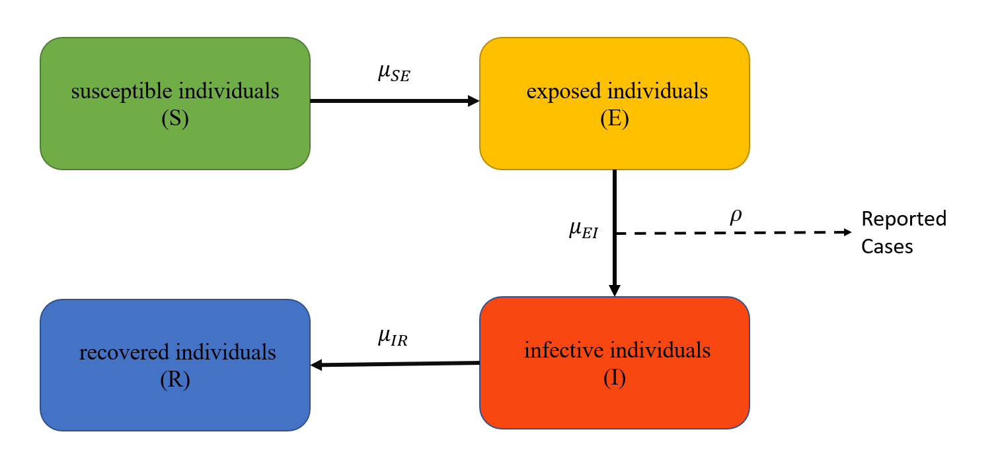

```{r setup, include=FALSE}
knitr::opts_chunk$set(
  echo = FALSE,
  warning = FALSE,
	message = FALSE,
	include = TRUE,
  comment = '',
  fig.align = "center"
)
library(tidyverse)
plot_simulation = function(sim_dat) {
  sim_dat %>%
    ggplot() +
    theme_bw() +
    geom_line(aes(Time, Cases, group = .id, 
                  color = (.id == "data"), alpha = (.id == "data"), 
                  linetype = (.id == "data"))) +
    scale_color_manual(values = c("#18bc9c", "#c61919")) +
    scale_alpha_manual(values = c(0.5, 1)) +
    scale_linetype_manual(values = c(5, 1)) +
    guides(color = FALSE, linetype = FALSE, alpha = FALSE)
} # plot_simulation()
# rm(list = ls()); rmarkdown::render("main.Rmd")
```


```{css, include = TRUE, echo = FALSE}
pre { /* Scrollable code block */
  max-height: 230px;
  overflow-y: auto;
}
span.math{ /* Formulas */
  font-size: 14px;
}
table{
  margin-left: auto; /* center the tables */
  margin-right: auto; /* center the tables */
  margin-bottom: 10px; /* add vertical space after table */
}
tr td {
  min-width: 70px;
  height: 35px;
}
tr:nth-child(odd) td {
  background-color: #f9f9f9; /* create the striped effect */
}
.center {
  display: block;
  margin-left: auto;
  margin-right: auto;
}
```

## Introduction


As is a contagious disease caused by a virus, the severe acute respiratory syndrome coronavirus 2 (SARS-CoV-2), Coronavirus disease 2019 (COVID-19) was first identified in Wuhan, China, in December 2019. The disease has since spread worldwide, leading to the ongoing COVID-19 pandemic[1]. Of those people who develop symptoms noticeable enough to be classed as patients, most (81%) develop mild to moderate symptoms (up to mild pneumonia), while 14% develop severe symptoms (dyspnea, hypoxia, or more than 50% lung involvement on imaging), and 5% suffer critical symptoms[2]. Older people are at a higher risk of developing severe symptoms. 

The goal of this final project is to investigate the potential patterns of COVID-19. We want to examine the following question: 

**Can COVID-19 be well modeled by SARIMA and/or SEIR models?** 

## Data

The dataset is downloaded from Kaggle, link can be found here: https://www.kaggle.com/datasets/imdevskp/corona-virus-report. This dataset contains all confirmed, new, and death cases from the beginning of the pandemic in the US, 2021 June 5st, to the date we started our research, 2022 March 29th. We pre-processed the data to have the variable "Cases" contain all confirmed accumulated cases and "date" contains the date that the data was collected. 

### Exploratory Data Analysis

```{r, echo=TRUE}
covid <- read.csv("us1.csv") %>% 
  mutate(daily.cases = cases - lag(cases)) %>% 
  filter(!is.na(daily.cases)) %>% 
  filter(date > as.Date("2021-06-04")) %>%
  mutate(Time = 1:n()) %>% 
  rename(
    Time = Time,
    Cases = daily.cases
    )
cases <- covid[, c("Time", "Cases")]
cases$Cases <- as.integer(cases$Cases)
covid_t0 = min(cases$Time)
```

```{r fig.height = 4.5, fig.width = 8, echo=TRUE}
ggplot(data=covid, aes(x=as.Date(date), y=Cases)) + geom_line() + labs(x='Date', y='Cases', title='Original')
```


We first transform the "Cases" variable in the dataset to be daily new cases and "Time" to be a number of time points starting from 1. 

From the plot above we can see that the two peaks happen in around September 2021 and early 2022 respectively. This may be attributed to the large number of national and international traveling at the beginning and end of vacations, and the emergence of Omicron in December 2021. We fit SARIMA and SEIR models below to simulate the process and examine the fitness of the models.


## SARIMA model

### Model Selection

```{r, echo=TRUE}
library(forecast)

```

From the ACF plot of the daily cases data, it can be seen that all the acfs are larger than the blue band, indicating dependencies between data. Therefore, we use the differenced data in our model, which gives a better ACF plot.


```{r, echo=TRUE}
acf(covid$Cases)
acf(diff(covid$Cases))
```


We first use a SARIMA model $[4][5]$ to fit our data. The $SARIMA(p,d,q)\times (P,D,Q)_T$ model can be written as:

$$ 
\phi(B)\Phi(B^T)[(1-B)^d(1-B^T)^DY_n - \mu]=\psi(B)(\epsilon_n)\Psi(B^T)\epsilon_n
$$

where the intercept $\mu$ is the mean of the differenced process $\left\{(1-B)^d(1-B^T)^DY_n\right\}$, and

$$
\mu = E[Y_n]\\
\phi(x)=1-\phi_1x-\dots-\phi_px^p\\
\psi(x)=1+\psi_1x + \dots + \psi_qx^q\\
\Phi(x)=1-\Phi_1x-\dots-\Phi_px^p\\
\Psi(x)=1+\Psi_1x + \dots + \Psi_qx^q\\
\epsilon_n \sim \text{iid} \,N[0, \sigma^2]
$$


Since we will use differenced data, we set the variables $D$ and $d$ both to 1 in the model.


From the above data plot, we can observe a regular period in jagged shape. The trend is probably due to the reason of different report rates between weekend and weekdays, suggesting a seasonal trend with period $T=7$.

We first fit an ARIMA model with different $p$ and $q$ values and use the AIC table [3] to find the most suitable parameter setting. As can be seen from the below table, ARIMA(5,1,5) has the lowest AIC value 7622.218. Therefore, we set $p=5$, $q=5$ for further analysis.


```{r, echo=TRUE}
aic_table_arima = function(data, P, Q){
  table = matrix(NA, (P + 1), (Q + 1) )
  for(p in 0:P){
    for(q in 0:Q){
        try({
            table[p+1, q+1] = arima(data,
                              order = c(p, 1, q)
      )$aic
            })
    }
  }
  dimnames(table) = list(paste("AR", 0:P),
                         paste("MA", 0:Q) )
  table
}
aic_table_arima(covid$Cases, 5, 5)
```

Then, we fit a SARMA model given the seasonal trend we observed before. From the AIC table below, $SARIMA(5,1,5)\times(2,1,1)$ has the lowest AIC value. Therefore, we choose $SARIMA(5,1,5)\times(2,1,1)$ model to fit our data.

```{r, echo=TRUE}
aic_table_sarima = function(data, P, Q){ 
    table = matrix(NA, (P+1), (Q+1))
    for (p in 0:P){
        for (q in 0:Q){
            try({
            table[p+1, q+1] = arima(data, 
                                    order=c(5, 1, 5),
                                    seasonal = list(order = c(p, 1, q), period = 7))$aic
                })
        }
    }
    dimnames(table) = list(paste('SAR', 0:P, sep=' '), paste('SMA', 0:Q, sep=' '))
    table
}
aic_table_sarima(covid$cases, 2, 2)

```

### Model Diagnosis

As can be calculated below, the $SARIMA(5,1,5)\times(2,1,1)$ model is able to achieve a log likelihood of -3672.181[3].

```{r, echo=TRUE}
arima110 <- Arima(covid$Cases, order=c(5,1,5), seasonal = list(order=c(2,1,1), period=7))
arima110$loglik
```

We then plotted observed covid cases and predicted covid cases. From the below graph, we see that much of the variation of covid cases as well as the periodic trend can be explained by our model.


```{r, echo=TRUE}
ggplot(data=covid, aes(x=as.Date(date), y=Cases)) + geom_line()+ geom_line(aes(y=fitted(arima110)), col="red")

```

From the below plot, we can see that most of the inverse roots are within the unit circle. However, 4 of the AR polynomial roots are inside the unit circle and one of the MA polynomial roots are inside the unit circle, indicating the $SARIMA(5,1,5)\times(2,1,1)_7$ model is not invertible and not causal.

```{r, echo=TRUE}
cap_fig21 = paste(
  "**Figure 21.** *Inverse AR roots and inverse MA roots displayed in a complex plane.*"
)
# plot(arima110, type = "both")
autoplot(arima110)
```


```{r, echo=TRUE}
abs(polyroot(c(1,-coef(arima110)[c("ar1","ar2","ar3","ar4","ar5","ma1","ma2", "ma3","ma4","ma5","sar1","sar2","sma1")])))
```

From the residual plot below, we can see that most of the residual values stay close to the horizontal line $y=0$, suggesting a good fit of our model.

To check whether the assumption of i.i.d residuals holds, we also plot the ACF of residuals. It can be seen that for most of the lags, the autocorrelation values are inside the horizontal dashed lines. Therefore, we do not reject the null hypothesis that the residuals are i.i.d. Notice that there are some values outside the horizontal line, indicates that model doesn't adequately fit, or there are some outliers in the data. However, given that the number of values outside the horizontal are small, we can say that this is still an adequate model.

```{r, echo=TRUE}
checkresiduals(arima110)
```

Then, we check to see if the assumptions we placed on $\{\epsilon_n\}$ that it is normally distributed were valid.

A quantile-normal plot of the residuals indicates that the residuals are not normal, with heavy tails. Therefore, we can draw the conclusion that the assumption of normally distributed white noise does not hold, indicating a different distribution should be assumed.

```{r, echo=TRUE}
cap_fig18 = paste(
  "**Figure 18.** *QQ-plot for ARIMA(1,1,0) residuals*"
)
qqnorm(arima110$residuals, main = "QQ-Plot: Residuals")
qqline(arima110$residuals)
```


## SEIR Model

```{r seir_include, echo = FALSE}
library(parallel)
NCORES = detectCores()

run_level = 2
Np = switch(run_level, 50, 1e3, 2500)
Nmif = switch(run_level, 10, 100, 250)
Nreps_eval = switch(run_level, 5, 20, 40)
Nreps_local = switch(run_level, 10, 20, 40)
Nreps_global = switch(run_level, 10, 30, 50)
Nsim = switch(run_level, 50, 100, 500)

suppressPackageStartupMessages({
  library(foreach)
  library(doParallel)
  library(doRNG)
  library(tidyverse)
  library(pomp)
})

cl = makeCluster(NCORES)
registerDoParallel(cl)
registerDoRNG(625904618)
```

Although the fitted value shows that the SARIMA model works well, the normality assumption is not passed on the residuals. So next we will try to build the pomp model and compare it with the SARIMA model. From [6] in 2021, we learn that the SEIR model has good results on the COVID-19 data. We will follow their example to build a similar model. In order to capture the emergence of Omicron, we made changes on the code of the SEIR model.

### Model specification



As shown in the figure, the SEIR model divides people into four categories
according to the course of the onset of COVID-19. They are susceptible individuals (those able to contract the disease), exposed individuals (those who have been infected but are not yet infectious), infective individuals (those capable of transmitting the disease) and recovered individuals (those who have become immune). Note that the sum of thesefour kind of individuals is a constant number N, which is the population of America in our model. The data we want to fit is the reported cases in the model.

Between the four states, there are three transition parameters:
$\mu_{SI}=\beta(t) I(t)/N$ denotes the rate at which susceptible individuals become 
exposed individuals in unit time, and $\beta$ is contact rate; $\mu_{EI}$ denotes the rate at which exposed individuals become infective individuals; similarly, $\mu_{IR}$ denotes the rate at which infective individuals become recovered. Besides, considering that not all cases can be effectively counted, $\rho$ is used to 
represent the average number of cases that can be reported.

This leads us to the following model:
$$
\begin{align}
S(t) &= S(t-1) - \Delta N_{SE}(t-1) \\
E(t) &= E(t-1) + \Delta N_{SE}(t-1) - \Delta N_{EI}(t-1) \\
I(t) &= I(t-1) + \Delta N_{EI}(t-1) - \Delta N_{IR}(t-1) \\
R(t) &= R(t-1) + \Delta N_{IR}(t-1)
\end{align}
$$

where

$$
\begin{align}
\Delta N_{SE} &\sim \mathrm{Binomial}(S, 1-e^{\frac{\beta I}{N}\Delta t})\\
\Delta N_{EI} &\sim \mathrm{Binomial}(E, 1-e^{-\mu_{EI}\Delta t})\\
\Delta N_{IR} &\sim \mathrm{Binomial}(I, 1-e^{-\mu_{IR}\Delta t})
\end{align}
$$

### Model assumption

For simplicity, we suppose that:
* birth rate, death rate and movement of population are 0,
* recovered individuals are permanently immune,
* the contact rate $\beta$ is a function of time,
* the transition rate $\mu_{EI}$ is a function of time because of Omicron,
* other transition rates and reporting rate are fixed.

Therefore, we divide time from 06/05/2021 to 03/29/2022 into 7 disjoint periods.
In different time periods, $\beta$ and $\mu_{EI}$ have different values due to climate, government's attitude towards epidemic prevention and virus variants. Especially, the arrival of the omicron variant has let to another outbreak of infections in late 2021.

$$
\beta = \begin{cases}
  b_1, & \text{06/05 - 07/04/2021}, \\
  b_2, & \text{07/05 - 08/01/2021}, \\
  b_3, & \text{08/02 - 10/02/2021}, \\
  b_4, & \text{10/03 - 11/11/2021}, \\
  b_5, & \text{12/09 - 12/21/2021}, \\
  b_6, & \text{12/22/2021 - 01/05/2022}, \\
  b_7, & \text{01/06 - 03/29/2022}.
\end{cases}
$$

$$
\mu_{EI} = \begin{cases}
  \mu_{ei}^1, & \text{06/05 - 11/11/2021}, \\
  \mu_{ei}^2, & \text{11/12/2021 - -3/29/2022}.
\end{cases}
$$

```{r seir_model, echo = TRUE}
seir_step = Csnippet("
  double Beta;
  if(intervention == 1) Beta = b1;
  else if(intervention == 2) Beta = b2;
  else if(intervention == 3) Beta = b3;
  else if(intervention == 4) Beta = b4;
  else if(intervention == 5) Beta = b5;
  else if(intervention == 6) Beta = b6;
  else Beta = b7;
  
  double mu_EI;
  if (intervention <= 4) mu_EI = ei1;
  else mu_EI = ei2;
  
  double dN_SE = rbinom(S, 1 - exp(-Beta * I / N * dt));
  double dN_EI = rbinom(E, 1 - exp(-mu_EI * dt));
  double dN_IR = rbinom(I, 1 - exp(-mu_IR * dt));
  S -= dN_SE;
  E += dN_SE - dN_EI;
  I += dN_EI - dN_IR;
  H += dN_IR;
")

seir_rinit = Csnippet("
  S = N;
  E = 200000;
  I = 270000;
  H = 0;
")

dmeas <- Csnippet("
  double tol  = 1.0e-25;
  double mean = rho * H;
  double sd = sqrt(pow(tau*H, 2)+rho*H);
  if(Cases > 0.0){
    lik = pnorm(Cases+0.5, mean, sd, 1, 0) - pnorm(Cases-0.5, mean, sd, 1, 0) + tol;
  } else {
    lik = pnorm(Cases+0.5, mean, sd, 1, 0) + tol;
  }
  if(give_log) lik=log(lik);
")

rmeas <- Csnippet("
  Cases = rnorm(rho*H, sqrt(pow(tau*H,2)+rho*H));
  if(Cases > 0.0){
    Cases = nearbyint(Cases);
  } else {
    Cases = 0.0;
  }
")

seir_covar <- covariate_table(
  t = cases$Time,
  intervention = c(rep(1, 30),
                   rep(2, 28), # 58
                   rep(3, 62), # 120
                   rep(4, 40), # 160
                   rep(5, 40), # 200
                   rep(6, 15), # 215
                   rep(7, 83)), # 298
  times = "t")

covidSEIR = cases %>% select(Time, Cases) %>%
  pomp(
    times = "Time", t0 = covid_t0,
    rprocess = euler(seir_step, delta.t = 1), # delta.t set to 1 day
    rinit = seir_rinit,
    rmeasure = rmeas,
    dmeasure = dmeas,
    accumvars = "H",
    partrans=parameter_trans(
      log = c("mu_IR", "tau", "b1", "b2", "b3", "b4", "b5", "b6", "b7", "ei1", "ei2"),
      logit = c("rho")
    ),
    statenames = c("S", "E", "I", "H"),
    paramnames = c("b1", "b2", "b3", "b4", "b5", "b6", "b7", "ei1", "ei2", "mu_IR", 
                   "rho", "N", "tau"),
    covar = seir_covar
  )
```


### Choosing starting points

According to this [7], we know that the current population of the United States is 334,515,015. And because our data is not collected from the beginning of the pandemic, we need to set initial values for E and I. In [8], the authors build a more complex SEIR model taking care of environment and social distancing to analysis COVID-19 data. 

From its table 1 and through our explorations, we set our starting
parameters as follows:

$$
\begin{cases}
N = 334,515,015,\ S(0) = N,\ E(0) = 200,000,\ I(0) = 270,000,\ R(0) = 0, \\
b_1 = 0.1,\ b_2 = 0.4,\ b_3= 0.09,\ b_4 = 0.08,\ b_5 = 1.5,\ b_6 = 0.5,\ b_7 = 0.04, \\
\mu_{ei}^1 = 0.1,\ \mu_{ei}^2 = 0.15, \\
\mu_{IR} = 0.1 \text{ (fixed)}, \\
\rho = 0.5,   \\
\tau = 0.001, \\
N = 367,601 \text{ (fixed)}.
\end{cases}
$$

```{r seir_start_p, echo=TRUE}
pop_us = 334515015
params = c(b1 = 0.1, b2 = 0.4, b3 = 0.09, b4 = 0.08, b5 = 0.15, b6 = 0.5, 
           b7 = 0.04, ei1 = 0.1, ei2 = 0.15, mu_IR = 0.1, rho = 0.5,
           tau = 0.001, N = pop_us)
fixed_params = params[c("N", "mu_IR")]
params_rw.sd = 
  rw.sd(b1 = 0.002, b2 = 0.002, b3 = 0.002, b4 = 0.002, b5 = 0.002, b6 = 0.002, 
        b7 = 0.002, ei1 = 0.01, ei2 = 0.01, rho = 0.02, tau = 0.01)

```

Using the starting parameters, we can do our first simulation. The likelihood of this set of parameters if -16696.25 which is much worse than the SARIMA model, and the Monte Carlo standard error is 0.678.

```{r seir_start_loglik, echo=TRUE}
registerDoRNG(1235252)
foreach(i=1:10, .combine = c) %dopar% {
  suppressPackageStartupMessages({
      library(pomp)
    })
  covidSEIR %>% 
    pfilter(params=params, Np=Np)
} -> pf

pf %>% 
  logLik() %>% 
  logmeanexp(se = TRUE)-> L_pf

L_pf
```

Then we can plot the simulations based on the starting values. We can see that the model captures the general trend of the data but not fully fitted. So we need to do local and global search to get better parameters.

```{r seir_start_sim, echo=TRUE}
plot_simulation = function(sim_dat) {
  sim_dat %>%
    ggplot() +
    theme_bw() +
    geom_line(aes(Time, Cases, group = .id, 
                  color = (.id == "data"), alpha = (.id == "data"), 
                  linetype = (.id == "data"))) +
    scale_color_manual(values = c("#18bc9c", "#c61919")) +
    scale_alpha_manual(values = c(0.5, 1)) +
    scale_linetype_manual(values = c(5, 1)) +
    guides(color = FALSE, linetype = FALSE, alpha = FALSE)
} # plot_simulation()

set.seed(983475)
covidSEIR %>%
  simulate(params = params, nsim = 100, format = "data.frame", include.data = TRUE) %>% 
  plot_simulation()
```

### Local Search

With the starting point, we use the pomp function for multiple iterations to find a better parameter set. In loglik's trajectory graph, there are multiple sets of parameters that give loglik a big boost. Several of the pink curves are particularly noticeable. 

Looking at those pink curves in the trajectory graph of each parameter, we can see the approximate value range of the parameter better. At the same time, it can be seen that most of the parameters have not converged after the iteration. Hopefully this will improve when searching globally.

```{r seir_local_mifs, fig.height = 5, fig.width = 8, echo = TRUE}
registerDoRNG(482947940)
bake(file = "mifs_local.rds", {
  foreach(i = 1:Nreps_local, .combine = c) %dopar% {
    suppressPackageStartupMessages({
      library(tidyverse)
      library(pomp)
    })
    covidSEIR %>%
      mif2(
        params = params,
        Np = Np, 
        Nmif = Nmif,
        cooling.fraction.50 = 0.5,
        rw.sd = params_rw.sd
      )
  } -> mifs_local
  mifs_local
 }) -> mifs_local


mifs_local %>%
  traces() %>%
  melt() %>%
  ggplot(aes(x = iteration, y = value, group = L1, color = factor(L1))) +
  theme_bw() +
  geom_line() +
  guides(color = FALSE) +
  facet_wrap(~variable, scales = "free_y")
```

```{r seir_local_search, echo=TRUE}
# likelihood est. for local search results
registerDoRNG(900242057)
bake(file = "local_search.rds", {
  foreach(mf = mifs_local, .combine = rbind) %dopar% {
    suppressPackageStartupMessages({
      library(tidyverse)
      library(pomp)
    })
    
    ll = replicate(Nreps_eval, logLik(pfilter(mf, Np = Np))) %>% 
         logmeanexp(se = TRUE)
    
    coef(mf) %>% 
      bind_rows() %>% 
      bind_cols(loglik = ll[1], loglik.se = ll[2])
  } -> local_results
  
  local_results
}) -> local_results
```

We print the best local result's parameters here. We will use them as the starting parameters for global search. We can see that the loglik of it is already close to our SARIMA model.

```{r seir_local_best, echo=TRUE}
local_best <- local_results %>%
  arrange(-loglik) %>%
  slice(1)

knitr::kable(local_best[,c(1:8)])
knitr::kable(local_best[,c(9:length(local_best))])
```

### Global Search

Now, we search for the global optimal solution by randomly selecting points within the respective value ranges of the parameters to generate random parameters.

Our program will be repeated many times, and the running time will be about 20 minutes.

First, we set the range of values for each parameter and find the best local search result from mifs_local[9].

```{r seir_global_range, echo = TRUE}
# create a box of starting values (for parameters)
covid_box <- rbind(
  b1 = c(0.15, 0.25),
  b2 = c(0.2, 0.4),
  b3 = c(0.07, 0.09),
  b4 = c(0.06, 0.09),
  b5 = c(0.12, 0.18),
  b6 = c(0.3, 0.6),
  b7 = c(0.03, 0.06),
  ei1= c(0, 0.25),
  ei2= c(0.1, 0.5),
  rho= c(0.4, 0.6),
  tau= c(0.2, 0.4)
)

find_best_local = function(mifs_local, max_loglik = -20000) {
  max_loglik = max_loglik
  res = 0
  for (i in 1:length(mifs_local)) {
    if (logLik(mifs_local[[i]]) > max_loglik) {
      max_loglik = logLik(mifs_local[[i]])
      res = i
    }
  }
  mifs_local[[res]]
}

local_best = find_best_local(mifs_local)
```

Next, we use the local optimal solution found earlier to start the search of the global optimal solution.

```{r seir_global_mifs, echo=TRUE}
bake(file = "mifs_global.rds",{
  registerDoRNG(1270401374)
  foreach(i=1:Nreps_global, .combine = c) %dopar% {
    suppressPackageStartupMessages({
      library(tidyverse)
      library(pomp)
    })
    
    local_best %>% 
    mif2(
      params = c(apply(covid_box,1,function(x)runif(1,x[1],x[2])), fixed_params),
         Np = Np,
         Nmif = Nmif,
         cooling.fraction.50 = 0.5,
         rw.sd = params_rw.sd
    ) %>%
    mif2(Nmif = Nmif, cooling.fraction.50 = 0.3) %>%
    mif2(Nmif = Nmif, cooling.fraction.50 = 0.1)
    } -> mifs_global
    mifs_global
}) -> mifs_global
```

```{r seir_global_search, echo=TRUE}
bake(file = "global_search.rds", {
  foreach(mf = mifs_global, .combine = rbind) %dopar% {
    suppressPackageStartupMessages({
      library(tidyverse)
      library(pomp)
    })
    
    evals <- replicate(10, logLik(pfilter(mf, Np=100)))
    ll <- logmeanexp(evals, se = TRUE)
    mf %>%
      coef() %>%
        bind_rows() %>%
          bind_cols(loglik = ll[1], loglik.se = ll[2])
  } -> global_results
  
  global_results
}) -> global_results
```

Here, we can print out the top 6 results found from global search. 
The maximum likelihood estimate (MLE) obtained a log likelihood of -3684.733 and a standard error of 0.0053, which is an improvement from the starting parameters.

```{r seir_global_top, echo=TRUE}
global_results <- global_results %>% arrange(-loglik) %>% head
knitr::kable(global_results[,c(1:8)])
knitr::kable(global_results[,c(9:length(global_results))])
```

### SEIR Fit Analysis

To check the performance of the SEIR model, we do 5 simulations using optimal parameters and plot them together with original data. We find that the fit of the model to the data has been significantly improved.

```{r seir_global_sim, echo=TRUE}
set.seed(857457923)
optimal_params = global_results %>% arrange(-loglik) %>% slice(1) %>%
  select(-loglik, -loglik.se)
covidSEIR %>%
  simulate(params = optimal_params, nsim = 5, format = "data.frame", include.data = TRUE) %>% 
  plot_simulation()
```

What's more, we can check the convergence diagnostics. However, Trajectory plots for some variables still do not show significant convergence.

```{r seir_fit_conv, echo=TRUE}
plot(mifs_global)
```

## Conclusion

After our research, we can conclude that both SARIMA and SEIR models can well model COVID-19 daily cases. In our analysis, we use AIC values to select the parameter settings of the SARIMA model and use local and global search to fit our SEIR model. Based on the analysis, the SARMA model is able to achieve a log likelihood of -3672.181 while the SEIR model results in a log likelihood of -3684.733. 

The reason that the SARIMA model has a higher log likelihood compared with the SEIR model is that we make some assumptions in the SEIR model that go against reality in order to simplify it. This affects the accuracy of the model to some extent, but the SEIR model still fits the data well. This is due to the variables beta and mu, as they reflect the influence of masks, vaccines, and mutant viruses on the infection rate.  From loglik's point of view, the SEIR model does not seem to perform as well as the SARIMA model. As project 15 in 2021 said, this may be caused by the SEIR model ignoring periodicity. Of course, there are other factors worth adding to the model, such as weather changes, since people tend to congregate indoors in winter, and/or the flow of people.

COVID-19 is a complicated disease to analyze. Therefore, in further investigations, we plan to add more parameters as well as use different compartment models to capture the complexities of this disease.


## References

[1] Zimmer C (26 February 2021). "The Secret Life of a Coronavirus" An oily, 100-nanometer-wide bubble of genes has killed more than two million people and reshaped the world. Scientists don't quite know what to make of it". Archived from the original on 28 December 2021. Retrieved 28 February 2021.

[2] Interim Clinical Guidance for Management of Patients with Confirmed Coronavirus Disease (COVID-19)". U.S. Centers for Disease Control and Prevention (CDC). 6 April 2020. Archived from the original on 2 March 2020. Retrieved 19 April 2020.

[3] Lecture slides - Chapter 5: Parameter estimation and model identification for ARMA models, slides 21 - 29.

[4] Lecture slides - Chapter 4: Linear time series models and the algebra of ARMA model, slides 16 - 17.

[5] Lecture slides - Chapter 6: Extending the ARMA model: Seasonality, integration and trend, slides 3 - 9, 15.

[6] Final project w21 project 15: https://ionides.github.io/531w21/final_project/project15/blinded.html

From [6] in 2021, we learn that the SEIR model has good results on the COVID-19 data. We will follow their example to build a similar model. In order to capture the emergence of Omicron, we made changes on the code of the SEIR model.

[7] United States Population https://www.worldometers.info/world-population/us-population/

[8] SEIR model for COVID-19 dynamics incorporating the environment and social distancing https://www.ncbi.nlm.nih.gov/pmc/articles/PMC7376536/

[9] Lecture slides - Chapter 15: A case study of polio including covariates, seasonality & over-dispersion, slides 46 - 49.

## Contribution

Description of individual contributions removed for anonymity.
