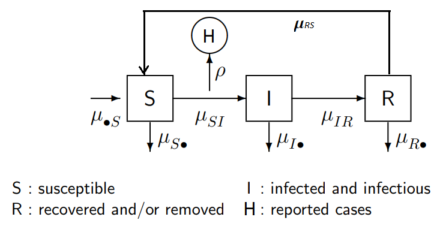

# Statistical Analysis and Modeling of Flu Reports Time Series

```{r setup, include=FALSE}
knitr::opts_chunk$set(echo = TRUE)
library(tidyverse)
library(pracma)
library(WaveletComp)
library(knitr)
library(sarima)
library(forecast)
library(astsa)
library(rmarkdown)
```

# 1 Introduction {.sidebar}
In this report, we present our study of the influenza cases reported from 2010 to 2022 years by the US Center of Disease Control Prevention [12]. The data shows regular seasonal cycles related to the increase of flu cases from the late fall to early spring with a peak at the end of winter. Interestingly, the 2020-2021 cycle has negligibly small number of cases while 2021-2022 again shows slight increase of flu cases number. We assume that such a drastic drop of cases in 2020-2021 is related to the COVID-19 pandemic policy imposed nationwide. Recall that this policy prohibited public gatherings and/or imposed mandatory masks and social distancing. The policy was partially released in the following year that shows a return of flu cases cycle. In this study, we aim to model this interesting observation by Partially Observed Markov Processes (POMP) model [13]. Particularly, we use the SIRS epidemiology compartmental model with seasonality and time-variable transmission ([14] and [11] Ch14-15). We aim to show that the flu drop in 2020-2021 cycle can be modeled by low mean transmission rate during this particular cycle [0]. We also construct Seasonal Autoregressive Integrated Moving Averaging  model (SARIMA) which is a relatively simple model to fit and predict flu data. We recognize that the SARIMA model cannot give mechanistic insights such as a drop of transmission rates, thus we limit it to pre-pandemic data and use for getting the likelihood estimation benchmark for the POMP model.

The report is organized as follows: exploratory data analysis, SARIMA model, and SIRS model, where two models can be considered independently. The SIRS model is developed to answer the question of the study and thus we discuss its results and model limitations in more details in the conclusion.


```{r include = FALSE}
df= read.csv("US_influenza_2010-2022.csv")
```

# 2 Data {.sidebar}

## 2.1 Overview {.sidebar}

The Weekly Flu Data in United States is downloaded from the Influenza Division at Centers for Disease Control and Prevention (CDC). The data is collected from both the U.S. World Health Organization (WHO) Collaborating Laboratories and National Respiratory and Enteric Virus Surveillance System (NREVSS) [15]. In this report, we focus on the data from 2010 to 2022. The original dataset contains the following influenza types: H1N1, H3, A, B, BVic, BYam, H3N2v. For this report, we sum up all these types of flu to get a total cases of flu in United States:

```{r, echo=F}
#paged_table(df)
head(df)
```

## 2.2 Exploratory data analysis {.sidebar}

There is a seasonal increase of flu cases each year during winter time. The cycle start late fall and ends early spring. Then in the COVID-19 pandemic year this pattern comes to a sudden end until the slight recovery next year, (see the Figure below). We can assume that this sudden drop is associated with the lockdown policy imposed by the US during this time. 


```{r}
plot(df$index, df$cases, type="l", xlab="Time", ylab="Total Reported Flu Cases")
```

For the SARIMA time series analysis we consider the difference of weekly total cases. 

```{r include = FALSE}
ts_ori <- ts(df$cases, start = c(2010,40), frequency = 52)
ts_df_all <- diff(ts(df$cases, start = c(2010,40), frequency = 52))
ts_df <- ts(df$cases[1:500], start = c(2010,40), frequency = 52)
```

```{r, echo=F}
plot(ts_df_all, ylab="Difference of Total Flu Cases")
```

We create the auto correlation function (ACF) plot for this time-series. It shows significant negative correlations for lags at around 8-12 weeks and positive correlations for lags at around 51-56 weeks. However, this ACF does not elaborate on the seasonality pattern and whether this pattern is stable for all time points. 

```{r}
acf(ts_df_all, 100)
```

## 2.3 Spectrum {.sidebar}

We introduce wavelet analysis to investigate precise frequency patterns of flu cases from 2010 to 2022. Wavelet utilizes the formula $$\lambda(a,\tau)=\frac{1}{\sqrt{a}}\int_{\infty}^\infty \gamma(x)\psi(\frac{x-\tau}{a})dt $$ for different choice of wave functions $\psi(x)$, where $a$ is the scale controlling the stretch extension of the wave function and $\tau$ is the translation parameter controlling the movement of the wave function in the scope of time [1]. The wave function we use [2] is $$\psi(x)=\pi^{-\frac{1}{4}}e^{i\omega x}e^{-\frac{-x^2}{2}}$$ 
Instead of converting raw data into the frequency domain, wavelet transformation converts data into the frequency and time domains, such that we can analyze the frequency patterns within the scope of time.

```{r include=FALSE}
my.w <- analyze.wavelet(df, "cases",
                        loess.span = 1,
                        dt = 1, 
                        dj = 1/250,
                        lowerPeriod = 8,
                        upperPeriod = 128,
                        make.pval = TRUE, n.sim = 10)
```

```{r echo=FALSE}
wt.image(my.w, n.levels = 250,legend.params = list(lab = "wavelet power levels"),
         spec.time.axis = list(at = seq(14, 597, by = 52),labels = seq(2011, 2022)))
```

The frequency pattern, at period equals 52, is very stable before April 2020 - the start of pandemic. The spectrum heatmap confirmed that the total case of flu has a stable 1-year frequency pattern before the burst of COVID-19. In order to fit a stationary model, we will only use data from 2010 to 2020, so the stationary model will not fail because of the wane of seasonality pattern after April 2020. 

# 3 SARIMA model {.sidebar}
## 3.1 Model Coefficients

Since the flu dataset has a clear seasonal patter, we will use the seasonal autoregressive integrated moving average (SARIMA) model to fit the data. SARIMA model is represented by [3]:
$$\text{SARIMA}(p,d,q)\times(P,D,Q)_{s}$$
$$\Phi(B^{s})\phi(B)\triangledown_{s}^D\triangledown^d (X_n-\mu)=\Psi(B^s)\psi(B)\epsilon_n$$
where $\{\epsilon_n\}$ is a white noise process and
$\mu=\mathbb{E}(X_n)$\
$\phi(x)=1-\phi_1x-...-\phi_px^p$,\
$\psi(x)=1+\psi_1x+...+\psi_q x^q$,\
$\Phi(x)=1-\Phi_1x-...-\Phi_Px^P$\
$\Psi(x)=1+\Psi_1x+...+\Phi_Qx^Q$\
$\triangledown_{s}^D=(1-B^{s})^{(D)}$\
$\triangledown^d=(1-B)^{(d)}$\

However, the number of flu case is too small at non-flu-season. The difference in the number of case between flu-season and non-flu-season is too large, and the SARIMA model may not be able to capture such difference. Hence, we will perform a BoxCox transformation to the data before fitting a SARIMA model.

```{r warning = FALSE}
print(paste("Box Cox lambda is:", BoxCox.lambda(ts_ori)))
ts_bc <- ((ts(df$cases[1:500], start = c(2010,40), frequency = 52)+1050)^.2-1)/.2
plot(ts_bc, ylab="Box Cox Transformed values")
```


```{r include=FALSE}
aic_table<-function(data,P,Q){
  table<-matrix(NA,(P+1),(Q+1))
  for(p in 0:P){
    for(q in 0:Q){
        table[p+1,q+1]<- sarima(data,p,1,q,1,1,0, 52)$AIC
     }
    }
  dimnames(table)<-list(paste("AR",0:P,sep=""),
                        paste("MA",0:Q,sep=""))
  table
}
set.seed(1)
aic_table <- aic_table(ts_bc,2,2)
```

By grid search of the best SARIMA model, we find that $\text{SARIMA}(2,1,2)\times(1,1,0)_{52}$ has the lowest AIC. Based on the results, we choose $\text{SARIMA}(2,1,2)\times(1,1,0)_{52}$ model.

```{r}
kable(aic_table,digits=2)
```

```{r include=FALSE}
set.seed(1)
BoxCox_ts <- ts(ts_bc[1:400], start = c(2010,40), frequency = 52)
fit <- sarima(BoxCox_ts, 2,1,2,1,1,0,52)
```

## 3.2 Diagnosis

Before fitting the model to data, we want to check if there are unit roots in AR and MA parts. By just looking at the coefficients, the MA coefficient is close to -1, so we are almost certain that the fitted model is at the threshold of non-invertibility. [4] 

```{r}
fit$fit
```


```{r include=FALSE}
arroots <- function(object){
  if(!("Arima" %in% class(object)) &
     !("ar" %in% class(object)))
    stop("object must be of class Arima or ar")
  if("Arima" %in% class(object))
    parvec <- object$model$phi
  else
    parvec <- object$ar
  if(length(parvec) > 0)
  {
    last.nonzero <- max(which(abs(parvec) > 1e-08))
    if (last.nonzero > 0)
      return(structure(list(
          roots=polyroot(c(1,-parvec[1:last.nonzero])),
          type="AR"),
        class='armaroots'))
  }
  return(structure(list(roots=numeric(0), type="AR"),
    class='armaroots'))
}

# Compute MA roots
maroots <- function(object){
  if(!("Arima" %in% class(object)))
    stop("object must be of class Arima")
  parvec <- object$model$theta
  if(length(parvec) > 0)
  {
    last.nonzero <- max(which(abs(parvec) > 1e-08))
    if (last.nonzero > 0)
      return(structure(list(
          roots=polyroot(c(1,parvec[1:last.nonzero])),
          type="MA"),
        class='armaroots'))
  }
  return(structure(list(roots=numeric(0), type="MA"),
    class='armaroots'))
}

plot.armaroots <- function(x, xlab="Real", ylab="Imaginary",
    main=paste("Inverse roots of", x$type,
          "characteristic polynomial"),
    ...)
{
  oldpar <- par(pty='s')
  on.exit(par(oldpar))
  plot(c(-1,1), c(-1,1), xlab=xlab, ylab=ylab,
       type="n", bty="n", xaxt="n", yaxt="n", main=main, ...)
  axis(1, at=c(-1,0,1), line=0.5, tck=-0.025)
  axis(2, at=c(-1,0,1), label=c("-i","0","i"),
    line=0.5, tck=-0.025)
  circx <- seq(-1,1,l=501)
  circy <- sqrt(1-circx^2)
  lines(c(circx,circx), c(circy,-circy), col='gray')
  lines(c(-2,2), c(0,0), col='gray')
  lines(c(0,0), c(-2,2), col='gray')
  if(length(x$roots) > 0)
  {
    inside <- abs(x$roots) > 1
    points(1/x$roots[inside], pch=19, col='black')
    if(sum(!inside) > 0)
      points(1/x$roots[!inside], pch=19, col='red')
  }
}
```

In the visualized unit roots, we can see that there is a unit root in the MA part of the fitted model. That is to say, we need to reduce the model to $\text{SARIMA}(2,1,1)\times(1,1,0)_{52}$ to avoid non-invertibility. 

```{r}
par(mfrow=c(1,2))
plot(arroots(fit$fit),main="Inverse AR roots")
plot(maroots(fit$fit),main="Inverse MA roots")
```

```{r include=FALSE}
set.seed(1)
fit <- sarima(BoxCox_ts, 2,1,1,1,1,0,52)
```

By replacing the model by $\text{SARIMA}(2,1,1)\times(1,1,0)_{52}$, we now have no unit root in AR and MA parts. 

```{r}
par(mfrow=c(1,2))
fit$fit
plot(arroots(fit$fit),main="Inverse AR roots")
plot(maroots(fit$fit),main="Inverse MA roots")
```

The final model is:

$$\text{SARIMA}(2,1,1)\times(1,1,0)_{52}$$
where $(1-0.305B-0.298B^2)(1-B^{52})(1-B^{52})'(1-B)'(X_n-\mu)=(1+0.331B)\epsilon_n$.\
We plot the ACF for the model residual and see that there are almost no lags with significant autocorrelation. Hence, we think that this model is able to capture most of the patterns in the data of total flue cases.

```{r}
par(mfrow=c(1,2))
acf(BoxCox_ts,100, main= "Box Cox Transformed data")

acf(fit$fit$residuals, 100, main = "ACF residuals")
par(mfrow=c(1,1))
```


## 3.3 Prediction {.sidebar}

```{r include=FALSE}
fit <-sarima.for(BoxCox_ts,100,2,1,1,1,1,0,52)
```

We use the data in the interval 2010-2018 to predict the total flu cases in the interval 2018-2020. As shown below, the red line represents the predicted total flu cases and the black line is the original data. The predicted line is significantly close to the original data. Therefore, $\text{SARIMA}(2,1,1)\times(1,1,0)_{52}$ model is able to predict the total pre-pandemic flu cases very well [5].

```{r}
modd <- (fit$pred*0.2 +1)^5-1050
mod_fore <- ts(modd, start = c(2016,51), frequency = 52)
plot(ts_df, main="Prediction", ylab="Total Flu Cases")
points(ts(mod_fore, start = c(2018,23), frequency = 52),type="l",col=2)
```

To model the flu cases in the interval including the pandemic cycle, we will consider the POMP model.


# 4 SIRS model {.sidebar}

In this section we describe the susceptible-infected-recovered-susceptible (SIRS) model as a part of POMP modeling. We follow the description of the SIR model in [11]Ch12-14 and generalize it to the SIRS model. It includes the following states: susceptible ($S$), infected ($I$), recovered ($R$), and reported ($H$). There are the following key changes we introduce:

 * Include recovered individuals who can be reinfected with flu again. It is modeled by introducing the count process $N_{RS}$ with reinfection rate $\mu_{RS}$ between compartments $R$ and $S$ (see the figure below).
 * Introduce the time-variable transmission rate $\beta=\beta(t)$ to reflect seasonality of the flu cycles. We also incorporate step-wise function of the average transmission rate to reflect its drop during the pandemic cycle.
 * Introduce an initial parameters for the infection state $I_0$ and recovery state $R_0$ as in [11] Ch17.
 
```{r, echo=F}

```
 
Thus, the conservation of individuals can be described via the system of equations [11]Ch12,slide5:
$$S(t) = S(0)-N_{SI}(t)+N_{RS}(t), \\
I(t) = I(0)+N_{SI}(t)-N_{IR}(t), \\
R(t) = R(0)+N_{IR}(t)-N_{RS}(t)$$

The flow of counting process can be described with the system of ordinary differential equations (ODE) [11]Ch12, slide11:
$$\frac{dN_{SI}}{dt} = \mu_{SI}(t)S(t),\\
\frac{dN_{IR}}{dt} = \mu_{IR}I(t), \\
\frac{dN_{RS}}{dt} = \mu_{RS}R(t)$$

The ODEs can be solved by Euler' numerical method ([11]Ch12,slide16-23). The right hand side of equations can be described by a binomial approximation with exponential transition probability ([11]Ch12,slide24):
$$ N_{SI}(t+\Delta t) \approx N_{SI}(t) + Binomial[S(t),1-exp(-\mu_{SI}(t)\Delta t)],\\
N_{IR}(t+\Delta t) \approx N_{IR}(t) + Binomial[I(t),1-exp(-\mu_{IR}\Delta t)],\\
N_{RS}(t+\Delta t) \approx N_{RS}(t) + Binomial[R(t),1-exp(-\mu_{RS}\Delta t)]$$

For this model we consider constant recovery rate $\mu_{IR}$ and reinfection rate $\mu_{RS}$. The rate at which individuals move from $S$ to $I$ is the force of infection [11]Ch12,slide 32. We consider the infection rate as a time-variable function with periodic $\beta$ to incorporate seasonality with a period of 52 weeks (a year). 
$$\mu_{SI}(t)=\beta(t)\frac{I(t)}{N},\\
\beta(t)=\beta_0(t)(1 + c\ cos(2\pi(t+d)/52))\\
\beta_0(t) = a \ \text{, in prepandemic years} \\
\beta_0(t) = b = a-\Delta a \ \text{, during pandemic year}$$
where $a, b$ are average transmission rates for prepandemic years (before 2020) and pandemic season (2020-2021 cycle), respectively. The change in the pandemic transmission rate also can be defined by a positive difference $\Delta a$. The constant $c\in [0,1]$ defines the magnitude of the cycle peak while $d$ is a phase shift. 

For this model we neglect birth and death changes of the population and fix the population size to an average value: $N = 325$ millions [6]. The conservation of state variables can be written as: 
$$N= S(t) + I(t) + R(t)$$
 with the initial values $S_0,I_0,R_0$ defined by the following relations [11]Ch17: 
 $$S(t=0)\approx S_0 m\\
 I(t=0)\approx I_0 m\\
 R(t=0) \approx R_0 m\\
 m = N/(S_0+I_0+R_0)$$
 
An initial value of the reported cases $H$ is updated to zero every week.
   

## 4.1 Flu data of interest {.sidebar}

We choose to select total 5 cycles from 2015-2016 to 2019-2020 for our model with one diminished cycle during pandemic year 2020-2021. We reset the weeks numbering to be starting from the 40th week of 2015.

```{r data, echo=F}
df= read.csv("US_influenza_2010-2022.csv")
lowerbound = df[ (df$year == 2015 & df$week==40),]$index       #index 261
upperbound = df[ (df$year == 2020 & df$week==39),]$index       #index 520  pre-pandemic
#upperbound_pand = df[ (df$year == 2021 & df$week==39),]$index #index 573  with pandemic
upperbound_pand = df[ (df$year == 2021 & df$week==23),]$index  #with pandemic, till June 2021

#get prepandemic data, 2015 - 2020
df1 = df[(df$index >= lowerbound & df$index <= upperbound),]
df_pre = df1[,c('index','cases')]
df_pre$index = df1$index - lowerbound + 1 #reset index numbering
#change index to cumulative week number (starting from 40th week, 2014)
names(df_pre)[names(df_pre)=='index']<-'week'
names(df_pre)[names(df_pre)=='cases']<-'reports'
#tail(df_pre)

#get data with pandemic, 2015-2021
df3 = df[(df$index >= lowerbound & df$index <= upperbound_pand),]
df_pand = df3[,c('index','cases')]
df_pand$index = df3$index - lowerbound + 1
names(df_pand)[names(df_pand)=='index']<-'week'
names(df_pand)[names(df_pand)=='cases']<-'reports'
head(df_pand)
tail(df_pand)
```

Thus we plot the time series we aim to study with the SIRS model.

```{r include=T}
#df_pre %>%
#  ggplot(aes(x=week,y=reports))+
#  geom_line()+
#  geom_point()

df_pand %>%
  ggplot(aes(x=week,y=reports))+
  geom_line()+
  geom_point()
```


## 4.2 Defining of the SIRS model in 'pomp' {.sidebar}

First we define a set of parameters to run the SIRS model at different levels of accuracy [6].

```{r level, echo=T}
#Ref: https://ionides.github.io/531w22/hw07/sol07.html
run_level <- 3
Np <-              switch(run_level,100, 1e3, 1e3, 2e3)
Nlocal <-          switch(run_level,  2,   5,  10, 20)
Nglobal <-         switch(run_level,  2,   5, 20, 100)
Npoints_profile <- switch(run_level,  4,  10,  20, 50)
Nreps_profile   <- switch(run_level,  2,   4,  5, 15)
Nmif <-            switch(run_level, 10,  50, 50, 100)
Nreps_eval <-      switch(run_level,  2,   5,  10, 10)
```

```{r library, echo=F, message=FALSE, error=FALSE}
#Set file directory as current (for Rstudio)
#setwd(dirname(rstudioapi::getActiveDocumentContext()$path))
set.seed(531)
library(pomp)
library(tidyverse)
library(doRNG)
library(foreach)
library(doParallel)

cores <-  as.numeric(Sys.getenv('SLURM_NTASKS_PER_NODE', unset=NA))
if(is.na(cores)) cores <- detectCores()  
registerDoParallel(cores)

registerDoRNG(900314859)


#results_dir <- paste0("laptop_",run_level,"/")
results_dir <- paste0("greatlakes_",run_level,"/")

if(!dir.exists(results_dir)) dir.create(results_dir)
bake(file=paste0(results_dir,"cores.rds"),cores) -> cores

if (!dir.exists('tmp')) dir.create('tmp')
options(pomp_cdir="./tmp")
```

Second, we define the SIRS model for the 'pomp' package as follows. 

```{r SIRS_def, echo=T}
# week > 260 starts from  40th week of 2020

sirs_step <- Csnippet("
  double pi = 3.141593;
  double Beta;
  double Beta0;
  double dN_SI;
  double dN_IR;
  double dN_RS;
  double pandemic__week = 260;
  
  if (t > pandemic__week)
    Beta0 = b;
  else
    Beta0 = a;
  Beta = Beta0*(1 + c*sin(2*pi*(t+d)/52));
  
  dN_IR = rbinom(I,1-exp(-mu_IR*dt));
  dN_RS = rbinom(R,1-exp(-mu_RS*dt));
  dN_SI = rbinom(S,1-exp(-Beta*I/N*dt));
  
  S += dN_RS - dN_SI;
  I += dN_SI - dN_IR;
  R += dN_IR - dN_RS;
  H += dN_IR;
  ")

sirs_rinit <- Csnippet("
  double m = N/(S_0+I_0+R_0);
  S = nearbyint(S_0*m);
  I = nearbyint(I_0*m);
  R = nearbyint(R_0*m);
  H = 0;
  ")

#quick fix: set lik=0 if some parameters are negative
#may need a better solution
sirs_dflu <- Csnippet("
  if ( (k < 0) || (rho < 0) || (H < 0))
    lik = 0;
  else
    lik = dnbinom_mu(reports,k,rho*H,give_log);
  ")

#sirs_dflu <- Csnippet("
#  lik = dnbinom_mu(reports,k,rho*H,give_log);
#  ")


sirs_rflu <- Csnippet("
  reports = rnbinom_mu(k,rho*H);
  ")

#df_pre %>%
df_pand %>%
  pomp(times="week",t0=0,
       rprocess=euler(sirs_step,delta.t=1/7),
       rinit=sirs_rinit,
       rmeasure=sirs_rflu,
       dmeasure=sirs_dflu,
       accumvars="H",
       statenames=c("S","I","R","H"),
       paramnames=c("a","b","c","d","mu_IR","mu_RS","N","S_0","I_0","R_0","rho","k"),
       partrans=parameter_trans(
          log=c("a","b","mu_IR","mu_RS","k"),
          logit=c("rho","c"),
          barycentric=c("S_0","I_0","R_0")
          )
  ) -> fluSIRS
```


Next, we would like to explain our choice of the parameters we set as for initial guess and fixed parameters. According to [7], in 2015-2019 the US population was around $N=3.25e+8$ million people and the number of tested individuals is around 120,000 per year. We assume that the number of positive specimens tested is around 10% (see cdc.goc, e.g. for 2022 it is  8.4%). Thus, the proportion of influenza positive reported cases is around $\rho \approx 4.e-5$. Hereafter we fix $N,\rho$ parameters. 

The parameter $\mu_{IR}$ is inverse to a period to get infection. It can be set to 1/week though for flu it is usually 3-4 days, so we expect $\mu_{IR}$ will increase eventually. For the parameter $\mu_{RS}$ we approximately set the inverse reinfection time to be 1/(3 weeks). The parameter $S_0$ is proportional to 1/'R-Naught' [0], which is the number of secondary infections from one primary. For flu 'R-Naught' is 1-2 or sometimes 3, so we set $S_0= 1/5$ but expect it to be eventually larger. We set initial proportion of infected people to be small $I_0=0.01$. We set mean transmission rate $a$ to be around 1. Other parameters we set to fit the first simulation relatively well, e.g. we keep $0< b,c <a$ and $d<0$. 

Thus, with this set of initial parameters we can test the SIRS model by running a simulation. The figure shows that we capture seasonality and peaks relatively well though there is a phase offset.

Note that choosing pandemic transmission rate $b$ much smaller than $a$ fits the seasonality drop quite well.

```{r parameter, echo=T, message=FALSE}
#12 params
params = c(a=1.2, b=0.75, c=0.5, d=-5, mu_IR=1, mu_RS=1/3, N=3.25e8, 
           S_0=0.2, I_0=0.01, R_0=0.5, rho=4.e-5, k=5) # for df_pre

# from df_pre search results (loglik -1798)
#params = c(a=2.64, b=1, c=0.2, d=-3, mu_IR=2.77, mu_RS=0.73, N=3.25e8,
#           S_0=0.28, I_0=0.014, R_0=0.7, rho=3.6e-5, k=1.6)

#fixed_params <- c(b=0.5, N=3.25e8, rho=4.e-5) # for df_pre
fixed_params <- c(N=3.25e8, rho=4.e-5)  # for df_pand
```

```{r simulation, echo=FALSE}
set.seed(531)
fluSIRS %>%
  simulate(params=params,nsim=20,format="data.frame",include.data=TRUE) %>%
  ggplot(aes(x=week,y=reports,group=.id,color=.id=="data"))+
  geom_line()+
  guides(color="none")
```


## 4.3 Particle filter and likelihood for intial guess {.sidebar}

We will need particle filtering to run iterative simulations for local and global search. Thus, let us see what particle filter gives us for the model with parameters specified above. The resulted plot shows the flu reports, along with the effective sample size (ESS) of the particle filter and the log likelihood of each observation conditional on the preceding ones [11]Ch14. The ESS struggles in the beginning of each cycles (drops to a low size) but otherwise is adequate. The initial guess likelihood estimate is quite low and hopefully can be improved by next steps.

```{r label=particle_filter, echo=FALSE}
#print('Run particle filter')
registerDoRNG(123294940)
foreach(i=1:30,.combine=c) %dopar% {
  library(tidyverse)
  library(pomp)
  fluSIRS %>% pfilter(params=params,Np=Np)
} -> sirs_pf
sirs_pf %>% logLik() %>% logmeanexp(se=TRUE) -> sirs_L_pf

sirs_pf[[1]] %>% 
  coef() %>% 
  bind_rows() %>% 
  bind_cols(loglik=sirs_L_pf[1],loglik.se=sirs_L_pf[2]) %>%
  write_csv("sirs_lik.csv")

print(paste('loglik estimate and standard error for the initial guess:',
            round(sirs_L_pf[1],2),round(sirs_L_pf[2],2)))

plot(sirs_pf)
```

## 4.5 Local search {.sidebar}

Let us run the local search based on the initial guess paramaters above. The random walk perturbation 0.01 is chosen for most of the parameters except of initial states perturbation for which we take 0.002.

```{r}
#params = c(a=1.2, b=0.5, c=0.5, d=-5, mu_IR=1, mu_RS=1/3, N=3.25e8, S_0=0.2, I_0=0.01, R_0=0.5, rho=3.6e-5, k=5)
#fixed_params <- c(b=0.5, N=3.25e8, rho=4.e-5) # for df_pre
#fixed_params <- c(N=3.25e8, rho=4.e-5)  # for df_pand

library(doRNG)
registerDoRNG(900242057)
#tic <- Sys.time()
bake(file="local_search.rds",{
  foreach(i=1:20,.combine=c) %do% {
    library(pomp)
    library(tidyverse)
    fluSIRS %>%
      mif2(
        params=params,
        Np=Np, Nmif=Nmif,
        cooling.fraction.50=0.5,
        #rw.sd=rw.sd(a=0.02,c=0.02,d=0.02,mu_IR=0.02,mu_RS=0.02,k=0.02,S_0=ivp(0.002),
                    #I_0=ivp(0.002),R_0=ivp(0.002)), #for df_pre
        rw.sd=rw.sd(a=0.01,b=0.01,c=0.01,d=0.01,mu_IR=0.01,mu_RS=0.01,k=0.01,
                    S_0=ivp(0.002),I_0=ivp(0.002),R_0=ivp(0.002)), #for df_pand
      )
  } -> mifs_local
  mifs_local
}) -> mifs_local
#toc <- Sys.time()
#toc-tic
```


The plotted results of the local search shows evidence of log likelihood convergence with a number of iterations. Interestingly, the initial state variables $S_0,I_0,R_0$ show strong convergence to specific values. We will set them fixed for the next analysis. The variance parameter $k$ also converges fast to the smaller number than we suggested. Parameters $\mu_{RS},\mu_{IR},a,b,d$ increase and do not show evidence of convergence yet while $c$ decreases. In addition, we can see some evidences that $a>b$ slightly which we aim to test more carefully later.  


``` {r label=local_search_iterations, message=FALSE}
mifs_local %>%
  traces() %>%
  melt() %>%
  ggplot(aes(x=iteration,y=value,group=L1,color=factor(L1)))+
  geom_line()+
  guides(color=FALSE)+
  facet_wrap(~variable,scales="free_y")
```


### 4.5.1 Likelihood estimation, pairplot and updated simulation {.sidebar}

We can evaluate the log likelihood using the particle filtering results . 


```{r label=local_search_pairplot}
registerDoRNG(900242057)
#tic <- Sys.time()
  foreach(mf=mifs_local,.combine=rbind) %dopar% {
    library(pomp)
    library(tidyverse)
    evals <- replicate(Nreps_eval, logLik(pfilter(mf,Np=Np)))
    ll <- logmeanexp(evals,se=TRUE)
    mf %>% coef() %>% bind_rows() %>%
      bind_cols(loglik=ll[1],loglik.se=ll[2])
}  %>% filter(is.finite(loglik))  -> sirs_lik_local
#toc <- Sys.time()
#toc-tic

read_csv("sirs_lik.csv") %>%
  bind_rows(sirs_lik_local) %>%
  arrange(-loglik) %>%
  filter(is.finite(loglik)) %>%
  write_csv("sirs_lik.csv")

pairs(~loglik+a+b+c+d+mu_IR+mu_RS+S_0+I_0+R_0+rho+k,data=sirs_lik_local,pch=16)
```

Now, using the updated parameters selected by local search, we run the new simulation. We can see that all peaks and seasonality are fitted well though the high frequency fluctuations have relatively high variance (small $k$).


```{r, message=F}
#best local search results
read_csv("sirs_lik.csv") %>%
  filter(
    loglik==max(loglik),
    (loglik < -0.001)  #not zero
    )  %>% filter(is.finite(loglik))  -> local_search_res
local_search_res[1,]
#local_search_res[1,0:12] #params

read_csv("sirs_lik.csv") %>%
  filter(
    loglik==max(loglik) #,
#    abs(mu_IR-2)<0.001
    ) %>%
  select(-loglik,-loglik.se) -> coef(fluSIRS)
#coef(fluSIRS)
```


```{r label=simulation_local_search_updated, message=F}
set.seed(1014406)
fluSIRS %>%
  simulate(params = local_search_res[1,0:12],
           nsim=20,format="data.frame",include.data=TRUE) %>%
  ggplot(aes(x=week,y=reports,group=.id,color=.id=="data"))+
  geom_line()+
  guides(color="none")
```

## 4.6 Global search {.sidebar}

For the global search, we fix the same parameters as before ($N,\rho$). In addition, we fix the initial state values $S_0,I_0,R_0$ obtained from the local search because of strong evidence of their convergence to those specific values. 


First, we set boundaries for parameters initial guess.


```{r, message=F}
#Let's inlclude intial parameters from local search as fixed
#fixed_params <- c(b=0.5, N=3.25e8, rho=4.e-5, #for df_pre
                  #S_0=local_search_res[1,0:12]$S_0,  #0.282625
                  #I_0=local_search_res[1,0:12]$I_0,  #0.01401318
                  #R_0=local_search_res[1,0:12]$R_0,  #	0.7033618)

fixed_params <- c(N=3.25e8, rho=4.e-5, #for df_pand
                  S_0=0.282625,
                  I_0=0.01401318,
                  R_0=0.7033618
                  )
set.seed(531)
runif_design(
  #lower=c(a=1, c=0,   d=-10,  mu_IR=0.9, mu_RS=0, k=0.5), #for df_pre
  #upper=c(a=3, c=0.9, d=10,   mu_IR=4,   mu_RS=1, k=10),  #for df_pre
  lower=c(a=0.1, b=0.1, c=0,   d=-10,  mu_IR=0.9, mu_RS=0, k=0.5),  #for df_pand
  upper=c(a=3, b=3,   c=0.9, d=10,   mu_IR=4,   mu_RS=1, k=10),   #for df_pand
  nseq=Nglobal
) -> guesses

mf1 <- mifs_local[[1]]
#guesses
```

Second, we run the global search, [11] Ch14,slides 43-48.

```{r, message=FALSE, error=FALSE}
# error fix: https://github.com/stan-dev/rstan/issues/780
# error fix: https://kingaa.github.io/manuals/pomp/html/mif2.html

#tic <- Sys.time()
bake(file=paste0(results_dir,"global_search.rds"),{
  registerDoRNG(1270401374)
  foreach(guess=iter(guesses,"row"), .combine=rbind) %dopar% {
    library(pomp)
    library(tidyverse)
    
    mf1 %>%
      mif2(params=c(unlist(guess),fixed_params), 
           Np=Np, Nmif=Nmif,cooling.fraction.50=0.5,
           #rw.sd=rw.sd(a=0.02,c=0.02,d=0.02,mu_IR=0.02,mu_RS=0.02, k=0.02, I_0=ivp(0.0002), R_0=ivp(0.004))) %>% 
           #rw.sd=rw.sd(a=0.02,c=0.02,d=0.02,mu_IR=0.02,mu_RS=0.02, k=0.02)) %>% #for df_pre
           rw.sd=rw.sd(a=0.01,b=0.01,c=0.01,d=0.01,mu_IR=0.01,mu_RS=0.01, k=0.01)) %>% #for df_pre
        
      mif2() -> mf

    replicate(
      Nreps_eval,
      mf %>% pfilter(Np=Np) %>% logLik()
    ) %>%
      logmeanexp(se=TRUE) -> ll
    mf %>% coef() %>% bind_rows() %>%
      bind_cols(loglik=ll[1],loglik.se=ll[2])
  } -> results
results
}) %>%
  filter(is.finite(loglik)) -> results
#toc <- Sys.time()
#toc-tic
```

Then we update the parameters file and visualize the global search.

```{r label=global_search_pairplot, message=F}
read_csv("sirs_lik.csv") %>%
  bind_rows(results) %>%
  filter(is.finite(loglik)) %>%
  arrange(-loglik) %>%
  write_csv("sirs_lik.csv")

read_csv("sirs_lik.csv") %>%
  #filter(loglik>max(loglik)-50) %>%  #50?
  #filter(is.finite(loglik)) %>%
  filter(loglik>max(loglik)-1.e3) %>%
  bind_rows(guesses) %>%
  mutate(type=if_else(is.na(loglik),"guess","result")) %>%
  arrange(type) -> all

pairs(~loglik+a+b+c+d+mu_IR+mu_RS+k,
      data=all,pch=16, cex=1,
      col=ifelse(all$type=="guess",grey(0.5),"red"))

#pairs(~loglik+a+b,
#      data=all,pch=16, cex=2,
#      col=ifelse(all$type=="guess",grey(0.5),"red"))
```


## 4.7 Profile likelihood {.sidebar}

We build the profile likelihood function for $\beta_0$ which is either $a$ or $b$ depending on the pandemic time. Find the parameters boundaries for the highest-likelihood estimates [11]Ch14,slide 53. Use the boundaries for the parameter $a$ and $b$ for the profile likelihood computations.

```{r, echo=FALSE, message=FALSE}
read_csv("sirs_lik.csv") %>%
  #filter(loglik>max(loglik)-1e3) %>%
  filter(is.finite(loglik)) %>%
    sapply(range) -> box
box
```

### 4.7.1 Poor man's profile likelihood {.sidebar}

We build the poor man' profile for both parameters $a,b$.

```{r label=poor_man_profile_lik}
all %>%
  filter(type=="result") %>%
  filter(is.finite(loglik)) %>%
  #filter(loglik>max(loglik)-1.e3) %>%
  ggplot(aes(x=a, y=loglik))+
  geom_point()+
  labs(
    x=expression(a),
    title="poor man's profile likelihood for a"
  )

all %>%
  filter(type=="result") %>%
  filter(is.finite(loglik)) %>%
  #filter(loglik>max(loglik)-1.e3) %>%
  ggplot(aes(x=b, y=loglik))+
  geom_point()+
  labs(
    x=expression(b),
    title="poor man's profile likelihood for b"
  )
```

### 4.7.2 Profile likelihood over paramater $a$ {.sidebar}

Within this box we choose some random starting points for each of several values of parameter $a$.

```{r label=random_choice_for_a_profile_lik, echo=F}
#upper=c(a=3, c=0.9, d=10, mu_IR=2,   mu_RS=1, k=10,  eta2=1)
freeze(seed=1196696958,
  profile_design(
    #a=seq(2,5,length=Npoints_profile),
    #a=seq(0.9*a_low,1.1*a_up,length=Npoints_profile),
    a=seq(0.1,3,length=Npoints_profile),
    lower=box[1,c("b","c","d","mu_IR","mu_RS","k")],
    upper=box[2,c("b","c","d","mu_IR","mu_RS","k")],
    nprof=Nreps_profile, type="runif"
  )) -> guesses_a
plot(guesses_a)
```

Then we run independent sequence of iterated filtering operations from each of these points. We keep the parameter $a$ fixed.

```{r, message=F}
guesses=guesses_a
#tic <- Sys.time()
bake(file=paste0(results_dir,"a_profile.rds"),dependson=guesses,{
  registerDoRNG(2105684752)
  foreach(guess=iter(guesses,"row"), .combine=rbind) %dopar% {
    library(pomp)
    library(tidyverse)
    mf1 %>% 
      mif2(params=c(unlist(guess),fixed_params),
           rw.sd=rw.sd(b=0.02,c=0.02,d=0.02,mu_IR=0.02,mu_RS=0.02, k=0.02) #0.01
          ) %>%
      mif2(Nmif=Nmif,Np=Np,cooling.fraction.50=0.3) -> mf
    replicate(
      Nreps_eval,
      mf %>% pfilter(Np=Np) %>% logLik()) %>%
      logmeanexp(se=TRUE) -> ll
    mf %>% coef() %>% bind_rows() %>%
      bind_cols(loglik=ll[1],loglik.se=ll[2])
  } -> profile_results_a
  profile_results_a
}) -> profile_results_a

#toc <- Sys.time()
#toc-tic
```

Here, we visualize the profile likelihood.

```{r label=a_profile_lik_pairplot, message=F}
read_csv("sirs_lik.csv") %>%
  #bind_rows(results) %>%
  bind_rows(profile_results_a) %>%
  filter(is.finite(loglik)) %>%
  arrange(-loglik) %>%
  write_csv("sirs_lik.csv")

read_csv("sirs_lik.csv") %>%
  #filter(loglik>max(loglik)-1.e3) -> all
  filter(is.finite(loglik)) -> all

pairs(~loglik+a+b+c+d+mu_IR+mu_RS+k,
        data=all,pch=16)
```

Let us look at $a$ parameter log likelihood and visualize the confidence interval cutoffs [11] Ch14, slide65.

```{r, message=F}
#library(latex2exp)

maxloglik_a <- max(profile_results_a$loglik,na.rm=TRUE)
ci.cutoff_a <- maxloglik_a - 0.5*qchisq(df=1,p=0.95)

profile_results_a %>%
    filter(is.finite(loglik)) %>%
    group_by(round(a,5)) %>%
    filter(rank(-loglik)<3) %>% #3?
    ungroup() %>%
    filter(loglik>max(loglik)-1.e4) %>%
    ggplot(aes(x=a,y=loglik))+
    geom_point()+
    #geom_smooth(methid="loess",span=0.25)+
    geom_hline(color="red",yintercept=ci.cutoff_a) #+
    #lims(y=maxloglik-c(1.e4,0))
```

We plot the parameter $a$ profile trace.

```{r label=a_b_profile_trace_1}
profile_results_a %>%
    filter(is.finite(loglik)) %>%
    group_by(round(a,5)) %>%
    filter(rank(-loglik)<3) %>%  #3?
    ungroup() %>%
    mutate(in_ci=loglik>max(loglik)-1.92) %>% 
    ggplot(aes(x=a, y= b, color=in_ci))+
    geom_point()+
    labs(
      color="inside 95% CI?",
      x=expression(a),
      y=expression(b),
      title="profile trace (a-b)"
    )
```

Then we get the confidence interval boundaries for $a$.

```{r}
#ci.cutoff
profile_results_a %>%
  filter(loglik>ci.cutoff_a) %>% 
  summarize(min=min(a),max=max(a)) -> a_ci 
a_ci 
```

### 4.7.3 Profile likelihood over paramater $b$ {.sidebar}

Within this box we choose some random starting points for each of several values of parameter $b$.

```{r label=random_choice_for_b_profile_lik, echo=T}
#upper=c(a=3, c=0.9, d=10, mu_IR=2,   mu_RS=1, k=10,  eta2=1)
freeze(seed=1196696958,
  profile_design(
    #b=seq(0.9*b_low,1.1*b_up,length=Npoints_profile),
    b=seq(0.1,3,length=Npoints_profile),
    lower=box[1,c("a","c","d","mu_IR","mu_RS","k")],
    upper=box[2,c("a","c","d","mu_IR","mu_RS","k")],
    nprof=Nreps_profile, type="runif"
  )) -> guesses_b
plot(guesses_b)
```

Then we run independent sequence of iterated filtering operations from each of these points. Again, we keep the parameter $b$ fixed.

```{r, message=F}
guesses=guesses_b
#tic <- Sys.time()
bake(file=paste0(results_dir,"b_profile.rds"),dependson=guesses,{
  registerDoRNG(2105684752)
  foreach(guess=iter(guesses,"row"), .combine=rbind) %dopar% {
    library(pomp)
    library(tidyverse)
    mf1 %>% 
      mif2(params=c(unlist(guess),fixed_params),
           rw.sd=rw.sd(a=0.02,c=0.02,d=0.02,mu_IR=0.02,mu_RS=0.02, k=0.02) #0.01
          ) %>%
      mif2(Nmif=Nmif,Np=Np,cooling.fraction.50=0.3) -> mf
    replicate(
      Nreps_eval,
      mf %>% pfilter(Np=Np) %>% logLik()) %>%
      logmeanexp(se=TRUE) -> ll
    mf %>% coef() %>% bind_rows() %>%
      bind_cols(loglik=ll[1],loglik.se=ll[2])
  } -> profile_results_b
  profile_results_b
}) -> profile_results_b

#toc <- Sys.time()
#toc-tic
```

We visualize the profile likelihood.

```{r label=b_profile_lik_pairplot, message=F, echo=F}
read_csv("sirs_lik.csv") %>%
  #bind_rows(results) %>%
  bind_rows(profile_results_b) %>%
  filter(is.finite(loglik)) %>%
  arrange(-loglik) %>%
  write_csv("sirs_lik.csv")

read_csv("sirs_lik.csv") %>%
  #filter(loglik>max(loglik)-1.e3) -> all
  filter(is.finite(loglik)) -> all

pairs(~loglik+a+b+c+d+mu_IR+mu_RS+k,
        data=all,pch=16)
```

Then we visualize the confidence interval cutoffs [11] Ch14, slide65.

```{r, message=F}
#library(latex2exp)

maxloglik_b <- max(profile_results_b$loglik,na.rm=TRUE)
ci.cutoff_b <- maxloglik_b -0.5*qchisq(df=1,p=0.95)

profile_results_b %>%
    filter(is.finite(loglik)) %>%
    group_by(round(b,5)) %>%
    filter(rank(-loglik)<3) %>%
    ungroup() %>%
    filter(loglik>max(loglik)-1.e4) %>%
    ggplot(aes(x=b,y=loglik))+
    geom_point()+
    #geom_smooth(methid="loess",span=0.25)+
    geom_hline(color="red",yintercept=ci.cutoff_b) #+
    #lims(y=maxloglik-c(1.e4,0))
```

Plot the parameter $b$ profile trace.

```{r label=a_b_profile_trace_2}
profile_results_b %>%
    filter(is.finite(loglik)) %>%
    group_by(round(a,5)) %>%
    filter(rank(-loglik)<3) %>%
    ungroup() %>%
    mutate(in_ci=loglik>max(loglik)-1.92) %>%
    ggplot(aes(x=a, y= b, color=in_ci))+
    geom_point()+
    labs(
      color="inside 95% CI?",
      x=expression(a),
      y=expression(b),
      title="profile trace (a-b)"
    )
```

Get the confidence interval boundaries.

```{r}
#ci.cutoff
profile_results_b %>%
  filter(loglik>ci.cutoff_b) %>% 
  summarize(min=min(b),max=max(b)) -> b_ci 
b_ci 
```


# 5 Conclusion {.sidebar}

We study the flu time series data collected over 2010-2022 years in the US. The goal of our analysis is to build statistical models to fit/predict and infer on time series data. We are especially interested in modeling the influenza reports drop observed during COVID-19 pandemic in 2020-2021 years. To achieve these goals, we build two models: 1) the SARIMA to fit and predict prepandemic data during 2010-2020; 2) the SIRS model to fit and infer on data during 2015-2021 period that includes the first pandemic cycle.

We obtained the following results. The $\text{SARIMA}(2,1,1)\times(1,1,0)_{52}$ model is able to fit and predict the total pre-pandemic flu cases very well with the log likelihood value around -162. The SIRS model is able to fit data relatively well with a reasonable choice of parameter values, though with a log likelihood around -2,000.

Note that the SARIMA model has no functionality to model sudden and relatively unique changes in seasonality as in observed drop of pandemic cases. The SIRS model is able to do it. Indeed, with the introduced time-variable transmission rate $\beta(t)$ the pandemic cases drop can be modeled with use of additional parameter ($b$ or $\Delta a$) as opposed to prepandemic mean transmission rate $a$. The initial simulations and local search results show that having the parameter $b$ smaller than $a$ helps to fit pandemic cases drop quite well. It may suggest a plausible explanation that the flu cases drop happens due to pandemic lockdown policy effective that time in the US. However, such explanation in general might be wrong and requires rigorous statistical support, for example, by obtaining reproducible profile likelihoods and confidence intervals for both $a$ and $b$ or just $\Delta a$ parameters [11] Ch17. With this one can test the null hypothesis that there is no significant difference between transmission rates $a=b$ or that $\Delta a =0$.

Given more time, we could test this null-hypothesis and obtain more informative profile likelihood and confidence intervals than we present here. In addition, there is a list of other limitations of our study that potentially can be addressed in future analysis:

* The log likelihood we obtain from the SIRS model is an order of magnitude different from the SARIMA's one. It can be a result of a specific choice of initial and fixed parameters as well as drawbacks in the model specification. 
* We consider no changes in birth and death rates by fixing the population size $N$ over the entire period of observation. It can be an appropriate simplification to study flu cases, but in general it can impose some restriction to the model flexibility.
* Potentially, the drop of flu cases during pandemic can be also explained by a low number of tested specimens. This hypothesis can be checked by looking at the original data [15] that includes a total number of specimens tested per week.
* We considered only the first pandemic cycle (2020-2021), but it would be also interesting to model the second pandemic cycle (2021-2022) as well.

To conclude, we developed and built the basic mechanistic SIRS model to describe the flu cases time series and there is a room for some further improvements.

# References {.sidebar}

[0] Suggestions from Professor E.Ionides office hours (03-04/2022)
[1] K. Wirsing (2020). Wavelet Theory. Ch.5 Continuous wavelet. https://www.intechopen.com/chapters/74096 \
[2] WaveletComp 1.1:A guided tour through the R package. https://cran.r-project.org/web/packages/WaveletComp \
[3] E.Ionides, STATS 531 ch.6 slide. 3, Winter 2022. https://ionides.github.io/531w22/ \
[4] E.Ionides, STATS 531 ch.5 slide. 32, Winter 2022. https://ionides.github.io/531w22/ \
[5] R library documentation for `sarima` package: https://cran.r-project.org/web/packages/sarima \
[6] E.Ionides, STATS 531 hw.7 sol, Winter 2021. https://ionides.github.io/531w22/hw07/sol07.html \
[7] Statista, Demographics. https://www.statista.com/statistics/183457/united-states--resident-population/ \
[8] Group05, STATS 531 final project, Winter 2021. https://ionides.github.io/531w21/final_project/project05/blinded.html \
[9] Github. issues #780 for `rstan` package. https://github.com/stan-dev/rstan/issues/780 \
[10] Github. mif2 from `pomp` package. https://kingaa.github.io/manuals/pomp/html/mif2.html \
[11] E.Ionides, STATS-531 lectures, Winter 2022. https://ionides.github.io/531w22/ \
[12] CDC, FluView interactive. https://gis.cdc.gov/grasp/fluview/fluportaldashboard.html \
[13] R library documentation for `pomp` package. https://cran.r-project.org/web/packages/pomp/pomp.pdf \
[14] Compartmental models in epidemiology. https://en.wikipedia.org/wiki/Compartmental_models_in_epidemiology \
[15] CDC: https://www.cdc.gov/cdc.gov \


