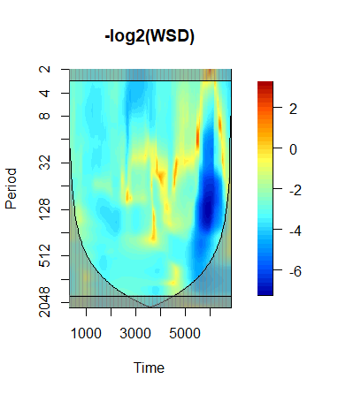

```{r setup, include=FALSE}
knitr::opts_chunk$set(echo = TRUE, message = FALSE)
```

```{r loadPkgsData}

# Suppress messages upon loading packages
suppressPackageStartupMessages({
    library(tidyverse)
    library(knitr)
    library(data.table)
    library(ggplot2)
    library(ggpubr)
    library(scales)
})

if(!require(tidyverse)){
    install.packages("tidyverse")
}

if(!require(data.table)){
    install.packages("data.table")
}

if(!require(wavScalogram)){
    install.packages("wavScalogram")
}

 
if(!require(ggplot2)){
    install.packages("ggplot2")
}

if(!require(ggpubr)){
    install.packages("ggpubr")
}

if(!require(scales)){
    install.packages("scales")
}

```

<!-- Begin Body of Report -->

# Background

Space weather as a phenomena is primarily an effect of the interaction between the Sun’s ejecta of mostly protons and electrons, which constitute a plasma of magnetized constituents called solar wind, and the Earth’s magnetosphere, thermosphere, and ionosphere. The solar wind manifests as a stream of subatomic particles emitted from the Sun, at variable intensities, speeds, and times, which impart energy to the magnetosphere. High-speed solar wind imparts more energy, inducing perturbations in the Earth's magnetic field, which manifests as geomagnetic storms. The most relevant downstream effect of these strong storms are the geo-magnetically induced currents (GICs), which can damage power grid infrastructure.

The appropriateness of using magneometer station data that captures the horizontal component of Earth's magnetic field denoted dB in place of propiretary oil company data is described in the in the literature [@viljanen_time_2001]. Because of the more readily available nature of this data, it is potentially more valuable for studying GIC across a wider geographic area than from proprietary sources. 

Therefore, the subject of this study is the variation in dB (and its cross-correlation with solar wind dynamic pressure). We construct the pressure variable using the ram pressure formula $P = M-p \cdot n \ cdot V^2 = 1.6726 \cdot 10^-6 \cdot n \cdot V^2$ where $m_p$ is the proton mass, pressure is in nPA (nanopascals), $n$ is the density in particles/cm^3 and V is the speed in km/s of the solar wind {@wikisolar}. We follow a similar approach taken by @adhikari_spectral_2019 in studying pressure as an increased pressure is a driver of geomagnetic disturbances. However, unlike the previous study it is the magnetic field measured at a station in Ottawa, Canada rather than a composite of the horizontal component across all global stations that we study alongside pressure. We choose the Ottawa magnemometer station because it is a mid-lattitude station examined in several other studies, and the results from this analysis may be useful to similar projects. In this study we are using 1-min resolution magnetometer and solar wind data, rather than the 1-min resolution GIC data that is proprietary from an oil company.

Our data are for a single storm at the Ottawa station, which was chosen to represent a moderately strong storm. Our first question is whether GIC has any relation with solar wind pressure at the Ottawa station. As seen below in Figure 1, we have non-stationary processes that we will approach in two ways. The first will be constructing an ARIMA model with differencing, under the untested assumption that the model will be robust to smaller deviations from stationarity, compared to the undifferenced data, as seen in the ACF and PARF plots of dB and pressure. We will use these plots to inform the choice of ARIMA model, and also inform our choice by computing AICs for various models. We will perform a Fourier power-spectral analysis of this ARIMA model.

Similar to Adhikari et. al, we pursue an investigation of the time-evolution of frequency distributions associated with dB and pressure.  Our second approach taken from the paper is to take the non-stationary time series as given, and employ wavelet analysis to examine the time-evolution of frequency distributions of dB by itself. We expect from previous work that changes in the scaling exponent during wavelet analysis will indicate transitions to high state associated with intense storms. The advantage of this approach is that wavelet analyses are not troubled by choices of windowing or detrending. This is due to the wavlet transform being able to ignore low-frequency trends, and potentially be better able to determine power-law correlation with scale-invariance properties. We employ the same Windowed Scalogram Difference for this purpose.

Acknowledgments: The data in this study were obtained for the purpose of work with the SOLSTICE team in the Department of Climate and Space Sciences and Engineering (CLaSP). This was an individual class project, although the data were obtained beforehand in collaboration with Daniel Iong, a PhD student at Michigan, whose code helped obtain the solar wind and dB data for this study. 

# Question

To follow the approach of Adhikari et al., we rely on discrete wavelet transform analysis of dB, the geomagnetic field flucations at 1-min resolution. Previous work established in the field established that time-varying magnetic field and GIC are linearly related, and under storm conditions conducive to GIC, wavelet coefficients are relatively large. We expect in this study that the dB will have similar behavior to actual GIC, in that the highest amplitude of the square wavelet coefficients can be interpreted as singularities associated with distrubed or fluctuating geomagnetic field. We wish to study whether dB has a relation with solar wind speed. We first evaluate this in the time domain with the cross-correlation function, then evaluate the similarity of these time series with the Windowed Scalogram Difference function.

<!-- INSTRUCTION: You should explain some background to the data you chose, and give motivation for the reader to appreciate the purpose of your data analysis. -->

<!-- If you address a question related to a previous project, you should put your contribution in the context of the previous work and explain how your approach varies or extends the previous work. It is especially important that this is clearly explained: substantial points will be lost if the reader has to carry out detective work to figure out clearly the relationship to a previous project. --> 

<!-- Explain any contributions from othersUsually, there should be a short section explaining how the group operated.You should properly acknowledge any sources (people or documents or internet sites) that contributed to your project.. This means Daniel and Yang -->

<!-- Recommendation from Prompt: If your data are longer than, say, 1000 time points, you can subsample if you start having problems working with too much data. -->
  <!-- Recommendation: Communication style. Material should be   presented in a way that helps the reader to appreciate the   contribution of the project. If the reader has to study the source code, your report probably has not explained well enough what you were doing.-->
  
```{r readdata, message=FALSE}

library(tidyverse)
library(knitr)
library(data.table)
library(ggplot2)
library(ggpubr)
library(scales)

X_train <- readr::read_csv("X_train_10.csv")
X_test <- readr::read_csv("X_test_10.csv")
y_test <- readr::read_csv("y_test_10.csv")
y_test <- y_test %>% rename(times = Date_UTC)
y_train <- readr::read_csv("y_train_10.csv")
y_train <- y_train %>% rename(times = Date_UTC)

X <- inner_join(X_train, y_train, by = c("storm","times"))
X2 <- inner_join(X_test, y_test, by = c("storm","times"))
ott <- bind_rows(X, X2)
ott$pressure <- ((1.6726*10^-6) * (ott$density) * (ott$speed)^2)
#Confirm no duplicates by storm and times
#ott %>% distinct(storm, times, .keep_all = TRUE) %>% nrow()

#There are duplicates by time, does not matter if these are removed or not
#ott %>% distinct(times, .keep_all = TRUE) %>% nrow()

#Find top 10 max db_h
#aggregate(db_h ~ storm, data = ott, max) %>% arrange(desc(db_h)) %>% head(n=10)

storm24<- ott %>% filter(storm == 24)

#modified code from slide 3/11 of Notes 9
#t <- intersect(e_data$Year,u_data$Year)
t <- storm24$times
p <- storm24$pressure[storm24$times %in% t]
#d <- apply(u_data[u_data$Year %in% t, 2:13],1,mean)
d <- storm24$db_h[storm24$times %in% t]

new_par <- c(5.1, 4.1, 4.1, 5.1)

```

We perform exploratory data analysis to examine the raw time series of pressure and dB, to show it is plausible that there may be a lagged correlation between frequencies. 

```{r EDA_plot, fig.width=6, fig.height=3}

plot_p <- ggplot(storm24,
       aes(x = times, y = pressure)) + geom_line() +
  scale_x_datetime(labels = date_format("%Y-%m-%d %H:%M:%S")) +
  xlab("Storm Times") + ylab("Pressure") + theme_minimal()

plot_d <- ggplot(storm24,
       aes(x = times, y = db_h)) + geom_line() +
  scale_x_datetime(labels = date_format("%Y-%m-%d %H:%M:%S")) +
  xlab("Storm Times") + ylab("dB") + theme_minimal()

ggpubr::ggarrange(plot_p, plot_d, nrow=2)
```

<!-- INSTRUCTION: Focus on a few, carefully explained and justified, figures, tables, statistics and hypothesis tests. You may want to try many things, but only write up evidence supporting how the data help you to get from your question to your conclusions. -->

As we have global solar wind data from a local station, it is very reasonable from physical principles to suppose that lagged solar wind pressure is a confounder for horizontal geomagnetic activity. This is due to the various different effects on magnetic fluctuations driven by solar wind as a function of latitude. We wish to identify a lag relationship between solar wind pressure (s) and dB (d) from the sample cross-correlation function (CCF): $\hat{\rho}_{xy}(h) = \frac{\sum_{n=1}^{N-h}(s_{n+h}-\bar{s})(d_n-\bar{d})}{\sqrt{\sum_{n=1}^{N}(s_n-\bar{s})^2 \sum_{n=1}^{N}(d_n-\bar{d})^2}}$, which estimates Cor($S_{n+h}, D_n$), the cross-correlation at lag h for a bivariate stationary time series model (@ch9notes). We see borderline statistically significant correlations between pressure and dB at lags 35 minutes, while statistically significant correlations occur at  pressure lags dB at borderline statistically significant correlations from 7 through 35 minutes

Emulating figure 7 from the original paper, we produce the cross-correlation plot of dB with storm pressure with lags of negative and positive 1500 minutes. From this plot we see a negative lag time, so pressure leads dB by -1500 to -500 minutes before being negatively correlated. There appears to be strong evidence against the null hypothesis of zero correlation, as the correlation falls far outside a 95% confidence band. We see the sample cross-correlation function has negative values outside the 95% confidence band also for positive lags up to 1500 minutes (~ 25 hours) with gradually decreasing magnitude of correlation over time. Interestingly, we see shifts in sign of the correlation in the 500 minutes (~8 hours) leading up to dB. Therefore, to investigate this further we explore the correlation between frequency components of each series at each frequency.

```{r}

#The series are non-stationary
par(mfrow=c(2,2))
acf(d, lag.max=35, main="Series dB")
acf(p, lag.max=35, main="Series Pressure ")

acf(diff(d), lag.max=35, main="Series dB Differenced Once")
acf(diff(p), lag.max=35, main="Series Pressure Differenced Once")
```


```{r}


#First consider just differencing and calculating the pacf and acf of d and p
#We see the ACF of differenced d or p does not return to exactly zero after even after many lags. Therefore, we must consider pre-whitening
#We must consider pre-whitening

#Determine a time series model for the x-variable
#Store the residuals from this model
#Filter the y-variable series using the x-variable model
#Examine the CCF between the residuals from step 1 and the filtered y-values from step 2. This CCF can be used to identify the possible terms fo ra lagged regression
#par(mfrow=c(2,1))
#ccf(d, p, lag.max=60)
#ccf(diff(d), diff(p), lag.max=60)

ccf(storm24$pressure, storm24$db_h, lag.max=1500, main="Storm 24 CCF of dB and Pressure", xlab="Time (Minutes)", ylab = "Crosscorrelation Coefficient")
```

The ACF plots show considerable lag at dozens or hundreds of lags, so it is not practical to estimate and interpret hundreds of parameters. Therefore we consider ARIMA models with 1 degree of differencing for the p-series, which by ACF and PACF shows much lower amounts of autocorrelation, even if this time series may not be stationary, it appears to be less non-stationary than without differencing. 

To find lagged relationships between pressure and dB, we follow an approach (@pennstate_510) of finding an ARIMA model for pressure, applying it to dB as well, and taking the CCF of the residuals for each series.

Therefore, we start by constructing an ARIMA model for pressure. We see that by comparing various lower-order ARIMA models, with an aim to achieve the best improvements in AIC with each step, at the smallest increase in additional parameters, we found ARIMA(6, 1, 6) performed best. 


```{r, eval=FALSE}

p_e <- arima(storm24$pressure, order=c(6,1,6))$residuals
d_e <- arima(storm24$db_h, order=c(6,1,6))$residuals

a <- arima(storm24$db_h,xreg=storm24$pressure,order=c(6,1,6))

#c(0.9803/0.0876, -0.1249/0.0768, -0.2355/0.0516, 0.7921/0.0510, -0.8733/0.0799, 0.1375/0.0455, -0.4976/0.0873, -0.1444/0.0524, 0.1687/0.0453, -0.6762/0.0431, 0.5967/0.0579, 0.1419/0.0330, 0.1792/0.1707)
#c("ar1","ar3","ar4","ar5","ar6", "ma1", "ma2","ma3","ma4","ma5","ma6")

#raw, bandwidth=4.01e-05
spectrum(diff(storm24$pressure), method="pgram")


df1 <- data.frame(gr = names(a), model_result = I(a)) 


a1 <- arima(storm24$db_h[1:3600],xreg=storm24$pressure[1:3600],order=c(6,1,6))

a2 <- arima(storm24$db_h[3601:7201],xreg=storm24$pressure[3601:7201],order=c(6,1,6))


```

ACF plots of the residuals for the ARIMA(6, 1, 6) models for pressure and dB respectively both show some signs of heteroskedasticity, so using this model's residuals to compute cross-correlation may not be a valid approach. 

We saw that for very long time lags (1500 minutes) there was evidence for time-lagged correlations between dB and pressure. To investigate this relationship further in the frequency domain, we employ a more sensitive alternative to wavelet squared coherence for nonstationary time series, as pursued in the paper, to compare each variable's scalogram across many windows of time and scale. We see that during this moderate strength storm, the spectral power area with high itensity occurs at a time index of 3000-5000, which in the middle of the time series reprsents the main phase of the storm with highest similarity of dB and pressure. Note the bowl-shaped contour showing values that attain 95% and 5% significance levels.



```{r}

#Use this to generate the image, then load the image manually
#wavplot <- wavScalogram::wsd(storm24$pressure, storm24$db_h, #normalize = "ENERGY")

#acf(p_e)
#acf(d_e)
#ccf(p_e, d_e)

#s <- spectrum(cbind(e_hp,u_hp),spans=c(3,5,3),plot=F)
#plot(s,plot.type="coherency",main=""
     
     
#s <- spectrum(cbind(storm24$pressure,storm24$db_h),spans=c(3,1,3),plot=F)

#s = spectrum(storm24$db_h,method="ar",
#main="Spectrum estimated via AR model picked by AIC", plot=F)

#plot(s,plot.type="coherency")
     
#plot(s,plot.type="phase",main="")
#abline(h=0,col="red")

#s <- spectrum(cbind(storm24$db_h,storm24$db_h),spans=c(2,3),plot=F#)
#plot(s,plot.type="coherency",main="")
     

```


<!-- Check these are met for work so far: -->
<!-- #So, you've finished a few methods above. INSTRUCTION: the reasoning used to draw conclusions from results. Being self-critical and paying attention to detail can help here. -->

<!-- INSTRUCITON: For a well-written report the citations should be clearly linked to the material. The reader should not have to do detective work to figure out what assertion is linked to what reference. -->


<!-- INSTRUCTION: Reaching a conclusion. You should say what you have concluded about your question(s). -->

<!-- #INSTRUCTION: Check for plagiarism -- If material is taken directly from another source, that source must be cited and the copied material clearly attributed to the source, for example by the use of quotation marks. Properly cite any ideas, images, creative work, or other material taken from published or unpublished sources, including the author's own previous work. -->

# References

<!-- #Adhikari, B., Sapkota, N., Dahal, S., Bhattarai, B., Khanal, K., & Chapagain, N. P. (2019). #Spectral characteristic of geomagnetically induced current during geomagnetic storms by #wavelet techniques. Journal of Atmospheric and Solar-Terrestrial Physics, 192, 104777. #https://doi.org/10.1016/j.jastp.2018.01.020 -->


